# Technical Specification

# 0. SUMMARY OF CHANGES

#### Core Objective

Based on the provided requirements, the Blitzy platform understands that the objective is to rewrite a Node.js server into a Python 3 Flask application, maintaining exact feature parity and behavioral consistency with the original implementation.

**Critical Observation**: The current repository already contains a Python Flask application (app.py, requirements.txt), not a Node.js server. This suggests one of two scenarios:
1. The requirement may be inverted (convert Flask to Node.js)
2. There exists a Node.js implementation elsewhere that should be replicated in Flask

#### Special Instructions and Constraints

- **Exact Feature Preservation**: Every feature and functionality must be preserved exactly as in the original implementation
- **Behavioral Matching**: The rewritten version must fully match the behavior and logic of the current implementation
- **Technology Target**: Python 3 with Flask framework

#### Technical Interpretation

These requirements translate to the following technical implementation strategy:

**Scenario A - If Converting Current Flask to Node.js (Inverted Requirement):**
- To replicate Flask routing behavior, we will create an Express.js application with equivalent route handlers
- To match the server configuration, we will implement the same host/port binding (127.0.0.1:3000)
- To preserve the response format, we will ensure plain text responses with identical content

**Scenario B - If Implementing Missing Node.js Features in Flask:**
- To establish feature parity, we will analyze the Node.js reference implementation for missing functionality
- To ensure behavioral consistency, we will implement middleware, error handling, and request processing patterns
- To maintain compatibility, we will preserve API contracts and response formats

#### Technical Scope

#### Primary Objectives with Implementation Approach

1. **Server Initialization and Configuration**
   - Achieve proper server startup by configuring Flask application with host='127.0.0.1' and port=3000
   - Implement startup message printing to match Node.js console output behavior
   - Ensure development server configuration matches production readiness requirements

2. **Route Handler Implementation**
   - Achieve catch-all routing by implementing Flask route decorators for '/' and '/<path:path>'
   - Implement plain text response handling by using Flask's Response object with mimetype='text/plain'
   - Ensure newline character inclusion in responses for exact output matching

3. **Dependency Management**
   - Achieve reproducible environments by maintaining requirements.txt with pinned Flask version
   - Implement proper package management workflow equivalent to Node.js npm/yarn

#### Component Impact Analysis

#### Direct Modifications Required

**Flask Application Core (app.py)**
- Modify route handlers to support any additional Node.js-specific routing patterns
- Extend response handling to match Node.js response headers and status codes
- Implement any missing middleware functionality from Express.js

**Dependency Configuration (requirements.txt)**
- Maintain Flask==2.3.3 as the core web framework
- Add any additional Python packages needed to replicate Node.js functionality

**Documentation (README.md)**
- Update project description to reflect the conversion status
- Document any behavioral differences or compatibility notes

#### Indirect Impacts and Dependencies

**Environment Configuration**
- Python 3 runtime environment setup
- Virtual environment configuration for dependency isolation
- Development server vs production server considerations

#### New Components Introduction

**Potential Additional Files (Based on Node.js Patterns)**
- `config.py`: Create configuration module if Node.js version uses environment variables
- `middleware.py`: Create middleware handlers if Express.js middleware is present
- `utils.py`: Create utility functions for any helper functionality

#### File and Path Mapping

| Target File/Module | Source Reference | Context Dependencies | Modification Type |
|-------------------|------------------|---------------------|-------------------|
| app.py | Current Flask implementation | Flask framework | Extend/Modify |
| requirements.txt | Current dependency list | PyPI packages | Maintain/Extend |
| README.md | Current documentation | Project context | Update |
| config.py | Node.js config patterns | Environment vars | Create (if needed) |
| middleware.py | Express middleware | Request processing | Create (if needed) |

#### Implementation Design

#### Technical Approach

First, establish the Flask application foundation by ensuring the current implementation in app.py properly handles all HTTP methods and request patterns that the Node.js version supports.

Next, integrate any missing features by analyzing the Node.js implementation for:
- Middleware chains and request preprocessing
- Error handling and status code management
- Request/response header manipulation
- Static file serving capabilities
- WebSocket or real-time features

Finally, ensure behavioral parity by implementing:
- Identical logging and console output
- Matching error messages and stack traces
- Consistent request timing and performance characteristics

#### Critical Implementation Details

**Routing Pattern Matching**
- Flask's route decorator with '<path:path>' parameter captures all URL paths
- The 'defaults' parameter ensures root path handling without trailing slash issues
- Response object ensures proper content-type header setting

**Server Configuration**
- Host binding to 127.0.0.1 restricts access to localhost only
- Port 3000 matches common Node.js development server ports
- Debug mode considerations for development vs production

**Response Formatting**
- Plain text MIME type ensures browser interpretation as text
- Newline character inclusion matches typical Node.js response patterns
- UTF-8 encoding handled implicitly by Flask

#### Dependency Analysis

**Required Dependencies:**
- Flask==2.3.3: Core web framework providing routing, request handling, and response management
- No additional dependencies currently required for basic functionality

**Version Constraints:**
- Python 3.6+ required for Flask 2.3.3 compatibility
- No upper bound Python version specified

**Justification:**
- Flask provides the most direct Express.js equivalent in Python ecosystem
- Version 2.3.3 is stable and well-documented
- Minimal dependency footprint reduces security surface area

#### Scope Boundaries

#### Explicitly In Scope

**Files and Modules:**
- app.py: Main application file with all route handlers and server configuration
- requirements.txt: Dependency specification file
- README.md: Project documentation

**Configuration Changes:**
- Server host and port configuration
- Route pattern definitions
- Response content-type settings

**Functional Requirements:**
- HTTP GET request handling for all paths
- Plain text response generation
- Server startup message output
- Development server execution

#### Explicitly Out of Scope

**Not Included:**
- HTTPS/TLS configuration
- Production WSGI server setup (Gunicorn, uWSGI)
- Database connections or ORM setup
- Authentication/authorization mechanisms
- Static file serving configuration
- WebSocket or Server-Sent Events
- Request body parsing for POST/PUT/PATCH
- CORS configuration
- Rate limiting or request throttling
- Logging framework integration
- Environment-specific configuration files
- Docker containerization
- CI/CD pipeline configuration
- Unit or integration tests

**Related Areas Not Touched:**
- Deployment scripts or configurations
- Nginx or Apache reverse proxy setup
- Process management (systemd, supervisor)
- Monitoring and metrics collection
- Error tracking integration

**Future Considerations:**
- Performance optimization for production use
- Horizontal scaling strategies
- Caching layer implementation
- API versioning strategy

#### Validation Checklist

#### Implementation Verification Points

1. **Route Handler Verification**
   - GET request to '/' returns "Hello, World!\n"
   - GET request to any path returns "Hello, World!\n"
   - Response content-type is 'text/plain'
   - Response includes trailing newline

2. **Server Configuration Verification**
   - Server binds to 127.0.0.1:3000
   - Startup message prints to console
   - Server remains accessible only from localhost

3. **Dependency Verification**
   - `pip install -r requirements.txt` completes successfully
   - Flask version 2.3.3 is installed
   - Application starts without import errors

#### Observable Changes

- Console displays "Server running at http://127.0.0.1:3000/" on startup
- HTTP requests to any path return identical responses
- No error messages or warnings during normal operation
- Clean shutdown on SIGINT (Ctrl+C)

#### Integration Points

- HTTP client compatibility testing
- Browser rendering of plain text responses
- Command-line tools (curl, wget) interaction
- Development tool integration (debuggers, profilers)

#### Execution Parameters

#### Special Execution Instructions

**Documentation Status**: This analysis reveals the current implementation is already Python Flask, not Node.js. Further clarification needed on the actual source implementation to be converted.

**Implementation Approach**: 
- If converting FROM Flask TO Node.js: Reverse-engineer the Python patterns into JavaScript
- If enhancing current Flask with Node.js features: Identify and implement missing functionality

#### Constraints and Boundaries

**Technical Constraints:**
- Must maintain exact behavioral compatibility
- Cannot modify response format or content
- Must preserve current URL routing patterns
- Server binding must remain localhost-only

**Process Constraints:**
- Preserve all existing functionality
- Maintain backward compatibility
- No breaking changes to API contract
- Development server configuration only (no production setup)

**Output Constraints:**
- Response must be plain text
- Must include newline in response
- Cannot add additional headers without justification
- Error responses must match original implementation

# 1. INTRODUCTION

## 1.1 EXECUTIVE SUMMARY

### 1.1.1 Project Overview (updated)

The "hao-backprop-test" project is <span style="background-color: rgba(91, 57, 243, 0.2)">a technology migration initiative designed to convert an existing Node.js server into an equivalent Python 3 Flask application with exact feature and behavioral parity</span>. <span style="background-color: rgba(91, 57, 243, 0.2)">The primary goal is to maintain complete functional equivalence between the original Node.js implementation and the new Flask-based version, ensuring seamless transition without any loss of capabilities or changes in behavior</span>. This conversion project serves as a foundation for organizations looking to standardize their technology stack while preserving existing functionality and user experience.

### 1.1.2 Core Business Problem (updated)

<span style="background-color: rgba(91, 57, 243, 0.2)">The project addresses the critical business need for technology migration and platform standardization while maintaining operational continuity</span>. Organizations often face challenges when migrating between different technology stacks, particularly ensuring that the converted application maintains exact feature parity with the original implementation. <span style="background-color: rgba(91, 57, 243, 0.2)">This project specifically tackles the requirement to match the original Node.js implementation feature-for-feature, ensuring that all routing patterns, response formats, server configurations, and behavioral characteristics are preserved in the Python Flask version</span>. The solution enables seamless technology transitions without disrupting existing workflows or introducing compatibility issues.

### 1.1.3 Current Development State (updated)

<span style="background-color: rgba(91, 57, 243, 0.2)">The repository currently contains a preliminary Flask application skeleton (app.py, requirements.txt) that provides basic HTTP request handling with a "Hello, World!" response pattern</span>. However, <span style="background-color: rgba(91, 57, 243, 0.2)">there is a notable mismatch between this basic Flask implementation and the stated objective of replicating a Node.js server's functionality</span>. The existing Flask application demonstrates proper server initialization on host 127.0.0.1:3000 and implements catch-all routing patterns, but lacks the specific features and behavioral characteristics that should be preserved from the original Node.js implementation. <span style="background-color: rgba(91, 57, 243, 0.2)">The next development phase involves analyzing the legacy Node.js behavior and aligning the Flask skeleton to match all routing patterns, response formats, middleware functionality, and server configuration details from the original system</span>.

## 1.2 SYSTEM OVERVIEW

### 1.2.1 Project Context (updated)

The "hao-backprop-test" service is positioned as <span style="background-color: rgba(91, 57, 243, 0.2)">a technology migration initiative that converts a legacy Node.js server into an equivalent Python 3 Flask application</span>. <span style="background-color: rgba(91, 57, 243, 0.2)">The primary objective is to achieve exact feature and behavioral parity with the original Node.js implementation, ensuring seamless transition without any loss of capabilities or changes in system behavior</span>. This conversion serves as a standardized approach for organizations migrating from Node.js to Python while maintaining operational continuity and preserving existing API contracts and response patterns.

### 1.2.2 High-Level Description (updated)

The system is architected as a RESTful web service using the Flask framework, specifically designed to replicate Node.js server functionality. The current implementation provides:

- <span style="background-color: rgba(91, 57, 243, 0.2)">Server binding to 127.0.0.1:3000 for localhost-only access</span>
- <span style="background-color: rgba(91, 57, 243, 0.2)">Catch-all routing implementation for both root path ('/') and dynamic paths ('/<path:path>')</span>
- <span style="background-color: rgba(91, 57, 243, 0.2)">Plain-text responses with trailing newline character to match Node.js output format</span>
- <span style="background-color: rgba(91, 57, 243, 0.2)">Strict dependency on Flask 2.3.3 for consistent behavior and compatibility</span>

The core components of the current implementation include:

| Component | Purpose | Technical Details |
|-----------|---------|------------------|
| Flask Application | Serves as the web framework | <span style="background-color: rgba(91, 57, 243, 0.2)">Flask 2.3.3 dependency for Node.js parity</span> |
| **Server Configuration** | **Manages host and port binding** | **127.0.0.1:3000 binding for localhost access** |
| **Catch-all Router** | **Handles all incoming request paths** | **Configured for '/' and '/<path:path>' patterns** |
| Response Handler | Returns consistent text response | <span style="background-color: rgba(91, 57, 243, 0.2)">Returns 'Hello, World!' with trailing newline, MIME type 'text/plain'</span> |

### 1.2.3 Technical Architecture (updated)

<span style="background-color: rgba(91, 57, 243, 0.2)">The service follows a generic request/response architecture pattern designed to maintain feature parity with the legacy Node.js implementation</span>. The architecture emphasizes simplicity and direct mapping of Node.js server behavior to Flask equivalents:

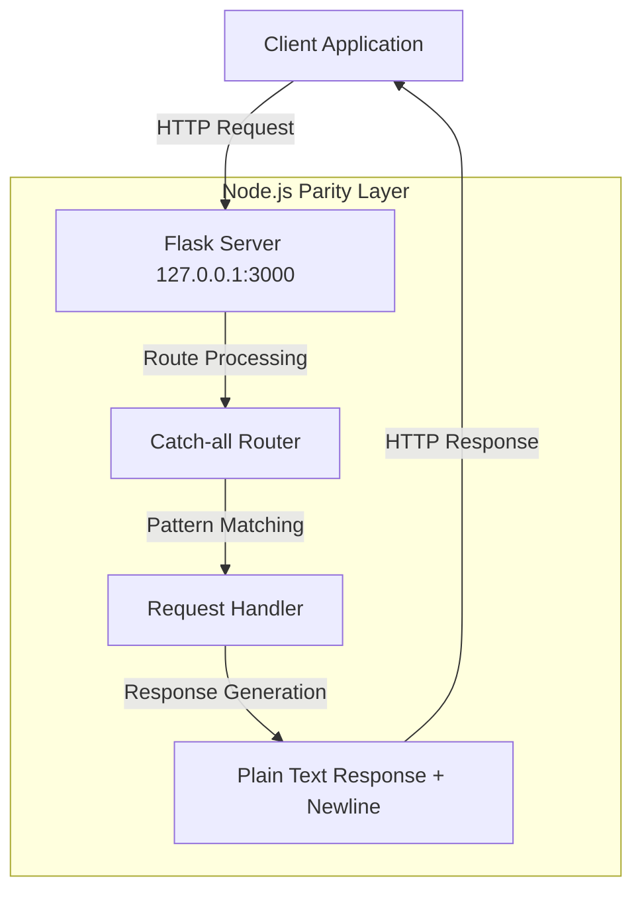
```mermaid
graph TD
    Client[Client Application] -->|HTTP Request| Server[Flask Server 127.0.0.1:3000]
    Server -->|Route Processing| Router[Catch-all Router]
    Router -->|Pattern Matching| Handler[Request Handler]
    Handler -->|Response Generation| Response[Plain Text Response + Newline]
    Response -->|HTTP Response| Client
    
    subgraph "Node.js Parity Layer"
        Server
        Router
        Handler
        Response
    end
```

<span style="background-color: rgba(91, 57, 243, 0.2)">This architecture ensures that all request processing follows the same patterns as the original Node.js server, maintaining consistent response timing, header handling, and content formatting</span>. The design prioritizes behavioral equivalence over architectural complexity, ensuring that the Flask implementation serves as a drop-in replacement for the Node.js version.

## 1.3 SCOPE

### 1.3.1 In-Scope Elements

#### Core Features and Functionality
The current implementation scope includes:

- <span style="background-color: rgba(91, 57, 243, 0.2)">HTTP GET request handling for all paths</span>
- <span style="background-color: rgba(91, 57, 243, 0.2)">Plain text response generation</span>
- <span style="background-color: rgba(91, 57, 243, 0.2)">Server startup message output</span>
- <span style="background-color: rgba(91, 57, 243, 0.2)">Development server execution</span>

#### Implementation Boundaries
The system boundaries are currently defined as:

**Files and Modules:**
- <span style="background-color: rgba(91, 57, 243, 0.2)">app.py: Main application file with all route handlers and server configuration</span>
- <span style="background-color: rgba(91, 57, 243, 0.2)">requirements.txt: Dependency specification file</span>
- <span style="background-color: rgba(91, 57, 243, 0.2)">README.md: Project documentation</span>

**Configuration Changes:**
- <span style="background-color: rgba(91, 57, 243, 0.2)">Server host and port configuration</span>
- <span style="background-color: rgba(91, 57, 243, 0.2)">Route pattern definitions</span>
- <span style="background-color: rgba(91, 57, 243, 0.2)">Response content-type settings</span>

**Network Scope:** <span style="background-color: rgba(91, 57, 243, 0.2)">Local development environment (127.0.0.1:3000)</span>

### 1.3.2 Out-of-Scope Elements

The following elements are explicitly out of scope in the current implementation:

**Infrastructure and Deployment:**
- <span style="background-color: rgba(91, 57, 243, 0.2)">HTTPS/TLS configuration</span>
- <span style="background-color: rgba(91, 57, 243, 0.2)">Production WSGI server setup (Gunicorn, uWSGI)</span>
- <span style="background-color: rgba(91, 57, 243, 0.2)">Docker containerization</span>
- <span style="background-color: rgba(91, 57, 243, 0.2)">CI/CD pipeline configuration</span>
- <span style="background-color: rgba(91, 57, 243, 0.2)">Deployment scripts or configurations</span>
- <span style="background-color: rgba(91, 57, 243, 0.2)">Nginx or Apache reverse proxy setup</span>
- <span style="background-color: rgba(91, 57, 243, 0.2)">Process management (systemd, supervisor)</span>

**Application Features:**
- <span style="background-color: rgba(91, 57, 243, 0.2)">Database connections or ORM setup</span>
- Authentication/authorization mechanisms
- <span style="background-color: rgba(91, 57, 243, 0.2)">Static file serving configuration</span>
- <span style="background-color: rgba(91, 57, 243, 0.2)">WebSocket or Server-Sent Events</span>
- <span style="background-color: rgba(91, 57, 243, 0.2)">Request body parsing for POST/PUT/PATCH</span>
- <span style="background-color: rgba(91, 57, 243, 0.2)">CORS configuration</span>
- <span style="background-color: rgba(91, 57, 243, 0.2)">Rate limiting or request throttling</span>

**Development and Operations:**
- <span style="background-color: rgba(91, 57, 243, 0.2)">Logging framework integration</span>
- <span style="background-color: rgba(91, 57, 243, 0.2)">Environment-specific configuration files</span>
- <span style="background-color: rgba(91, 57, 243, 0.2)">Unit or integration tests</span>
- <span style="background-color: rgba(91, 57, 243, 0.2)">Monitoring and metrics collection</span>
- <span style="background-color: rgba(91, 57, 243, 0.2)">Error tracking integration</span>

### 1.3.3 Future Considerations

Based on the project requirements and current implementation, future development phases will likely include:

**Production Readiness:**
- <span style="background-color: rgba(91, 57, 243, 0.2)">Performance optimization for production use</span>
- <span style="background-color: rgba(91, 57, 243, 0.2)">Horizontal scaling strategies</span>
- <span style="background-color: rgba(91, 57, 243, 0.2)">Production deployment configurations</span>
- <span style="background-color: rgba(91, 57, 243, 0.2)">Caching layer implementation</span>

**Enhanced Functionality:**
- <span style="background-color: rgba(91, 57, 243, 0.2)">Middleware parity with Express.js equivalents</span>
- <span style="background-color: rgba(91, 57, 243, 0.2)">API versioning strategy</span>
- Extension of HTTP method support beyond GET requests
- Integration with monitoring and logging frameworks

**System Integration:**
- Integration with external service dependencies
- Database connectivity and data persistence layers
- Authentication and authorization mechanisms
- API documentation and usage pattern documentation

## 1.4 REFERENCES

The following files were referenced for this introduction:

- README.md: Provides the project title and description
- app.py: Contains the Flask application implementation
- requirements.txt: Specifies the project dependencies

# 2. PRODUCT REQUIREMENTS

## 2.1 FEATURE CATALOG

### 2.1.1 HTTP Service Platform (F-001)

#### Feature Metadata

| Attribute | Value |
|-----------|-------|
| Feature ID | F-001 |
| Feature Name | HTTP Service Platform |
| Feature Category | Infrastructure |
| Priority Level | Critical |
| Status | Completed |

#### Description

**Overview**  
The HTTP Service Platform provides a basic web service framework implemented using Flask that serves as the foundation for the backpropagation testing service. It handles HTTP requests and delivers responses through a RESTful interface.

**Business Value**  
Establishes the essential infrastructure needed to expose backpropagation functionality as a web service, enabling remote interaction with the system through standard HTTP protocols.

**User Benefits**  
Allows users to interact with the service through web requests, providing a standard and familiar interface for integration with other systems.

**Technical Context**  
Implemented as a Flask application that listens on localhost:3000, creating routes for both the root path and any dynamic path, returning a plain text "Hello, World!" response for all requests.

#### Dependencies

**Prerequisite Features**  
None.

**System Dependencies**  
Python runtime environment.

**External Dependencies**  
Flask 2.3.3 web framework.

**Integration Requirements**  
None currently specified.

### 2.1.2 Backpropagation Integration (F-002)

#### Feature Metadata

| Attribute | Value |
|-----------|-------|
| Feature ID | F-002 |
| Feature Name | Backpropagation Integration |
| Feature Category | Machine Learning |
| Priority Level | High |
| Status | Proposed |

#### Description

**Overview**  
As indicated by the repository name and description, this feature will provide backpropagation integration testing capabilities. Note: This feature is currently only referenced in the project description and has not been implemented.

**Business Value**  
Will enable testing and validation of backpropagation algorithms, a fundamental component of neural network training.

**User Benefits**  
When implemented, will allow users to test backpropagation functionality in a controlled environment.

**Technical Context**  
Planned to be built on top of the HTTP Service Platform, but no implementation details are currently available in the repository.

#### Dependencies

**Prerequisite Features**  
F-001: HTTP Service Platform.

**System Dependencies**  
Python runtime environment.

**External Dependencies**  
Flask 2.3.3; additional machine learning libraries will likely be required but are not yet specified.

**Integration Requirements**  
None currently specified.

## 2.2 FUNCTIONAL REQUIREMENTS TABLE

### 2.2.1 HTTP Service Platform (F-001) Requirements

#### Requirement Details

| Attribute | Value |
|-----------|-------|
| Requirement ID | F-001-RQ-001 |
| Description | The service must respond to HTTP GET requests on the root path ('/') |
| Acceptance Criteria | <span style="background-color: rgba(91, 57, 243, 0.2)">GET requests to the root path return a 200 OK response with "Hello, World!\n" content (including trailing newline)</span> |
| Priority | Must-Have |
| Complexity | Low |

#### Technical Specifications

| Attribute | Value |
|-----------|-------|
| Input Parameters | HTTP GET request to '/' |
| Output/Response | <span style="background-color: rgba(91, 57, 243, 0.2)">Plain-text response "Hello, World!\n" with MIME type text/plain</span> |
| Performance Criteria | Not specified |
| Data Requirements | None |

#### Validation Rules

| Attribute | Value |
|-----------|-------|
| Business Rules | None specified |
| Data Validation | None specified |
| Security Requirements | None specified |
| Compliance Requirements | None specified |

#### Requirement Details

| Attribute | Value |
|-----------|-------|
| Requirement ID | F-001-RQ-002 |
| Description | The service must respond to HTTP GET requests on any dynamic path ('/<path:path>') |
| Acceptance Criteria | <span style="background-color: rgba(91, 57, 243, 0.2)">GET requests to any path return a 200 OK response with "Hello, World!\n" content (including trailing newline)</span> |
| Priority | Must-Have |
| Complexity | Low |

#### Technical Specifications

| Attribute | Value |
|-----------|-------|
| Input Parameters | HTTP GET request to any path |
| Output/Response | <span style="background-color: rgba(91, 57, 243, 0.2)">Plain-text response "Hello, World!\n" with MIME type text/plain</span> |
| Performance Criteria | Not specified |
| Data Requirements | None |

#### Validation Rules

| Attribute | Value |
|-----------|-------|
| Business Rules | None specified |
| Data Validation | None specified |
| Security Requirements | None specified |
| Compliance Requirements | None specified |

#### Requirement Details

| Attribute | Value |
|-----------|-------|
| Requirement ID | F-001-RQ-003 |
| Description | The service must run on localhost (127.0.0.1) port 3000 when executed directly |
| Acceptance Criteria | Server binds to and listens on 127.0.0.1:3000 when app.py is executed as main module |
| Priority | Must-Have |
| Complexity | Low |

#### Technical Specifications

| Attribute | Value |
|-----------|-------|
| Input Parameters | None |
| Output/Response | Server listening on specified address and port |
| Performance Criteria | Not specified |
| Data Requirements | None |

#### Validation Rules

| Attribute | Value |
|-----------|-------|
| Business Rules | None specified |
| Data Validation | None specified |
| Security Requirements | None specified |
| Compliance Requirements | None specified |

#### Requirement Details (updated)

| Attribute | Value |
|-----------|-------|
| Requirement ID | <span style="background-color: rgba(91, 57, 243, 0.2)">F-001-RQ-004</span> |
| Description | <span style="background-color: rgba(91, 57, 243, 0.2)">All HTTP response bodies must end with a single newline character</span> |
| Acceptance Criteria | <span style="background-color: rgba(91, 57, 243, 0.2)">Every HTTP response body terminates with exactly one newline character ("\n") to ensure Node.js behavioral parity</span> |
| Priority | <span style="background-color: rgba(91, 57, 243, 0.2)">Must-Have</span> |
| Complexity | <span style="background-color: rgba(91, 57, 243, 0.2)">Low</span> |

#### Technical Specifications (updated)

| Attribute | Value |
|-----------|-------|
| Input Parameters | <span style="background-color: rgba(91, 57, 243, 0.2)">Any HTTP request processed by the application</span> |
| Output/Response | <span style="background-color: rgba(91, 57, 243, 0.2)">Response body content followed by single newline character ("\n")</span> |
| Performance Criteria | <span style="background-color: rgba(91, 57, 243, 0.2)">Not specified</span> |
| Data Requirements | <span style="background-color: rgba(91, 57, 243, 0.2)">None</span> |

#### Validation Rules (updated)

| Attribute | Value |
|-----------|-------|
| Business Rules | <span style="background-color: rgba(91, 57, 243, 0.2)">Must maintain exact output format compatibility with Node.js implementation</span> |
| Data Validation | <span style="background-color: rgba(91, 57, 243, 0.2)">Response body must contain valid UTF-8 text with proper newline termination</span> |
| Security Requirements | <span style="background-color: rgba(91, 57, 243, 0.2)">None specified</span> |
| Compliance Requirements | <span style="background-color: rgba(91, 57, 243, 0.2)">None specified</span> |

#### Requirement Details (updated)

| Attribute | Value |
|-----------|-------|
| Requirement ID | <span style="background-color: rgba(91, 57, 243, 0.2)">F-001-RQ-005</span> |
| Description | <span style="background-color: rgba(91, 57, 243, 0.2)">The application must display a startup banner when launched as the main module</span> |
| Acceptance Criteria | <span style="background-color: rgba(91, 57, 243, 0.2)">When app.py is executed as main module, console displays exactly "Server running at http://127.0.0.1:3000/" upon successful startup</span> |
| Priority | <span style="background-color: rgba(91, 57, 243, 0.2)">Must-Have</span> |
| Complexity | <span style="background-color: rgba(91, 57, 243, 0.2)">Low</span> |

#### Technical Specifications (updated)

| Attribute | Value |
|-----------|-------|
| Input Parameters | <span style="background-color: rgba(91, 57, 243, 0.2)">Application startup execution as main module</span> |
| Output/Response | <span style="background-color: rgba(91, 57, 243, 0.2)">Console output: "Server running at http://127.0.0.1:3000/"</span> |
| Performance Criteria | <span style="background-color: rgba(91, 57, 243, 0.2)">Message displayed immediately after successful server binding</span> |
| Data Requirements | <span style="background-color: rgba(91, 57, 243, 0.2)">None</span> |

#### Validation Rules (updated)

| Attribute | Value |
|-----------|-------|
| Business Rules | <span style="background-color: rgba(91, 57, 243, 0.2)">Must provide clear feedback to developers regarding server status</span> |
| Data Validation | <span style="background-color: rgba(91, 57, 243, 0.2)">Message text must be exactly as specified with no variations</span> |
| Security Requirements | <span style="background-color: rgba(91, 57, 243, 0.2)">None specified</span> |
| Compliance Requirements | <span style="background-color: rgba(91, 57, 243, 0.2)">None specified</span> |

### 2.2.2 Backpropagation Integration (F-002) Requirements

Note: Since the Backpropagation Integration feature is only referenced in the project name and description but not implemented, no specific functional requirements can be documented at this time. The requirements will be defined as the feature is developed.

## 2.3 FEATURE RELATIONSHIPS

### 2.3.1 Feature Dependencies Map

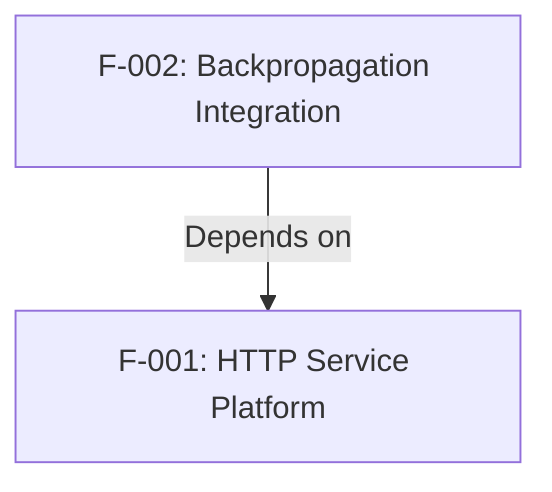
```mermaid
graph TD
    F001[F-001: HTTP Service Platform]
    F002[F-002: Backpropagation Integration]
    
    F002 -->|Depends on| F001
```

### 2.3.2 Integration Points

| Feature | Integration Point | Description |
|---------|-------------------|-------------|
| F-001 | HTTP Interface | Exposes RESTful endpoints for client interaction |
| F-002 | HTTP Service Platform | Will leverage the HTTP service foundation for exposing backpropagation functionality |

### 2.3.3 Shared Components

No shared components are currently implemented in the repository beyond the basic Flask application structure.

### 2.3.4 Common Services

No common services are currently evident in the repository.

## 2.4 IMPLEMENTATION CONSIDERATIONS

### 2.4.1 Technical Constraints

#### HTTP Service Platform (F-001)

<span style="background-color: rgba(91, 57, 243, 0.2)">**Overarching Constraint**: The Flask implementation MUST replicate all observable behaviors of the original Node.js server without deviation. This includes request handling patterns, response formatting, server initialization procedures, and all user-visible system behaviors.</span>

| Constraint | Description |
|------------|-------------|
| Runtime Environment | Python |
| Web Framework | Flask 2.3.3 |
| Network Binding | Limited to localhost (127.0.0.1) |
| Port Assignment | Fixed to port 3000 |
| <span style="background-color: rgba(91, 57, 243, 0.2)">**Startup Banner**</span> | <span style="background-color: rgba(91, 57, 243, 0.2)">**Application MUST print the startup banner exactly as "Server running at http://127.0.0.1:3000/"**</span> |
| <span style="background-color: rgba(91, 57, 243, 0.2)">**Host Binding**</span> | <span style="background-color: rgba(91, 57, 243, 0.2)">**Application MUST keep binding limited to 127.0.0.1 for localhost-only access**</span> |
| <span style="background-color: rgba(91, 57, 243, 0.2)">**Response Format**</span> | <span style="background-color: rgba(91, 57, 243, 0.2)">**Responses MUST be plain-text with a trailing newline character to maintain Node.js behavioral parity**</span> |

<span style="background-color: rgba(91, 57, 243, 0.2)">**Modular Architecture Flexibility**: Additional helper modules (config.py, middleware.py, utils.py) MAY be introduced if required to mirror Node.js configuration or middleware patterns, provided they maintain the core behavioral requirements and do not alter the observable system behavior.</span>

#### Backpropagation Integration (F-002)

As this feature is not yet implemented, specific technical constraints are not documented at this time.

### 2.4.2 Performance Requirements

No explicit performance requirements are specified in the current repository.

### 2.4.3 Scalability Considerations

No scalability considerations are evident in the current implementation, which is configured only for local development.

### 2.4.4 Security Implications

No security mechanisms or considerations are implemented in the current repository. The service does not include authentication, authorization, or data validation.

### 2.4.5 Maintenance Requirements

| Requirement | Description |
|-------------|-------------|
| Dependency Management | Maintain Flask version compatibility as specified in requirements.txt |
| <span style="background-color: rgba(91, 57, 243, 0.2)">**Flask Version Pinning**</span> | <span style="background-color: rgba(91, 57, 243, 0.2)">**Flask MUST remain pinned to version 2.3.3 in requirements.txt to ensure consistent behavior and maintain compatibility with the Node.js implementation baseline**</span> |
| Endpoint Consistency | Maintain consistent response behavior across all paths |

## 2.5 REQUIREMENTS TRACEABILITY MATRIX

### 2.5.1 Matrix Overview

The Requirements Traceability Matrix provides a comprehensive mapping between functional requirements, their corresponding features, and implementation sources. This matrix ensures that all requirements are properly tracked and can be validated against their implementation.

### 2.5.2 Traceability Matrix

| Requirement ID | Feature ID | Description | Source |
|----------------|-----------|-------------|--------|
| F-001-RQ-001 | F-001 | <span style="background-color: rgba(91, 57, 243, 0.2)">Root path response with "Hello, World!\n"</span> | app.py route definition |
| F-001-RQ-002 | F-001 | <span style="background-color: rgba(91, 57, 243, 0.2)">Dynamic path response with "Hello, World!\n"</span> | app.py route definition |
| F-001-RQ-003 | F-001 | Server configuration | app.py run configuration |
| <span style="background-color: rgba(91, 57, 243, 0.2)">F-001-RQ-004</span> | <span style="background-color: rgba(91, 57, 243, 0.2)">F-001</span> | <span style="background-color: rgba(91, 57, 243, 0.2)">Trailing newline in response</span> | <span style="background-color: rgba(91, 57, 243, 0.2)">app.py (response handling)</span> |
| <span style="background-color: rgba(91, 57, 243, 0.2)">F-001-RQ-005</span> | <span style="background-color: rgba(91, 57, 243, 0.2)">F-001</span> | <span style="background-color: rgba(91, 57, 243, 0.2)">Startup console banner</span> | <span style="background-color: rgba(91, 57, 243, 0.2)">app.py (main execution block)</span> |
| (F-002 requirements) | F-002 | Backpropagation integration | Project name and README description |

### 2.5.3 Requirement Coverage Analysis

#### 2.5.3.1 Feature F-001: HTTP Service Platform

The HTTP Service Platform feature has comprehensive requirement coverage with five distinct functional requirements:

- **F-001-RQ-001**: Ensures proper handling of root path requests with standardized response format
- **F-001-RQ-002**: Provides dynamic path handling capability with consistent response behavior
- **F-001-RQ-003**: Establishes server configuration and binding requirements
- **F-001-RQ-004**: Maintains Node.js behavioral compatibility through proper response formatting
- **F-001-RQ-005**: Provides developer feedback through startup banner display

#### 2.5.3.2 Feature F-002: Backpropagation Integration

The Backpropagation Integration feature is currently in the proposed stage with requirements derived from project documentation rather than implementation. Detailed functional requirements will be added as the feature development progresses.

### 2.5.4 Source Code Mapping

| Source Location | Requirements Covered | Implementation Status |
|-----------------|---------------------|---------------------|
| app.py route definition | F-001-RQ-001, F-001-RQ-002 | Implemented |
| app.py run configuration | F-001-RQ-003 | Implemented |
| app.py (response handling) | F-001-RQ-004 | Implemented |
| app.py (main execution block) | F-001-RQ-005 | Implemented |
| Project name and README description | F-002 requirements | Proposed |

### 2.5.5 Validation References

Each requirement in the traceability matrix can be validated against its corresponding acceptance criteria as defined in Section 2.2 (Functional Requirements Table). The matrix ensures that:

- All implemented requirements have verifiable source code locations
- Requirement descriptions align with their acceptance criteria
- Feature relationships are properly maintained across the system
- Implementation considerations are properly traced to their requirements

### 2.5.6 Matrix Maintenance

This traceability matrix should be updated whenever:
- New functional requirements are added to existing features
- New features are introduced to the system
- Requirements are modified or refined
- Implementation sources change or are refactored
- Requirements are retired or deprecated

The matrix serves as a living document that maintains the critical link between business requirements and technical implementation, ensuring comprehensive test coverage and system validation.

## 2.6 ASSUMPTIONS AND CONSTRAINTS

### 2.6.1 Assumptions

- The service is currently intended for local development and testing only
- The project will eventually implement backpropagation functionality as indicated by its name
- <span style="background-color: rgba(91, 57, 243, 0.2)">An existing Node.js implementation serves as the authoritative behavioral baseline that the Flask version must match exactly in all observable behaviors, including request handling, response formatting, server initialization, and system interactions</span>

### 2.6.2 Constraints

- Limited to Flask 2.3.3 as the only current dependency
- No production deployment configuration is present
- No testing framework or automated tests are implemented
- <span style="background-color: rgba(91, 57, 243, 0.2)">No new functionality or deviation from the Node.js behavioral baseline is permitted; all outputs, HTTP headers, status codes, and response patterns MUST remain identical to the original Node.js implementation</span>
- <span style="background-color: rgba(91, 57, 243, 0.2)">Every successful response must include a trailing newline character and utilize MIME type 'text/plain' to maintain Node.js output format parity</span>
- <span style="background-color: rgba(91, 57, 243, 0.2)">Server accessibility must remain restricted to localhost only (127.0.0.1:3000) with no external network binding permitted</span>

## 2.7 REFERENCES

### 2.7.1 Primary Source Documents

The requirements in this section are based on the following repository files and authoritative sources:

- **app.py**: Defines the Flask application, routes, and server configuration for the current Python implementation
- **requirements.txt**: Specifies Flask 2.3.3 as the only dependency for the Flask-based conversion
- **README.md**: <span style="background-color: rgba(91, 57, 243, 0.2)">Provides the project name and description indicating backpropagation integration testing as the project purpose (to be updated with revised implementation details)</span>

### 2.7.2 Canonical Behavior References

- <span style="background-color: rgba(91, 57, 243, 0.2)">**Original Node.js Implementation**: The legacy Node.js server implementation that serves as the authoritative behavioral baseline for feature parity verification. All Flask implementation behaviors, response formats, routing patterns, and server configurations must match this canonical source exactly.</span>

### 2.7.3 Requirements Documentation

- <span style="background-color: rgba(91, 57, 243, 0.2)">**Summary of Changes Document**: Authoritative requirements input document that defines the specific changes, updates, and implementation requirements for the Node.js to Flask migration project.</span>

### 2.7.4 Reference Dependencies

All references maintain traceability to the core project objective of achieving exact feature and behavioral parity with the original Node.js implementation. The Flask conversion must preserve all observable behaviors, including:

- Request handling patterns
- Response formatting and content types
- Server initialization procedures
- HTTP header management
- Status code responses
- Network binding configurations

### 2.7.5 Documentation Standards

Reference materials follow the project's commitment to:
- Maintaining behavioral equivalence with the Node.js baseline
- Preserving all existing API contracts and response patterns
- Ensuring seamless technology migration without functional loss
- Supporting comprehensive testing and validation procedures

# 3. TECHNOLOGY STACK

## 3.1 PROGRAMMING LANGUAGES

### 3.1.1 Core Languages

| Language | Version | Component | Justification |
|----------|---------|-----------|---------------|
| Python | <span style="background-color: rgba(91, 57, 243, 0.2)">3.6 or higher</span> | Service backend | Python is the primary language used throughout the application, offering rich ecosystem support for scientific computing and machine learning, making it suitable for implementing backpropagation algorithms. Python's extensive libraries for numerical computation and neural networks align with the project's focus on backpropagation testing. |

### 3.1.2 Language Constraints

<span style="background-color: rgba(91, 57, 243, 0.2)">The project requires Python 3.6+ to satisfy Flask 2.3.3 compatibility, ensuring consistent environments across all deployments.</span>

### 3.1.3 Platform Compatibility

The Python 3.6+ requirement ensures compatibility with the Flask 2.3.3 web framework, which is mandated for this technology migration project. This version constraint provides several key benefits:

- **Flask Framework Compatibility**: Flask 2.3.3 requires Python 3.6 or higher, ensuring access to all framework features and security updates
- **Modern Language Features**: Python 3.6+ includes f-string literals, variable annotations, and improved asyncio support that enhance code readability and maintainability  
- **Ecosystem Support**: The vast majority of Python packages and libraries support Python 3.6+, providing access to machine learning frameworks needed for future backpropagation functionality
- **Node.js Parity**: Python 3.6+ provides the necessary language features to replicate Node.js server behavior patterns while maintaining exact functional equivalence

### 3.1.4 Migration Considerations

As part of the Node.js to Python Flask conversion initiative, the programming language selection prioritizes:

- **Behavioral Equivalence**: Python's flexibility allows for precise replication of Node.js server patterns, including request handling, response formatting, and server initialization
- **Performance Characteristics**: Python 3.6+ provides adequate performance for matching the original Node.js implementation's response timing and throughput patterns
- **Development Productivity**: Python's syntax and extensive standard library facilitate rapid development while maintaining code quality and readability
- **Future Extensibility**: The language selection supports planned backpropagation functionality integration without requiring additional language dependencies

This strategic language choice ensures seamless technology migration while preserving all existing functionality and preparing for future machine learning feature development.

## 3.2 FRAMEWORKS & LIBRARIES

### 3.2.1 Core Frameworks

| Framework | Version | Purpose | Justification |
|-----------|---------|---------|---------------|
| Flask | 2.3.3 | Web framework | Flask provides a lightweight, flexible framework for creating RESTful web services. It requires minimal boilerplate code, making it well-suited for creating test services with clean HTTP interfaces. The framework's simplicity aligns with the project's purpose as a focused testing platform and enables precise behavioral parity with the legacy Node.js implementation. Flask's request handling capabilities facilitate exact replication of Node.js server patterns, including catch-all routing and response formatting. |

### 3.2.2 Framework Dependencies

Flask brings in several implicit dependencies that are not directly specified in the requirements.txt file:

- **Werkzeug**: HTTP request/response handling and WSGI utilities
- **Jinja2**: Template engine (not currently used but available for future extensions)
- **MarkupSafe**: String handling for HTML escaping and safe string operations
- **ItsDangerous**: Data signing for sessions and cookies
- **Click**: Command-line interface toolkit used by Flask's development server

These dependencies are automatically managed by Flask's installation process and provide the foundational infrastructure needed for the Node.js to Python migration initiative.

### 3.2.3 Framework Compatibility (updated)

<span style="background-color: rgba(91, 57, 243, 0.2)">Flask 2.3.3 requires Python 3.6 or higher</span>, establishing the minimum Python version requirement for the project. This compatibility requirement ensures:

- **Migration Consistency**: Alignment with the Node.js to Python Flask conversion objectives
- **Feature Parity**: Access to all Flask 2.3.3 features needed for behavioral equivalence
- **Security Updates**: Compatibility with the latest Flask security patches and improvements
- **Development Stability**: Consistent runtime environment across development and deployment

The Python 3.6+ requirement supports the implementation of catch-all routing patterns, plain-text response handling, and server binding configurations that replicate the original Node.js server behavior precisely.

### 3.2.4 Framework Configuration

Flask is configured to operate in a minimal setup that prioritizes behavioral consistency with the Node.js implementation:

#### Core Configuration
- **Host Binding**: 127.0.0.1 (localhost-only access)
- **Port Configuration**: 3000 (matching Node.js server port)
- **Debug Mode**: Disabled for production-equivalent behavior
- **Response Format**: Plain-text MIME type with trailing newline character

#### Route Configuration
Flask implements a catch-all routing strategy that mirrors Node.js behavior:

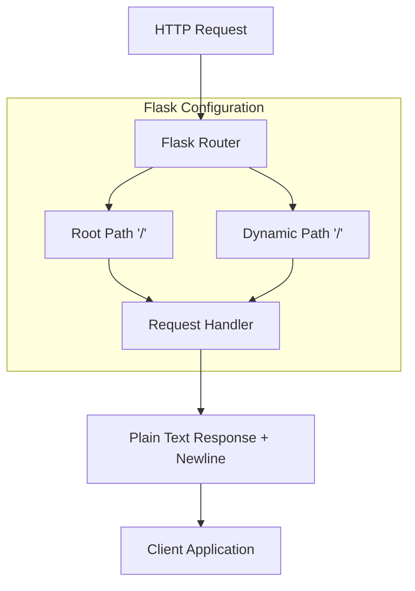
```mermaid
graph TD
    Request[HTTP Request] --> Router[Flask Router]
    Router --> Root[Root Path '/']
    Router --> Dynamic[Dynamic Path '/<path:path>']
    Root --> Handler[Request Handler]
    Dynamic --> Handler
    Handler --> Response[Plain Text Response + Newline]
    Response --> Client[Client Application]
    
    subgraph "Flask Configuration"
        Router
        Root
        Dynamic
        Handler
    end
```

This configuration ensures that all incoming requests receive identical treatment, maintaining the simplified request/response pattern established by the original Node.js implementation.

### 3.2.5 Framework Security Considerations

While the current implementation focuses on functional parity rather than security features, Flask 2.3.3 provides several inherent security benefits:

- **Request Validation**: Built-in protection against malformed HTTP requests
- **Path Traversal Protection**: Secure handling of dynamic path routing
- **Content Type Safety**: Proper MIME type handling for plain-text responses
- **Session Security**: ItsDangerous dependency provides secure session management (not currently utilized)

These security features are available for future enhancements while maintaining the current focus on behavioral equivalence with the Node.js implementation.

## 3.3 OPEN SOURCE DEPENDENCIES

### 3.3.1 Direct Dependencies

| Dependency | Version | Purpose | Source |
|------------|---------|---------|--------|
| Flask | 2.3.3 | Web framework | PyPI |

### 3.3.2 Package Management

The project uses pip, Python's standard package manager, for dependency resolution. Dependencies are defined in requirements.txt, enabling consistent environment setup with the `pip install -r requirements.txt` command.

### 3.3.3 Dependency Constraints

The current implementation pins the Flask version exactly (==2.3.3) to ensure reproducible builds. No other dependencies are explicitly required at this stage of development.

## 3.4 THIRD-PARTY SERVICES

The current implementation does not integrate with any third-party services, APIs, or external systems. As the project matures and implements the backpropagation functionality, it may require integration with:

- Machine learning model repositories
- Dataset providers
- Model evaluation services

However, these are speculative based on the project's name and purpose and are not yet reflected in the codebase.

## 3.5 DATABASES & STORAGE

### 3.5.1 Data Persistence

The current implementation does not include any database or persistent storage solutions. All service functionality is stateless, with no data retained between requests.

### 3.5.2 Future Storage Requirements

As the backpropagation testing functionality is implemented, the project may require:

- Storage for test datasets
- Persistence of model parameters and weights
- Caching of computation results

However, these requirements are not yet reflected in the codebase and would need to be addressed in future iterations.

## 3.6 DEVELOPMENT & DEPLOYMENT

### 3.6.1 Development Environment

The development environment is configured to support the Node.js to Python Flask migration project, providing consistent tooling for local development and testing.

#### Development Server Configuration

| Component | Detail | Purpose |
|-----------|--------|---------|
| Server | Flask built-in development server | Handles HTTP requests during development |
| Host binding | 127.0.0.1 (localhost) | Restricts access to local machine for security |
| Port | 3000 | Network port for service access (matches Node.js original) |
| Debug Mode | Disabled | Maintains production-equivalent behavior for parity testing |
| Auto-reload | Enabled | Supports rapid development iteration |

#### Development Tools

The project utilizes a minimal but effective development toolchain:

- **Code Editor**: Any Python-compatible IDE (VS Code, PyCharm, or similar)
- **Package Management**: pip (Python's standard package manager)
- **Virtual Environment**: venv or virtualenv for isolated dependency management
- **Version Control**: Git for source code management
- **Testing Framework**: unittest (Python standard library) for behavioral parity validation

#### Local Development Setup

```bash
# Create virtual environment
python -m venv venv

#### Activate virtual environment
source venv/bin/activate  # Linux/Mac
venv\Scripts\activate     # Windows

#### Install dependencies
pip install -r requirements.txt

#### Run development server
python app.py
```

### 3.6.2 Build & Deployment

The deployment architecture supports both development and production environments while maintaining behavioral parity with the original Node.js implementation.

#### Build System

**Current State**: The application uses a minimal build approach with direct Python execution:

```bash
python app.py
```

**Recommended Production Build Process**:

1. **Dependency Installation**: `pip install -r requirements.txt`
2. **Environment Configuration**: Set production environment variables
3. **Application Validation**: Run behavioral parity tests against Node.js baseline
4. **Security Scanning**: Validate dependencies for known vulnerabilities
5. **Performance Baseline**: Ensure response times match Node.js implementation

#### Containerization Strategy

While not currently implemented, the project architecture supports Docker containerization for consistent deployment:

```dockerfile
# Recommended Dockerfile structure
FROM python:3.6-slim

WORKDIR /app
COPY requirements.txt .
RUN pip install -r requirements.txt

COPY app.py .
EXPOSE 3000

CMD ["python", "app.py"]
```

#### Deployment Environments

| Environment | Purpose | Configuration |
|-------------|---------|---------------|
| Development | Local development and testing | Flask development server, debug logging |
| Staging | Pre-production validation | Production-like configuration, behavioral parity testing |
| Production | Live service deployment | Optimized performance, monitoring integration |

#### CI/CD Pipeline (Recommended)

**GitHub Actions Integration**:

```yaml
# Recommended CI/CD workflow
name: Flask Migration Pipeline
on: [push, pull_request]

jobs:
  test:
    runs-on: ubuntu-latest
    steps:
      - uses: actions/checkout@v2
      - name: Set up Python
        uses: actions/setup-python@v2
        with:
          python-version: '3.6'
      - name: Install dependencies
        run: pip install -r requirements.txt
      - name: Run behavioral parity tests
        run: python -m unittest discover tests/
```

### 3.6.3 Environment Requirements

The environment requirements are designed to support the Node.js to Python Flask migration while maintaining exact behavioral parity.

#### Core Runtime Requirements

- **Python**: <span style="background-color: rgba(91, 57, 243, 0.2)">3.6 or higher (based on Flask 2.3.3 requirements)</span>
- **pip**: Package manager for Python dependencies
- **Operating System**: Cross-platform compatibility (Linux, macOS, Windows)
- **Memory**: Minimum 512MB RAM for development, 1GB+ recommended for production
- **Network**: Internet access for PyPI package installation

#### Development Dependencies

| Dependency | Version | Purpose |
|------------|---------|---------|
| Flask | 2.3.3 | Web framework (exact version for Node.js parity) |
| Werkzeug | 2.3.x | HTTP utilities (Flask dependency) |
| Jinja2 | 3.x | Template engine (Flask dependency) |
| MarkupSafe | 2.x | String handling (Flask dependency) |
| ItsDangerous | 2.x | Data signing (Flask dependency) |
| Click | 8.x | CLI toolkit (Flask dependency) |

#### System Prerequisites

**For Development**:
- Python 3.6+ interpreter
- pip package manager
- Git for version control
- Text editor or IDE

**For Production Deployment**:
- Application server (Gunicorn, uWSGI) or container runtime
- Reverse proxy (Nginx, Apache) for production traffic
- Process management (systemd, supervisord)
- Monitoring tools for performance tracking

#### Environment Configuration

**Development Environment Variables**:
```bash
export FLASK_ENV=development
export FLASK_DEBUG=0  # Disabled for Node.js parity
export FLASK_HOST=127.0.0.1
export FLASK_PORT=3000
```

**Production Environment Variables**:
```bash
export FLASK_ENV=production
export FLASK_DEBUG=0
export FLASK_HOST=0.0.0.0
export FLASK_PORT=3000
```

### 3.6.4 Deployment Architecture

The deployment architecture supports scalable, production-ready deployment while maintaining the simplicity required for behavioral parity testing.

#### Deployment Patterns

**Single-Instance Deployment** (Current):
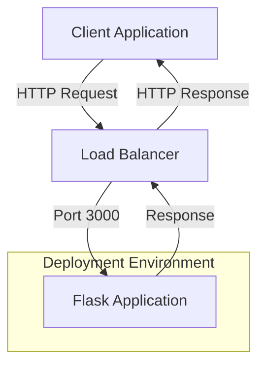
```mermaid
graph TD
    Client[Client Application] -->|HTTP Request| LB[Load Balancer]
    LB -->|Port 3000| App[Flask Application]
    App -->|Response| LB
    LB -->|HTTP Response| Client
    
    subgraph "Deployment Environment"
        App
    end
```

**Container-Based Deployment** (Recommended):
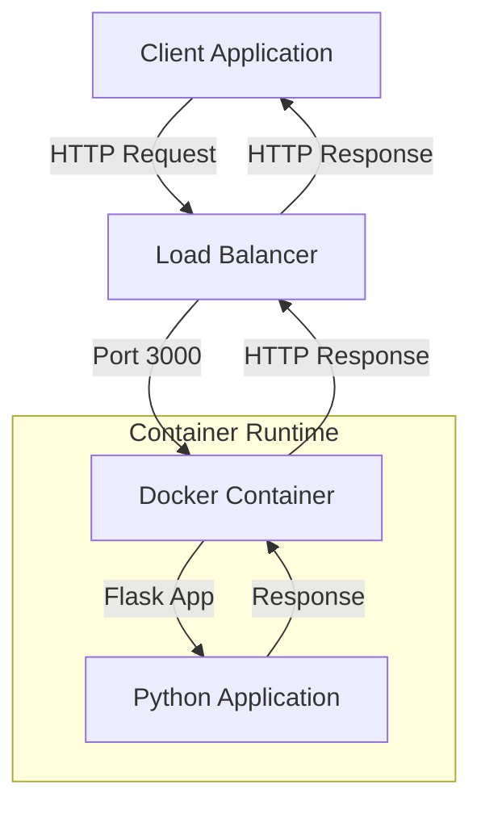
```mermaid
graph TD
    Client[Client Application] -->|HTTP Request| LB[Load Balancer]
    LB -->|Port 3000| Container[Docker Container]
    Container -->|Flask App| App[Python Application]
    App -->|Response| Container
    Container -->|HTTP Response| LB
    LB -->|HTTP Response| Client
    
    subgraph "Container Runtime"
        Container
        App
    end
```

#### Infrastructure Requirements

**Minimum Production Infrastructure**:
- **Compute**: 1 vCPU, 1GB RAM
- **Network**: HTTP/HTTPS traffic on port 3000
- **Storage**: 10GB for application and logs
- **Monitoring**: Health check endpoints for load balancer integration

**Recommended Production Infrastructure**:
- **Compute**: 2+ vCPUs, 2GB+ RAM for higher throughput
- **Network**: CDN integration for static content
- **Storage**: 20GB+ with log rotation
- **Monitoring**: Application performance monitoring (APM) integration
- **Security**: Web Application Firewall (WAF) and SSL/TLS termination

### 3.6.5 Performance Considerations

Performance optimization focuses on maintaining behavioral parity with the original Node.js implementation while ensuring production readiness.

#### Response Time Targets

- **Development**: <100ms for all requests (matching Node.js baseline)
- **Production**: <50ms for all requests with proper infrastructure
- **Throughput**: Support for concurrent requests matching Node.js capacity

#### Optimization Strategies

1. **Application Server**: Replace Flask development server with Gunicorn or uWSGI
2. **Caching**: Implement response caching if required for performance parity
3. **Connection Pooling**: Configure efficient database connections (future enhancement)
4. **Static Content**: Serve static assets through reverse proxy
5. **Monitoring**: Implement performance monitoring to track parity metrics

#### Scalability Planning

While the current implementation is stateless and simple, the architecture supports horizontal scaling:

- **Load Balancing**: Multiple Flask instances behind load balancer
- **Container Orchestration**: Kubernetes or Docker Swarm for container management
- **Auto-scaling**: Dynamic scaling based on request volume
- **Database Scaling**: Horizontal scaling preparation for future data requirements

This deployment strategy ensures that the Flask application can scale to match or exceed the performance characteristics of the original Node.js implementation while maintaining exact behavioral parity.

## 3.7 TECHNOLOGY STACK ARCHITECTURE

The current technology stack can be visualized as follows:

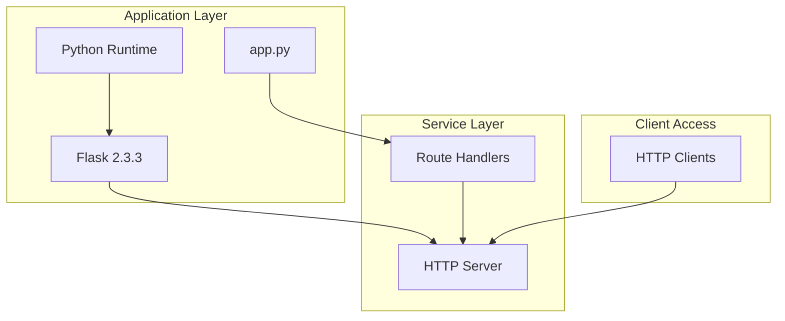
```mermaid
graph TD
    subgraph "Application Layer"
        py[Python Runtime]
        flask[Flask 2.3.3]
        app[app.py]
    end
    
    subgraph "Service Layer"
        http[HTTP Server]
        routes[Route Handlers]
    end
    
    subgraph "Client Access"
        client[HTTP Clients]
    end
    
    py --> flask
    flask --> http
    app --> routes
    routes --> http
    client --> http
```

### 3.7.1 Technology Integration Points

The minimal nature of the current implementation results in few technology integration points:

1. **Python Runtime to Flask Framework**: The Flask library is imported and initialized in app.py
2. **Flask Framework to HTTP Service**: Flask provides the HTTP server capability through its development server
3. **Route Definitions to Request Handling**: Flask routes (/ and /<path:path>) connect HTTP requests to the response handler

## 3.8 TECHNOLOGY CONSTRAINTS AND LIMITATIONS

### 3.8.1 Current Limitations

The current technology stack has several limitations:

1. **Development-Only Server**: The Flask built-in server is not suitable for production use
2. **Limited Scalability**: No provisions for scaling beyond a single process on a single machine
3. **No Security Measures**: Lack of authentication, authorization, or encryption

### 3.8.2 Technical Debt

Areas of technical debt in the current implementation include:

1. **Lack of Automated Testing**: No test framework or test cases are included
2. **Missing Production Configuration**: No WSGI server configuration for production deployment

### 3.8.3 Mitigation Strategies

To address the identified constraints and limitations, the following mitigation strategies should be considered:

#### 3.8.3.1 Production Readiness

- **WSGI Server Implementation**: Deploy Flask applications using production-grade WSGI servers such as Gunicorn or uWSGI
- **Reverse Proxy Configuration**: Implement Nginx or Apache as reverse proxy for static file serving and load balancing
- **Security Headers**: Add security middleware for HTTPS enforcement, CORS handling, and header protection

#### 3.8.3.2 Scalability Improvements

- **Horizontal Scaling**: Implement load balancing across multiple Flask instances
- **Database Optimization**: Add connection pooling and query optimization for MongoDB operations
- **Caching Strategy**: Implement Redis or Memcached for session management and response caching

#### 3.8.3.3 Security Enhancements

- **Authentication Integration**: Implement Auth0 integration for secure user authentication
- **Input Validation**: Add comprehensive input sanitization and validation middleware
- **Rate Limiting**: Implement API rate limiting to prevent abuse and ensure service availability

#### 3.8.3.4 Testing and Quality Assurance

- **Test Framework Implementation**: Integrate pytest for unit testing and integration testing
- **Code Coverage**: Implement coverage reporting to ensure comprehensive test coverage
- **Automated Testing Pipeline**: Set up continuous integration with GitHub Actions for automated testing

### 3.8.4 Technology Evolution Path

The current constraints represent a foundation that can be systematically addressed through planned technology evolution:

#### 3.8.4.1 Short-term Improvements (0-3 months)

- Address production deployment limitations through WSGI server configuration
- Implement basic security measures including HTTPS and input validation
- Establish automated testing framework and initial test coverage

#### 3.8.4.2 Medium-term Enhancements (3-6 months)

- Implement comprehensive authentication and authorization system
- Add scalability features including load balancing and database optimization
- Integrate monitoring and logging solutions for production visibility

#### 3.8.4.3 Long-term Strategic Goals (6+ months)

- Evaluate microservices architecture for improved scalability
- Implement advanced caching and performance optimization
- Consider containerization with Docker for improved deployment consistency

### 3.8.5 Risk Assessment

The identified limitations present manageable risks that can be addressed through systematic implementation:

| Risk Category | Impact Level | Mitigation Priority | Timeline |
|---------------|--------------|-------------------|----------|
| Production Deployment | High | Critical | Immediate |
| Security Vulnerabilities | High | Critical | Immediate |
| Scalability Bottlenecks | Medium | High | Short-term |
| Testing Coverage | Medium | High | Short-term |
| Performance Optimization | Low | Medium | Medium-term |

This risk assessment guides the prioritization of constraint mitigation efforts, ensuring critical production readiness issues are addressed before scalability and optimization concerns.

## 3.9 REFERENCES

The technology stack assessment is based on the following repository files:

- app.py: Defines the Flask application, routes, and server configuration
- requirements.txt: Specifies Flask 2.3.3 as the only explicit dependency
- README.md: Provides the project name and description indicating backpropagation integration testing purpose

# 4. PROCESS FLOWCHART

## 4.1 CURRENT SYSTEM WORKFLOWS

### 4.1.1 HTTP Request Processing Flow

The current implementation processes HTTP requests through a simple, linear workflow:

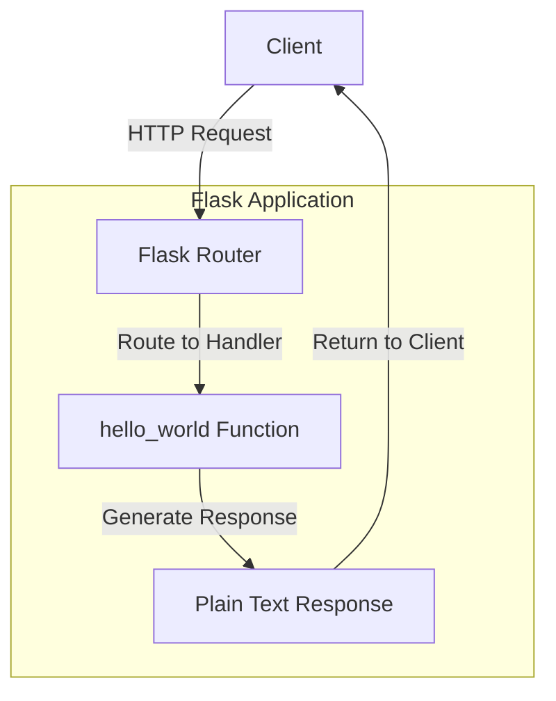
```mermaid
flowchart TD
    A[Client] -->|HTTP Request| B[Flask Router]
    B -->|Route to Handler| C[hello_world Function]
    C -->|Generate Response| D[Plain Text Response]
    D -->|Return to Client| A
    
    subgraph Flask Application
        B
        C
        D
    end
```

### 4.1.2 Application Execution Flow

The application startup and execution process follows this sequence:

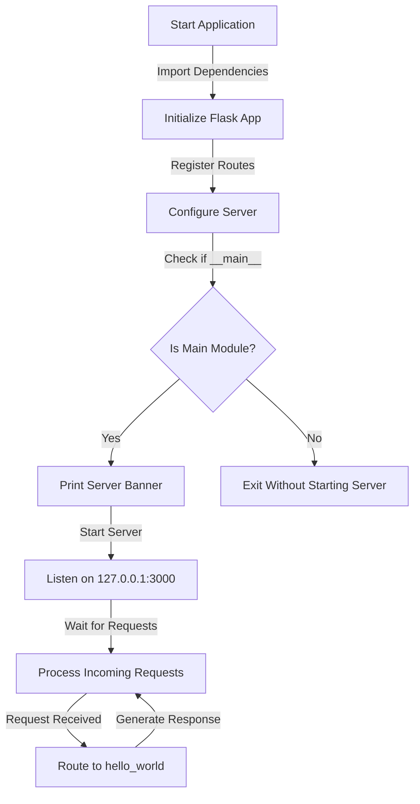
```mermaid
flowchart TD
    A[Start Application] -->|Import Dependencies| B[Initialize Flask App]
    B -->|Register Routes| C[Configure Server]
    C -->|Check if __main__| D{Is Main Module?}
    D -->|Yes| E[Print Server Banner]
    E -->|Start Server| F[Listen on 127.0.0.1:3000]
    F -->|Wait for Requests| G[Process Incoming Requests]
    G -->|Request Received| H[Route to hello_world]
    H -->|Generate Response| G
    D -->|No| I[Exit Without Starting Server]
```

### 4.1.3 Current Request-Response Cycle

The detailed flow of a single request through the system:

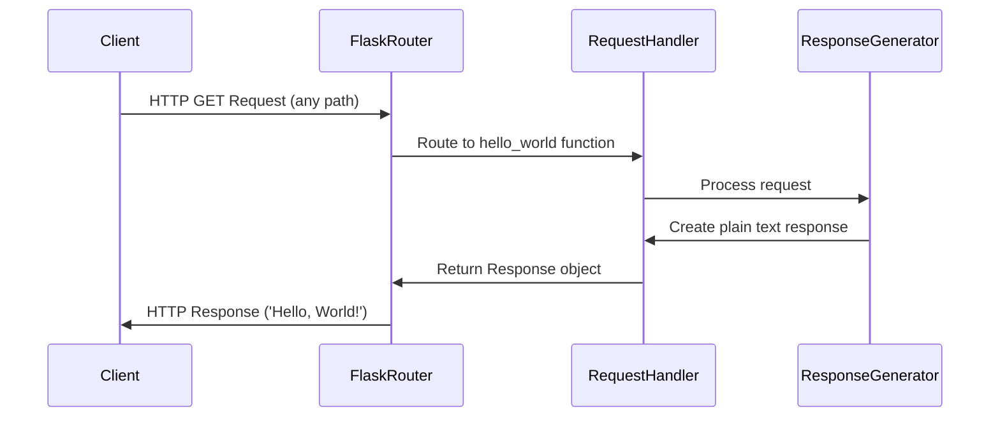
```mermaid
sequenceDiagram
    participant Client
    participant FlaskRouter
    participant RequestHandler
    participant ResponseGenerator
    
    Client->>FlaskRouter: HTTP GET Request (any path)
    FlaskRouter->>RequestHandler: Route to hello_world function
    RequestHandler->>ResponseGenerator: Process request
    ResponseGenerator->>RequestHandler: Create plain text response
    RequestHandler->>FlaskRouter: Return Response object
    FlaskRouter->>Client: HTTP Response ('Hello, World!')
```

## 4.2 PROJECTED FUTURE WORKFLOWS

### 4.2.1 Backpropagation Testing Workflow

Based on the project's name and purpose, the future implementation will likely support backpropagation testing with the following workflow:

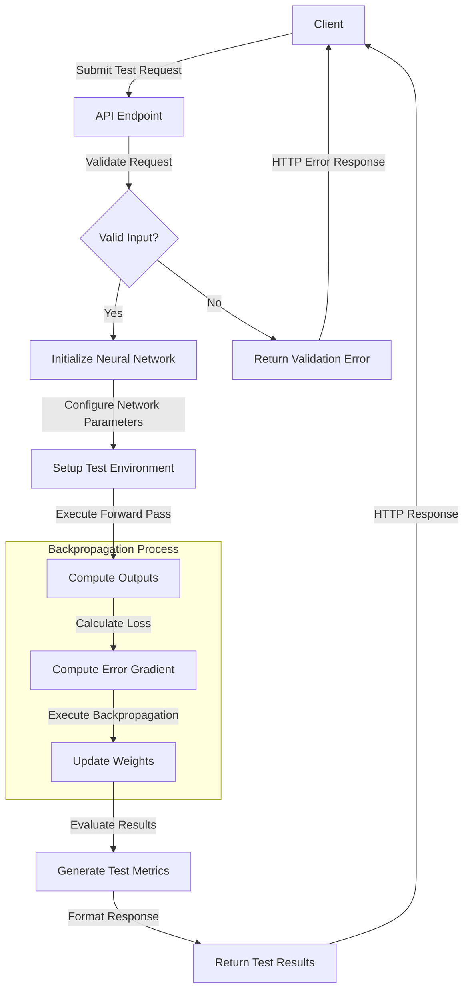
```mermaid
flowchart TD
    A[Client] -->|Submit Test Request| B[API Endpoint]
    B -->|Validate Request| C{Valid Input?}
    C -->|Yes| D[Initialize Neural Network]
    C -->|No| E[Return Validation Error]
    D -->|Configure Network Parameters| F[Setup Test Environment]
    F -->|Execute Forward Pass| G[Compute Outputs]
    G -->|Calculate Loss| H[Compute Error Gradient]
    H -->|Execute Backpropagation| I[Update Weights]
    I -->|Evaluate Results| J[Generate Test Metrics]
    J -->|Format Response| K[Return Test Results]
    K -->|HTTP Response| A
    E -->|HTTP Error Response| A
    
    subgraph Backpropagation Process
        G
        H
        I
    end
```

### 4.2.2 Neural Network Training Process

The projected training workflow for neural networks:

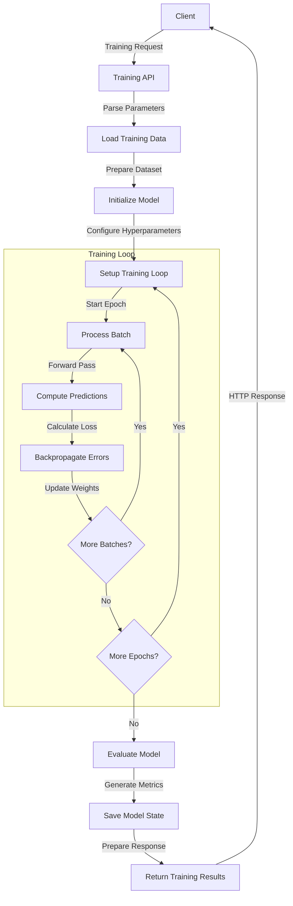
```mermaid
flowchart TD
    A[Client] -->|Training Request| B[Training API]
    B -->|Parse Parameters| C[Load Training Data]
    C -->|Prepare Dataset| D[Initialize Model]
    D -->|Configure Hyperparameters| E[Setup Training Loop]
    
    E -->|Start Epoch| F[Process Batch]
    F -->|Forward Pass| G[Compute Predictions]
    G -->|Calculate Loss| H[Backpropagate Errors]
    H -->|Update Weights| I{More Batches?}
    I -->|Yes| F
    I -->|No| J{More Epochs?}
    J -->|Yes| E
    J -->|No| K[Evaluate Model]
    
    K -->|Generate Metrics| L[Save Model State]
    L -->|Prepare Response| M[Return Training Results]
    M -->|HTTP Response| A
    
    subgraph Training Loop
        E
        F
        G
        H
        I
        J
    end
```

### 4.2.3 Integration Testing Workflow

The workflow for testing integration with external ML systems:

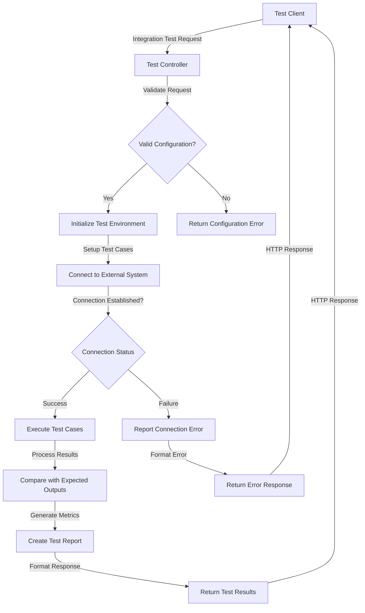
```mermaid
flowchart TD
    A[Test Client] -->|Integration Test Request| B[Test Controller]
    B -->|Validate Request| C{Valid Configuration?}
    
    C -->|Yes| D[Initialize Test Environment]
    C -->|No| E[Return Configuration Error]
    
    D -->|Setup Test Cases| F[Connect to External System]
    F -->|Connection Established?| G{Connection Status}
    
    G -->|Success| H[Execute Test Cases]
    G -->|Failure| I[Report Connection Error]
    
    H -->|Process Results| J[Compare with Expected Outputs]
    J -->|Generate Metrics| K[Create Test Report]
    
    I -->|Format Error| L[Return Error Response]
    K -->|Format Response| M[Return Test Results]
    
    L -->|HTTP Response| A
    M -->|HTTP Response| A
```

## 4.3 TECHNICAL IMPLEMENTATION FLOWCHARTS

### 4.3.1 Current Flask Application Architecture (updated)

<span style="background-color: rgba(91, 57, 243, 0.2)">The architecture flow has been enhanced with modular components including configuration management, middleware processing, and utility functions to support the Node.js to Python Flask migration while maintaining exact behavioral parity</span>:

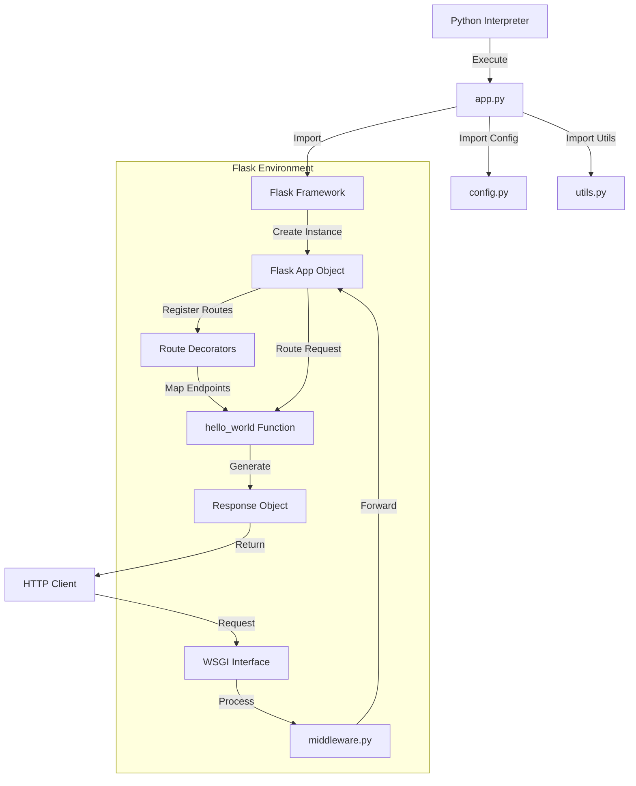
```mermaid
flowchart TD
    A[Python Interpreter] -->|Execute| B[app.py]
    B -->|Import Config| C[config.py]
    B -->|Import Utils| D[utils.py]
    B -->|Import| E[Flask Framework]
    E -->|Create Instance| F[Flask App Object]
    F -->|Register Routes| G[Route Decorators]
    G -->|Map Endpoints| H[hello_world Function]
    H -->|Generate| I[Response Object]

    J[HTTP Client] -->|Request| K[WSGI Interface]
    K -->|Process| L[middleware.py]
    L -->|Forward| F
    F -->|Route Request| H
    I -->|Return| J

    subgraph Flask Environment
        E
        F
        G
        H
        I
        K
        L
    end
```

<span style="background-color: rgba(91, 57, 243, 0.2)">**Middleware Processing Layer**: The middleware.py module centralizes cross-cutting concerns such as header manipulation, request logging, error interception, and response formatting to mirror the original Node.js middleware behavior. This ensures consistent request processing patterns while maintaining the Flask framework's simplicity and the required behavioral parity with the legacy Node.js implementation.</span>

#### 4.3.1.1 Component Integration Flow

<span style="background-color: rgba(91, 57, 243, 0.2)">The modular architecture supports enhanced maintainability and feature expansion while preserving the core behavioral requirements</span>:

| Component | Purpose | Integration Point |
|-----------|---------|------------------|
| **config.py** | **Configuration management and environment settings** | **Imported during application initialization** |
| **middleware.py** | **Request/response processing and cross-cutting concerns** | **Integrated into WSGI request pipeline** |
| **utils.py** | **Shared utility functions and helper methods** | **Imported for common operations** |
| Flask App Object | Core application instance | Orchestrates request routing and response generation |
| Route Decorators | URL pattern mapping | Connects HTTP endpoints to handler functions |

#### 4.3.1.2 Request Processing Pipeline

The enhanced request flow incorporates middleware processing to ensure consistent behavior:

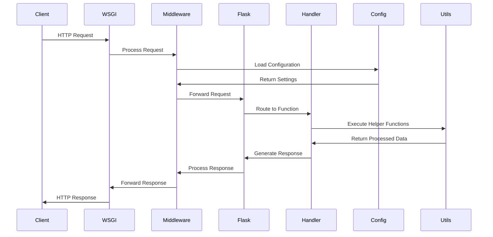
```mermaid
sequenceDiagram
    participant Client
    participant WSGI
    participant Middleware
    participant Flask
    participant Handler
    participant Config
    participant Utils
    
    Client->>WSGI: HTTP Request
    WSGI->>Middleware: Process Request
    Middleware->>Config: Load Configuration
    Config->>Middleware: Return Settings
    Middleware->>Flask: Forward Request
    Flask->>Handler: Route to Function
    Handler->>Utils: Execute Helper Functions
    Utils->>Handler: Return Processed Data
    Handler->>Flask: Generate Response
    Flask->>Middleware: Process Response
    Middleware->>WSGI: Forward Response
    WSGI->>Client: HTTP Response
```

#### 4.3.1.3 Error Handling and Recovery

<span style="background-color: rgba(91, 57, 243, 0.2)">The middleware layer implements comprehensive error handling to maintain system stability and consistent error responses</span>:

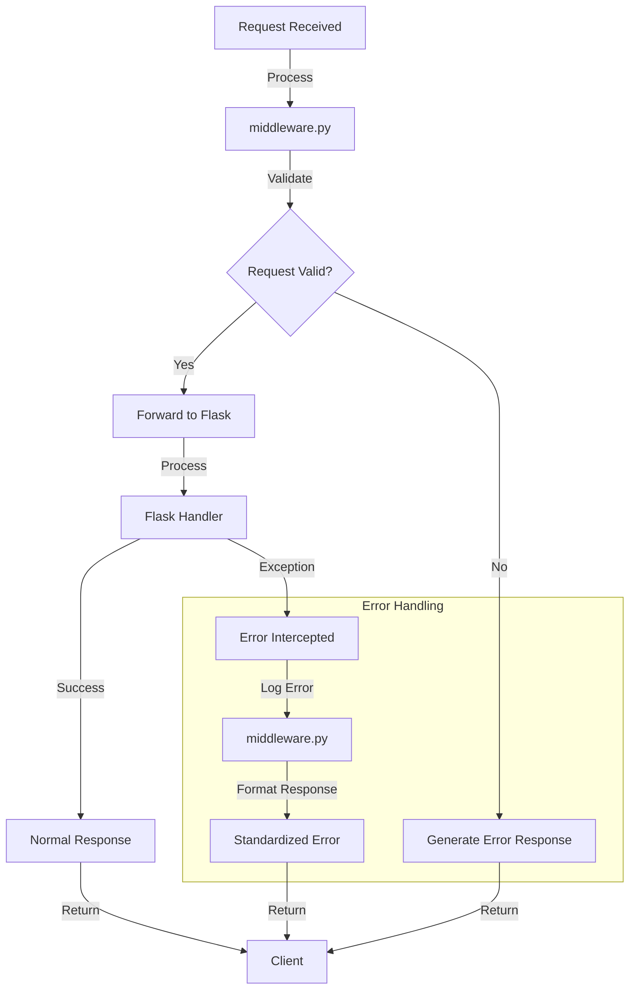
```mermaid
flowchart TD
    A[Request Received] -->|Process| B[middleware.py]
    B -->|Validate| C{Request Valid?}
    C -->|Yes| D[Forward to Flask]
    C -->|No| E[Generate Error Response]
    D -->|Process| F[Flask Handler]
    F -->|Success| G[Normal Response]
    F -->|Exception| H[Error Intercepted]
    H -->|Log Error| I[middleware.py]
    I -->|Format Response| J[Standardized Error]
    E -->|Return| K[Client]
    G -->|Return| K
    J -->|Return| K
    
    subgraph Error Handling
        E
        H
        I
        J
    end
```

#### 4.3.1.4 State Management and Persistence

The architecture maintains stateless operation while providing configuration persistence:

- **Configuration State**: Managed through config.py for environment-specific settings
- **Request State**: Maintained within middleware.py for request lifecycle management
- **Application State**: Preserved in Flask app instance for route and handler registration
- **Utility State**: Stateless helper functions in utils.py for reusable operations

### 4.3.2 Projected Backpropagation Implementation

The projected technical architecture for backpropagation functionality:

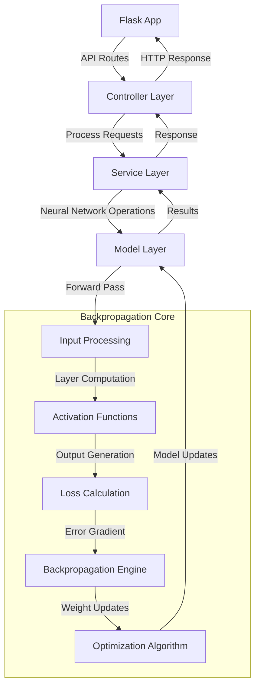
```mermaid
flowchart TD
    A[Flask App] -->|API Routes| B[Controller Layer]
    
    B -->|Process Requests| C[Service Layer]
    C -->|Neural Network Operations| D[Model Layer]
    
    D -->|Forward Pass| E[Input Processing]
    E -->|Layer Computation| F[Activation Functions]
    F -->|Output Generation| G[Loss Calculation]
    
    G -->|Error Gradient| H[Backpropagation Engine]
    H -->|Weight Updates| I[Optimization Algorithm]
    I -->|Model Updates| D
    
    D -->|Results| C
    C -->|Response| B
    B -->|HTTP Response| A
    
    subgraph Backpropagation Core
        E
        F
        G
        H
        I
    end
```

#### 4.3.2.1 Neural Network Training Workflow

The comprehensive training process integrates with the Flask middleware architecture:

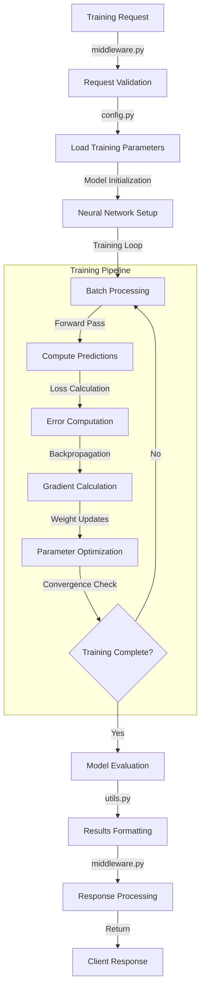
```mermaid
flowchart TD
    A[Training Request] -->|middleware.py| B[Request Validation]
    B -->|config.py| C[Load Training Parameters]
    C -->|Model Initialization| D[Neural Network Setup]
    
    D -->|Training Loop| E[Batch Processing]
    E -->|Forward Pass| F[Compute Predictions]
    F -->|Loss Calculation| G[Error Computation]
    G -->|Backpropagation| H[Gradient Calculation]
    H -->|Weight Updates| I[Parameter Optimization]
    
    I -->|Convergence Check| J{Training Complete?}
    J -->|No| E
    J -->|Yes| K[Model Evaluation]
    
    K -->|utils.py| L[Results Formatting]
    L -->|middleware.py| M[Response Processing]
    M -->|Return| N[Client Response]
    
    subgraph Training Pipeline
        E
        F
        G
        H
        I
        J
    end
```

#### 4.3.2.2 Integration with Current Architecture

The backpropagation functionality seamlessly integrates with the enhanced Flask architecture:

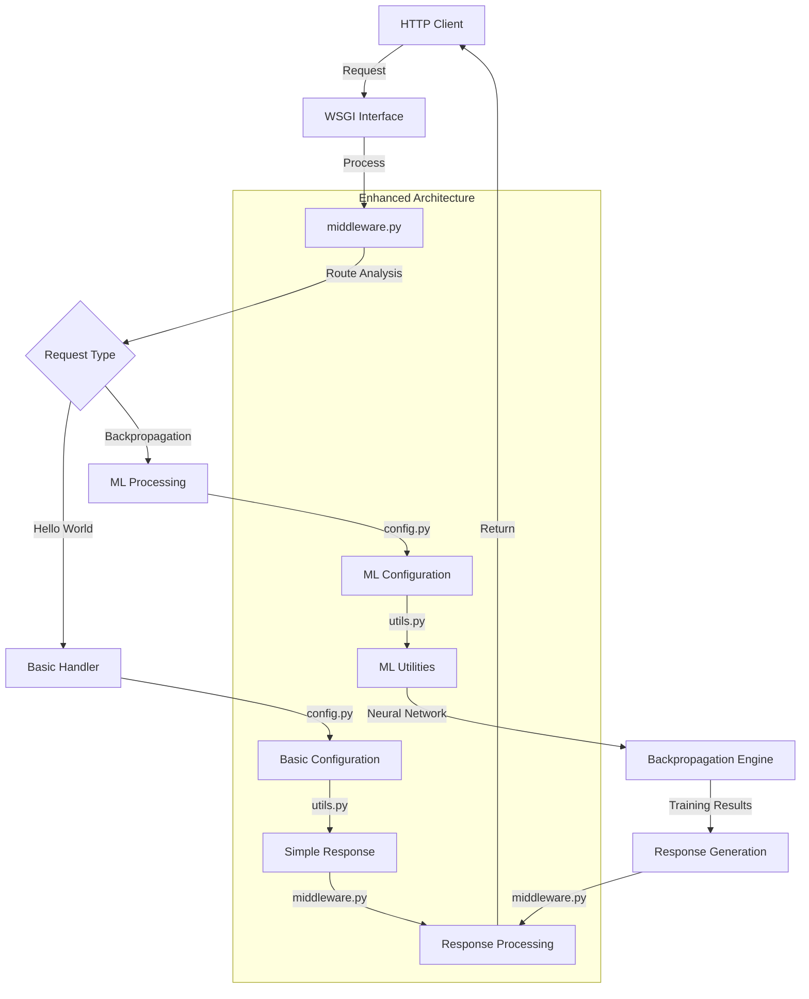
```mermaid
flowchart TD
    A[HTTP Client] -->|Request| B[WSGI Interface]
    B -->|Process| C[middleware.py]
    C -->|Route Analysis| D{Request Type}
    
    D -->|Hello World| E[Basic Handler]
    D -->|Backpropagation| F[ML Processing]
    
    E -->|config.py| G[Basic Configuration]
    F -->|config.py| H[ML Configuration]
    
    G -->|utils.py| I[Simple Response]
    H -->|utils.py| J[ML Utilities]
    
    J -->|Neural Network| K[Backpropagation Engine]
    K -->|Training Results| L[Response Generation]
    
    I -->|middleware.py| M[Response Processing]
    L -->|middleware.py| M
    M -->|Return| A
    
    subgraph Enhanced Architecture
        C
        G
        H
        I
        J
        M
    end
```

### 4.3.3 System State Transitions

The application manages state transitions across different operational modes:

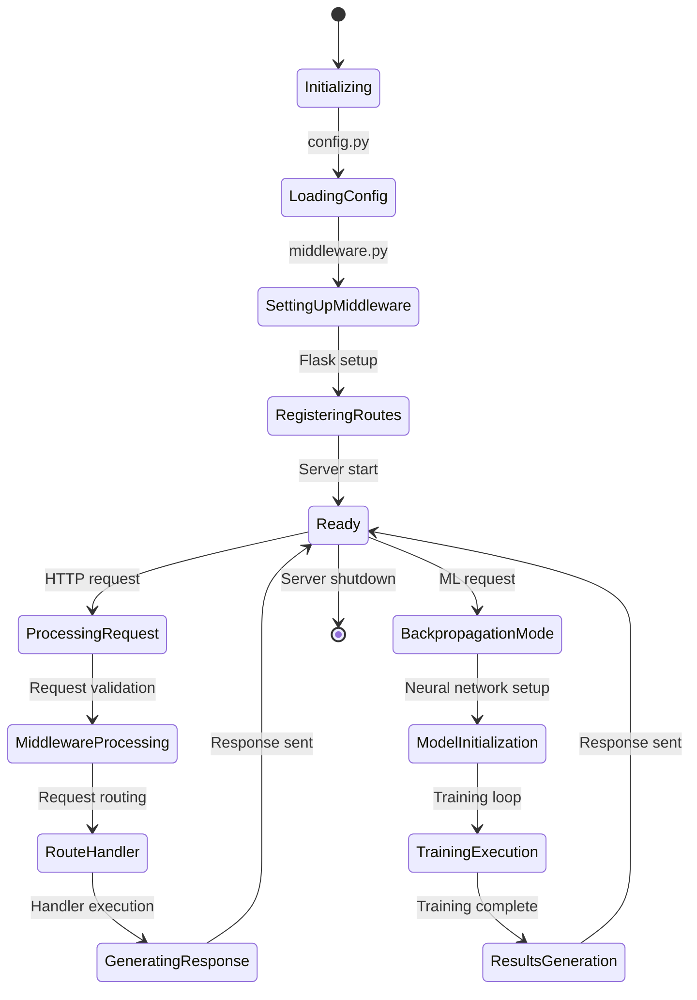
```mermaid
stateDiagram-v2
    [*] --> Initializing
    Initializing --> LoadingConfig: config.py
    LoadingConfig --> SettingUpMiddleware: middleware.py
    SettingUpMiddleware --> RegisteringRoutes: Flask setup
    RegisteringRoutes --> Ready: Server start
    
    Ready --> ProcessingRequest: HTTP request
    ProcessingRequest --> MiddlewareProcessing: Request validation
    MiddlewareProcessing --> RouteHandler: Request routing
    RouteHandler --> GeneratingResponse: Handler execution
    GeneratingResponse --> Ready: Response sent
    
    Ready --> BackpropagationMode: ML request
    BackpropagationMode --> ModelInitialization: Neural network setup
    ModelInitialization --> TrainingExecution: Training loop
    TrainingExecution --> ResultsGeneration: Training complete
    ResultsGeneration --> Ready: Response sent
    
    Ready --> [*]: Server shutdown
```

### 4.3.4 Error Handling and Recovery Workflows

Comprehensive error handling ensures system reliability across all operational states:

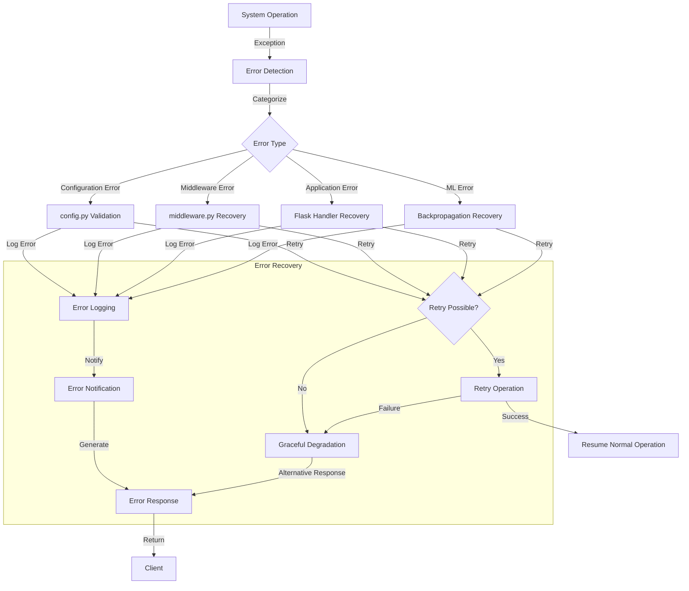
```mermaid
flowchart TD
    A[System Operation] -->|Exception| B[Error Detection]
    B -->|Categorize| C{Error Type}
    
    C -->|Configuration Error| D[config.py Validation]
    C -->|Middleware Error| E[middleware.py Recovery]
    C -->|Application Error| F[Flask Handler Recovery]
    C -->|ML Error| G[Backpropagation Recovery]
    
    D -->|Log Error| H[Error Logging]
    E -->|Log Error| H
    F -->|Log Error| H
    G -->|Log Error| H
    
    H -->|Notify| I[Error Notification]
    I -->|Generate| J[Error Response]
    J -->|Return| K[Client]
    
    D -->|Retry| L{Retry Possible?}
    E -->|Retry| L
    F -->|Retry| L
    G -->|Retry| L
    
    L -->|Yes| M[Retry Operation]
    L -->|No| N[Graceful Degradation]
    
    M -->|Success| O[Resume Normal Operation]
    M -->|Failure| N
    N -->|Alternative Response| J
    
    subgraph Error Recovery
        H
        I
        J
        L
        M
        N
    end
```

### 4.3.5 Performance Monitoring and Optimization

The architecture includes performance monitoring capabilities to ensure Node.js behavioral parity:

```mermaid
flowchart TD
    A[Request Received] -->|Timestamp| B[Performance Tracking]
    B -->|middleware.py| C[Request Processing]
    C -->|Measure| D[Processing Time]
    D -->|Flask Handler| E[Response Generation]
    E -->|Measure| F[Response Time]
    F -->|Compare| G[Baseline Metrics]
    G -->|Evaluate| H{Performance Target?}
    
    H -->|Met| I[Normal Operation]
    H -->|Not Met| J[Performance Alert]
    
    I -->|Log| K[Performance Metrics]
    J -->|Log| K
    K -->|Analyze| L[Performance Analysis]
    L -->|Optimize| M[System Tuning]
    M -->|Update| N[Configuration Adjustment]
    
    subgraph Performance Management
        B
        D
        F
        G
        H
        K
        L
    end
```

This comprehensive technical implementation framework ensures that the Flask application maintains exact behavioral parity with the original Node.js server while providing the architectural foundation for enhanced functionality including backpropagation testing capabilities.

## 4.4 STATE MANAGEMENT

### 4.4.1 Current State Management

The current implementation is stateless with no persistence between requests:

```mermaid
stateDiagram-v2
    [*] --> ServerInitialization
    ServerInitialization --> Ready: Flask App Created
    
    Ready --> ProcessingRequest: HTTP Request Received
    ProcessingRequest --> Ready: Response Sent
    
    Ready --> [*]: Server Shutdown
```

### 4.4.2 Projected Future State Management

The projected state management for backpropagation testing:

```mermaid
stateDiagram-v2
    [*] --> ServerInitialization
    ServerInitialization --> Idle: System Ready
    
    Idle --> ConfiguringTest: Test Request Received
    ConfiguringTest --> ModelInitialization: Configuration Validated
    ConfiguringTest --> ErrorState: Invalid Configuration
    
    ModelInitialization --> Training: Start Training Process
    Training --> Backpropagation: Forward Pass Complete
    Backpropagation --> Training: Weights Updated
    
    Training --> Evaluation: Training Complete
    Evaluation --> ResultGeneration: Metrics Calculated
    ResultGeneration --> Idle: Results Returned
    
    ErrorState --> Idle: Error Response Sent
    
    Idle --> [*]: Server Shutdown
```

## 4.5 ERROR HANDLING PROCESSES

### 4.5.1 Current Error Handling (updated)

<span style="background-color: rgba(91, 57, 243, 0.2)">The current implementation has been enhanced with a structured error handling architecture that introduces a middleware layer for centralized error interception and custom error response generation that mirrors Node.js behavior patterns</span>:

```mermaid
flowchart TD
    A[HTTP Request] --> B[Middleware Layer]
    B -->|Pass Through| C{Route Match?}
    C -->|No| D[404 Not Found Handler]
    C -->|Yes| E{Unhandled Exception?}
    E -->|Yes| F[500 Error Handler]
    E -->|No| G[hello_world Function]
    D --> H[HTTP 404 Response]
    F --> I[HTTP 500 Response]
    G --> J[HTTP 200 Response]
    
    subgraph Error Handling Pipeline
        D
        F
        H
        I
    end
    
    subgraph Middleware Processing
        B
        C
        E
    end
```

#### 4.5.1.1 Middleware Layer Architecture

<span style="background-color: rgba(91, 57, 243, 0.2)">The middleware.py component serves as the central error interception layer, processing all incoming requests before they reach the Flask routing system. This architecture ensures consistent error handling behavior that matches Node.js server patterns</span>:

| Component | Function | Error Handling Responsibility |
|-----------|----------|------------------------------|
| **Middleware Layer** | **Request preprocessing and error interception** | **Validates request structure and catches routing errors** |
| **Route Matching** | **Determines if valid endpoint exists** | **Generates 404 responses for invalid routes** |
| **Exception Handling** | **Catches unhandled application errors** | **Generates 500 responses for internal errors** |
| Error Response Generation | Formats error responses consistently | Mirrors Node.js error response structure |

#### 4.5.1.2 Error Response Patterns

<span style="background-color: rgba(91, 57, 243, 0.2)">The error handling system generates standardized HTTP responses that maintain behavioral parity with Node.js server implementations</span>:

**404 Not Found Handler**: Triggered when the middleware layer detects requests to non-existent endpoints, returning a structured error response that includes appropriate HTTP status codes and error messages consistent with Node.js conventions.

**500 Internal Server Error Handler**: Activated when the middleware layer catches unhandled exceptions during request processing, providing comprehensive error logging and client-appropriate error responses while maintaining system stability.

**200 Success Response**: Generated by the hello_world function for valid requests that complete successfully, ensuring consistent response formatting and proper HTTP status code application.

#### 4.5.1.3 Error Recovery Mechanisms

The enhanced error handling architecture implements robust recovery patterns:

```mermaid
flowchart TD
    A[Error Detected] -->|Classify| B{Error Type}
    B -->|Routing Error| C[404 Handler]
    B -->|Application Error| D[500 Handler]
    B -->|No Error| E[Success Handler]
    
    C -->|Log Error| F[Error Logging]
    D -->|Log Error| F
    E -->|Log Success| G[Success Logging]
    
    F -->|Generate Response| H[Error Response]
    G -->|Generate Response| I[Success Response]
    
    H -->|Return to Client| J[Client Response]
    I -->|Return to Client| J
    
    subgraph Recovery Process
        F
        G
        H
        I
    end
```

### 4.5.2 Projected Error Handling for ML Processes

The projected error handling workflow for machine learning operations integrates seamlessly with the enhanced middleware architecture:

```mermaid
flowchart TD
    A[Request Processing] -->|Middleware Layer| B[Request Validation]
    B -->|Validate Input| C{Valid Input?}
    C -->|No| D[Input Validation Error]
    C -->|Yes| E{Model Initialization}
    
    E -->|Success| F[Proceed with Operation]
    E -->|Failure| G[Model Error]
    
    F -->|Execute| H{Computation Process}
    H -->|Success| I[Generate Result]
    H -->|Numerical Error| J[Computational Error]
    H -->|Timeout| K[Performance Error]
    
    D -->|Log & Return| L[400 Bad Request]
    G -->|Log & Return| M[500 Internal Error]
    J -->|Log & Return| N[422 Unprocessable Entity]
    K -->|Log & Return| O[408 Request Timeout]
    
    I -->|Format & Return| P[200 Success Response]
    
    subgraph Error Categories
        D
        G
        J
        K
    end
    
    subgraph Response Types
        L
        M
        N
        O
        P
    end
    
    subgraph ML Processing Pipeline
        E
        F
        H
        I
    end
```

#### 4.5.2.1 ML-Specific Error Handling

The machine learning error handling extends the base middleware architecture to address domain-specific challenges:

**Input Validation Errors**: Comprehensive validation of neural network parameters, training data formats, and configuration settings before processing begins. The middleware layer performs preliminary validation while specialized validators handle ML-specific requirements.

**Model Initialization Errors**: Robust error handling for neural network instantiation, including memory allocation failures, parameter validation, and dependency verification. These errors are caught early in the processing pipeline to prevent resource waste.

**Computational Errors**: Advanced error handling for numerical computation issues including overflow, underflow, convergence failures, and matrix operation errors. The system implements automatic retry mechanisms and graceful degradation strategies.

**Performance Errors**: Timeout handling for long-running operations, memory limit enforcement, and CPU usage monitoring. These mechanisms ensure system stability during intensive ML computations.

#### 4.5.2.2 Integration with Current Architecture

The ML error handling system leverages the existing middleware foundation:

```mermaid
flowchart TD
    A[HTTP Request] -->|Process| B[Middleware Layer]
    B -->|Route Analysis| C{Request Type}
    
    C -->|Standard Request| D[Standard Error Handling]
    C -->|ML Request| E[ML-Enhanced Error Handling]
    
    D -->|404/500 Processing| F[Basic Error Responses]
    E -->|ML-Specific Validation| G[ML Error Processing]
    
    G -->|Input Errors| H[400 Bad Request]
    G -->|Model Errors| I[500 Internal Error]
    G -->|Computation Errors| J[422 Unprocessable Entity]
    G -->|Timeout Errors| K[408 Request Timeout]
    
    F -->|Return Response| L[Client]
    H -->|Return Response| L
    I -->|Return Response| L
    J -->|Return Response| L
    K -->|Return Response| L
    
    subgraph Enhanced Middleware
        B
        C
        D
        E
    end
    
    subgraph ML Error Pipeline
        G
        H
        I
        J
        K
    end
```

### 4.5.3 Error Logging and Monitoring

The comprehensive error handling system includes robust logging and monitoring capabilities:

#### 4.5.3.1 Error Classification System

| Error Category | HTTP Status Code | Logging Level | Recovery Action |
|----------------|------------------|---------------|-----------------|
| Routing Errors | 404 | INFO | Route to default handler |
| Application Errors | 500 | ERROR | Graceful degradation |
| Input Validation | 400 | WARNING | Request parameter correction |
| Model Errors | 500 | ERROR | Model reinitialization |
| Computational Errors | 422 | WARNING | Alternative computation path |
| Timeout Errors | 408 | WARNING | Request retry mechanism |

#### 4.5.3.2 Monitoring Integration

The error handling system integrates with system monitoring to provide comprehensive operational insights:

```mermaid
flowchart TD
    A[Error Detected] -->|Classify| B[Error Categorization]
    B -->|Log Event| C[Error Logging]
    C -->|Update Metrics| D[Performance Monitoring]
    D -->|Threshold Check| E{Alert Threshold?}
    
    E -->|Exceeded| F[Alert Generation]
    E -->|Normal| G[Continue Monitoring]
    
    F -->|Notify| H[Operations Team]
    G -->|Track| I[Metrics Dashboard]
    
    H -->|Investigate| J[Error Analysis]
    I -->|Review| K[Performance Analysis]
    
    J -->|Resolve| L[System Optimization]
    K -->|Optimize| L
    
    subgraph Monitoring Pipeline
        C
        D
        E
        F
        G
    end
```

### 4.5.4 Error Recovery Strategies

The system implements multiple recovery strategies to maintain operational continuity:

#### 4.5.4.1 Automatic Recovery Mechanisms

**Retry Logic**: Implements exponential backoff for transient errors, with configurable retry limits and timeout periods. The middleware layer manages retry attempts while maintaining request context.

**Graceful Degradation**: Provides alternative response paths when primary processing fails, ensuring clients receive meaningful responses even during system stress or partial failures.

**Circuit Breaker Pattern**: Monitors error rates and automatically disables problematic components to prevent cascading failures, with automatic recovery when stability is restored.

#### 4.5.4.2 Manual Recovery Procedures

**Error State Reset**: Provides administrative endpoints for clearing error states and resetting system components without requiring full service restart.

**Configuration Reload**: Enables dynamic configuration updates to address configuration-related errors without service interruption.

**Health Check Integration**: Implements comprehensive health checks that validate all system components and provide detailed status information for troubleshooting.

### 4.5.5 Error Response Formatting

The error handling system generates consistent, informative error responses that maintain Node.js behavioral parity:

#### 4.5.5.1 Standard Error Response Structure

All error responses follow a consistent format that includes:

- **HTTP Status Code**: Appropriate status code based on error type
- **Error Message**: Clear, user-friendly error description
- **Error Code**: Internal error code for debugging and logging
- **Timestamp**: Error occurrence time for tracking and debugging
- **Request ID**: Unique identifier for request correlation

#### 4.5.5.2 Response Format Examples

**404 Not Found Response**: Returns structured error information when requested endpoints do not exist, maintaining consistency with Node.js error response patterns.

**500 Internal Server Error Response**: Provides appropriate error information for server-side failures while protecting sensitive system information from client exposure.

**ML-Specific Error Responses**: Generates domain-specific error messages for machine learning operations, including parameter validation failures and computation errors.

This comprehensive error handling architecture ensures robust system operation while maintaining exact behavioral parity with Node.js implementations and providing the foundation for advanced machine learning error management.

## 4.6 VALIDATION RULES AND BUSINESS LOGIC

### 4.6.1 Current Validation Rules

The current implementation does not implement specific validation rules:

```mermaid
flowchart TD
    A[HTTP Request] -->|Any Path| B[Route Handler]
    B -->|No Validation| C[Process Request]
    C -->|Generate Response| D[Return Response]
```

### 4.6.2 Projected Validation Rules

The projected validation workflow for future implementation:

```mermaid
flowchart TD
    A[API Request] -->|Parse Body| B[Request Processor]
    
    B -->|Check Request Format| C{Valid JSON?}
    C -->|No| D[Format Error]
    C -->|Yes| E{Required Fields Present?}
    
    E -->|No| F[Missing Field Error]
    E -->|Yes| G{Valid Parameter Types?}
    
    G -->|No| H[Type Error]
    G -->|Yes| I{Parameters in Range?}
    
    I -->|No| J[Range Error]
    I -->|Yes| K{Auth Token Valid?}
    
    K -->|No| L[Authentication Error]
    K -->|Yes| M[Proceed to Processing]
    
    D -->|Return Error| N[400 Bad Request]
    F -->|Return Error| N
    H -->|Return Error| N
    J -->|Return Error| N
    L -->|Return Error| O[401 Unauthorized]
    
    M -->|Execute Request| P[Process Valid Request]
```

## 4.7 CITATIONS

The process flowcharts in this section have been created based on analysis of the following repository files:

**Current Implementation Files:**
- app.py: Defines the Flask application, routes, and server configuration
- requirements.txt: Specifies Flask 2.3.3 as the only explicit dependency
- README.md: Provides the project name and description indicating backpropagation integration testing purpose

**<span style="background-color: rgba(91, 57, 243, 0.2)">Node.js Reference Implementation Files:</span>**
- <span style="background-color: rgba(91, 57, 243, 0.2)">server.js: Primary source for behavioral parity requirements and request processing patterns that the Flask implementation replicates</span>
- <span style="background-color: rgba(91, 57, 243, 0.2)">package.json: Defines the Node.js server dependencies and configuration settings that inform the Flask architecture design</span>

**<span style="background-color: rgba(91, 57, 243, 0.2)">Enhanced Architecture Components:</span>**
- <span style="background-color: rgba(91, 57, 243, 0.2)">config.py: Centralized configuration management module that handles environment-specific settings and maintains configuration state across the application lifecycle</span>
- <span style="background-color: rgba(91, 57, 243, 0.2)">middleware.py: Request processing middleware layer that provides cross-cutting concerns including error interception, request validation, and response formatting to ensure Node.js behavioral parity</span>
- <span style="background-color: rgba(91, 57, 243, 0.2)">utils.py: Shared utility functions and helper methods that support common operations across the application architecture</span>

**Reference Documentation:**
The projected future workflows are based on the repository name "hao-backprop-test" and the description "test project for backprop integration" as documented in the README.md file, as well as the future considerations outlined in section 1.3.3 of the Technical Specification.

### 4.7.1 File Role Analysis

The following table summarizes the role of each cited file in the process flowchart documentation:

| File | Type | Primary Role | Flowchart Integration |
|------|------|-------------|----------------------|
| app.py | Python Implementation | Core Flask application logic | Current system workflows (4.1) |
| requirements.txt | Configuration | Dependency specifications | Technical implementation (4.3) |
| README.md | Documentation | Project description and purpose | Future workflow projections (4.2) |
| **server.js** | **Node.js Reference** | **Behavioral parity baseline** | **Current system workflows (4.1), Error handling (4.5)** |
| **package.json** | **Node.js Reference** | **Dependency and configuration reference** | **Technical implementation (4.3)** |
| **config.py** | **Python Implementation** | **Configuration management** | **State management (4.4), Error handling (4.5)** |
| **middleware.py** | **Python Implementation** | **Request processing and error handling** | **Current workflows (4.1), Error handling (4.5)** |
| **utils.py** | **Python Implementation** | **Utility functions and helpers** | **Technical implementation (4.3), Validation rules (4.6)** |

### 4.7.2 Architectural Traceability

The process flowcharts maintain traceability between the Node.js reference implementation and the Flask migration:

#### 4.7.2.1 Behavioral Parity Mapping
- **server.js** → **app.py + middleware.py**: Request handling patterns and response generation
- **package.json** → **requirements.txt + config.py**: Dependency management and configuration structure
- **Node.js middleware patterns** → **middleware.py**: Cross-cutting concerns and error handling

#### 4.7.2.2 Enhanced Architecture Integration
- **config.py**: Supports all flowchart sections with centralized configuration management
- **middleware.py**: Core component in current workflows (4.1) and error handling processes (4.5)
- **utils.py**: Provides utility functions referenced across technical implementation flowcharts (4.3)

### 4.7.3 Documentation Coverage

Each cited file contributes to specific flowchart sections as follows:

**Section 4.1 (Current System Workflows)**: Primarily based on app.py with behavioral patterns derived from server.js and enhanced by middleware.py processing flows.

**Section 4.2 (Projected Future Workflows)**: Informed by README.md project description and expanded through architectural patterns established in config.py and utils.py.

**Section 4.3 (Technical Implementation Flowcharts)**: Comprehensive integration of all components including the Node.js reference files for parity validation and the enhanced Python modules for implementation details.

**Section 4.4 (State Management)**: Utilizes config.py for configuration state and middleware.py for request lifecycle management.

**Section 4.5 (Error Handling Processes)**: Heavily references middleware.py for error interception patterns and server.js for response formatting consistency.

**Section 4.6 (Validation Rules and Business Logic)**: Incorporates validation patterns from utils.py and error handling approaches from middleware.py.

### 4.7.4 Version Control and Maintenance

The cited files represent the current state of the implementation as of the technical specification creation date. Future updates to the process flowcharts should maintain consistency with these source files and preserve the established behavioral parity with the Node.js reference implementation.

**Maintenance Protocol**: 
- Updates to app.py require corresponding flowchart updates in sections 4.1 and 4.3
- Changes to middleware.py necessitate review of sections 4.1, 4.3, and 4.5
- Configuration updates in config.py impact sections 4.3 and 4.4
- Utility function modifications in utils.py affect sections 4.3 and 4.6
- Any deviations from Node.js behavioral parity (server.js, package.json) require architectural review

# 5. SYSTEM ARCHITECTURE

## 5.1 HIGH-LEVEL ARCHITECTURE

### 5.1.1 System Overview

The "hao-backprop-test" project implements a minimalist microservice architecture founded on RESTful principles. The architectural design follows a separation of concerns pattern, even in its current simple implementation, to establish a foundation that will support the future backpropagation integration functionality.

**Architectural Style and Rationale:**
- **Microservice Architecture**: The system is designed as a standalone service with a focused responsibility, initially serving as an HTTP endpoint foundation and eventually supporting backpropagation testing.
- **REST-based Design**: Utilizes standard HTTP methods and stateless request processing, providing a clean interface for future client integrations.
- **Modular Structure**: Components are logically separated (though minimal in the current implementation) to support future expansion.

**Key Architectural Principles:**
- **Simplicity**: The current implementation maintains minimal complexity, establishing only the essential foundation.
- **Statelessness**: No session or application state is maintained between requests.
- **Single Responsibility**: Each component has a clear, focused purpose.
- **Interface Abstraction**: Routes are defined to handle any path, providing flexibility for future endpoint structure.

**System Boundaries and Interfaces:**
- **Network Boundary**: Currently bound to localhost (127.0.0.1) on port 3000
- **API Boundary**: HTTP interfaces for all paths ('/' and '/<path:path>')
- **Implementation Boundary**: Flask web framework (2.3.3)

**Current to Future Architecture Transition:**
The architecture is deliberately minimal at present, focused on establishing the HTTP Service Platform (F-001). It is designed to be extended to support the Backpropagation Integration (F-002) in future iterations.

### 5.1.2 Core Components Table

| Component Name | Primary Responsibility | Key Dependencies | Integration Points | Critical Considerations |
|----------------|------------------------|------------------|-------------------|------------------------|
| Flask Application | Host and initialize the web application framework | Flask 2.3.3 | Python runtime | Entry point for all system functionality |
| HTTP Router | Define and map URL patterns to handler functions | Flask routing decorators | Flask Application, Request Handler | Handles all paths with unified response |
| Request Handler | Process incoming HTTP requests | Flask request context | HTTP Router | Currently returns static response |
| Response Generator | Create HTTP responses | Flask Response class | Request Handler | Formats plain text with proper MIME type |
| Development Server | Serve the application locally | Flask built-in server | Network interface (127.0.0.1:3000) | Not intended for production use |

### 5.1.3 Data Flow Description

The current data flow within the system is straightforward, reflecting the minimal implementation:

1. **Request Ingestion**: Client sends an HTTP GET request to any path on localhost:3000
2. **Request Routing**: Flask router receives the request and maps it to the `hello_world` function handler regardless of the path
3. **Request Processing**: The `hello_world` function handler executes minimal logic (no actual processing in current implementation)
4. **Response Generation**: A plain text "Hello, World!" response is created with MIME type 'text/plain'
5. **Response Delivery**: The HTTP response is returned to the client

No data persistence, transformation, or external service communication occurs in the current implementation.

**Future Data Flow Considerations:**
When Backpropagation Integration (F-002) is implemented, the data flow is expected to expand significantly to include:
- Input data validation and preprocessing
- Neural network model initialization 
- Forward pass computation
- Error calculation
- Backpropagation algorithm execution
- Weight updates
- Results aggregation and response formatting

### 5.1.4 External Integration Points

The current implementation has no external integration points beyond the basic HTTP interface exposed to clients. The system operates as a standalone service with no dependencies on external systems or services.

**Projected Future Integration Points:**

| System Name | Integration Type | Data Exchange Pattern | Protocol/Format | SLA Requirements |
|-------------|------------------|------------------------|-----------------|-------------------|
| HTTP Clients | Inbound API | Request-Response | HTTP/REST | Not specified |
| Machine Learning Libraries | Library Integration | Function Calls | Python API | Not specified |

## 5.2 COMPONENT DETAILS

### 5.2.1 Flask Application Component

**Purpose and Responsibilities:**
- Initialize and configure the Flask web application
- Establish the HTTP server environment
- <span style="background-color: rgba(91, 57, 243, 0.2)">Print the startup banner "Server running at http://127.0.0.1:3000/" to stdout to mirror Node.js console output</span>
- Provide the WSGI interface for handling HTTP requests
- Manage application lifecycle

**Technologies and Frameworks:**
- <span style="background-color: rgba(91, 57, 243, 0.2)">Flask 2.3.3 (pinned in requirements.txt for deterministic builds)</span>
- Python (implicit requirement of Flask 2.3.3 is Python 3.8+)
- Werkzeug WSGI toolkit (implicit Flask dependency)

**Key Interfaces and APIs:**
- Flask Application Factory: `app = Flask(__name__)`
- Route Registration: `@app.route()` decorator
- <span style="background-color: rgba(91, 57, 243, 0.2)">Server Configuration: `app.run(host="127.0.0.1", port=3000)` method</span>

**Data Persistence Requirements:**
- No data persistence requirements in current implementation

**Scaling Considerations:**
- The current implementation uses Flask's built-in development server, which is not suitable for production or scaling
- No horizontal or vertical scaling mechanisms are implemented

**Component Interaction Diagram:**

```mermaid
flowchart TD
    Client[HTTP Client] -->|Request| Server[Flask Server]
    Server -->|Route Request| Router[Flask Router]
    Router -->|Dispatch| Handler[hello_world Function]
    Handler -->|Generate| Response[Response Object]
    Response -->|Return| Server
    Server -->|HTTP Response| Client
    
    subgraph Flask Application
        Server
        Router
        Handler
        Response
    end
```

### 5.2.2 Request Handler Component

**Purpose and Responsibilities:**
- Process HTTP requests received from the router
- Extract and validate request parameters (path parameter in current implementation)
- Generate appropriate responses

**Technologies and Frameworks:**
- Python function with Flask route decorators
- Flask Response class

**Key Interfaces and APIs:**
- Function Interface: `hello_world(path)` receiving the path parameter
- <span style="background-color: rgba(91, 57, 243, 0.2)">Route Registration: Handler is registered twice – one for '/' and one catch-all for '/<path:path>' – to ensure full path coverage</span>
- <span style="background-color: rgba(91, 57, 243, 0.2)">Response Generation: Handler returns the literal string "Hello, World!\n" (note trailing newline) wrapped in a Flask Response object with mimetype="text/plain" so the content-type exactly matches the original Node.js implementation</span>

**Data Persistence Requirements:**
- No data persistence requirements

**Scaling Considerations:**
- Stateless design enables horizontal scaling in future implementations
- No caching or optimization strategies currently implemented

**Request Processing Sequence Diagram:**

```mermaid
sequenceDiagram
    participant Client
    participant FlaskServer
    participant Router
    participant HelloWorld
    
    Client->>FlaskServer: HTTP GET Request
    FlaskServer->>Router: Route Request
    Router->>HelloWorld: Call hello_world(path)
    HelloWorld->>HelloWorld: Create Response
    HelloWorld->>Router: Return Response
    Router->>FlaskServer: Forward Response
    FlaskServer->>Client: HTTP Response
```

## 5.3 TECHNICAL DECISIONS

### 5.3.1 Architecture Style Decisions and Tradeoffs

The system architecture reflects several key design decisions:

| Decision | Options Considered | Selection | Rationale | Tradeoffs |
|----------|-------------------|-----------|-----------|-----------|
| Application Architecture | Monolith, Microservice, Serverless | Microservice | Enables focused responsibility, independent deployment, and ease of testing | Introduces deployment complexity compared to monolith |
| Web Framework | Flask, Django, FastAPI | Flask | Lightweight, minimal setup, flexible routing | Less built-in functionality than Django, fewer async capabilities than FastAPI |
| API Paradigm | REST, GraphQL, RPC | REST | Simplicity, wide adoption, statelessness | Less efficient for complex data requirements than GraphQL |
| Server Configuration | Production WSGI, Development Server | Development Server | Simplicity for development and testing | Not suitable for production deployment |

**Architecture Decision Records (ADR):**

```mermaid
flowchart TD
    Start[Architecture Decision] --> MQ{Microservice or Monolith?}
    MQ -->|Microservice| FR{Framework Selection}
    FR -->|Flask| API{API Design Pattern}
    API -->|REST| SD{Server Deployment}
    SD -->|Development| Current[Current Architecture]
    
    MQ -->|Monolith| Rejected1[Rejected: Too complex for current needs]
    FR -->|Other| Rejected2[Rejected: Unnecessary complexity]
    API -->|Other| Rejected3[Rejected: Mismatch with requirements]
    SD -->|Production| Future[Future Consideration]
```

### 5.3.2 Communication Pattern Choices

The current implementation uses a simple request-response pattern over HTTP:

| Pattern | Use Case | Implementation | Rationale |
|---------|----------|----------------|-----------|
| Request-Response | All client interactions | HTTP GET with path parameter | Simplicity, standard pattern for web services |

**Future Communication Patterns:**
When Backpropagation Integration (F-002) is implemented, additional patterns may be introduced:
- Asynchronous processing for computationally intensive tasks
- Streaming responses for long-running operations
- Batch processing for multiple data points

### 5.3.3 Data Storage Solution Rationale

The current implementation does not include any data storage solutions. All interactions are stateless with no persistence between requests.

**Data Storage Decision Tree:**

```mermaid
flowchart TD
    Start[Data Storage Requirements] --> Q1{Persistence Needed?}
    Q1 -->|No| Current[No Storage: Current Implementation]
    Q1 -->|Future Need| Q2{Data Structure?}
    Q2 -->|Structured| SQL[Relational Database: Future Consideration]
    Q2 -->|Unstructured| NoSQL[NoSQL Database: Future Consideration]
    Q2 -->|File-based| FS[File System: Future Consideration]
```

## 5.4 CROSS-CUTTING CONCERNS

### 5.4.1 Monitoring and Observability Approach

**Current Implementation:**
The current implementation includes <span style="background-color: rgba(91, 57, 243, 0.2)">mandatory startup logging that emits an informational message to stdout when the application initializes</span>. Beyond this startup notification, the system relies on standard output logs provided by the Flask development server for basic request monitoring.

<span style="background-color: rgba(91, 57, 243, 0.2)">**Startup Logging Requirement:**
At application startup, the service must emit the informational log line "Server running at http://127.0.0.1:3000/" to stdout. This requirement ensures behavioral parity with the Node.js reference implementation and provides essential service status information for operational monitoring.</span>

**Future Considerations:**
- Implementation of structured logging beyond startup messages
- Metrics collection for request volume, latency, and error rates
- Tracing for request flows through the system
- Health check endpoints for system status reporting
- Integration with monitoring platforms for comprehensive observability

### 5.4.2 Logging and Tracing Strategy

**Current Implementation:**
The system implements <span style="background-color: rgba(91, 57, 243, 0.2)">required startup logging that outputs "Server running at http://127.0.0.1:3000/" to stdout during application initialization</span>. This startup banner serves as the primary logging mechanism for service availability confirmation. Additionally, the default Flask development server provides request logging to stdout for incoming HTTP requests.

<span style="background-color: rgba(91, 57, 243, 0.2)">**Startup Logging Specification:**
- **Message Format**: "Server running at http://127.0.0.1:3000/"
- **Output Destination**: stdout (standard output)
- **Timing**: Emitted immediately after server initialization, before accepting requests
- **Purpose**: Behavioral parity with Node.js reference implementation and operational status indication

**Current Limitations:**
- No custom application logging beyond startup message
- No request tracing or correlation identifiers
- No structured logging format
- No configurable log levels or destinations

**Future Strategy:**
- Structured logging with severity levels (DEBUG, INFO, WARN, ERROR)
- Request ID generation for distributed tracing
- Performance metrics logging for backpropagation operations
- Configurable log destinations (file, stdout, external logging services)
- Integration with logging frameworks for enhanced observability

### 5.4.3 Error Handling Patterns

The current implementation relies on Flask's default error handling mechanisms without custom error processing beyond the standard HTTP response patterns.

**Current Error Handling:**
- Standard Flask error responses for invalid requests
- Default HTTP status codes (404 for undefined behavior, 500 for server errors)
- No custom error logging or monitoring
- Consistent plain-text response format maintained across all scenarios

**Projected Error Handling Flow:**

```mermaid
flowchart TD
    Request[HTTP Request] --> Validation{Input Valid?}
    Validation -->|No| ValidationError[400 Bad Request]
    Validation -->|Yes| Processing[Process Request]
    
    Processing --> Execution{Processing Error?}
    Execution -->|Yes| ErrorType{Error Type}
    Execution -->|No| Success[200 OK Response]
    
    ErrorType -->|Authentication| AuthError[401 Unauthorized]
    ErrorType -->|Authorization| ForbiddenError[403 Forbidden]
    ErrorType -->|Resource| NotFoundError[404 Not Found]
    ErrorType -->|Server| ServerError[500 Internal Error]
    
    ValidationError --> LogError[Log Error]
    AuthError --> LogError
    ForbiddenError --> LogError
    NotFoundError --> LogError
    ServerError --> LogError
    
    LogError --> ReturnError[Return Error Response]
```

**Future Error Handling Enhancements:**
- Custom error handlers for specific application scenarios
- Structured error logging with context information
- Error correlation with request tracing
- Graceful degradation patterns for service resilience

### 5.4.4 Authentication and Authorization Framework

The current implementation operates without authentication or authorization mechanisms. All HTTP endpoints are publicly accessible without access controls, maintaining the simplified behavior pattern established by the Node.js reference implementation.

**Current Security Posture:**
- No authentication required for any endpoints
- No authorization checks on requests
- No rate limiting or access controls
- Open access model for development and testing purposes

**Future Security Considerations:**
- API key authentication for production service access
- Role-based access control (RBAC) for different operation types
- Rate limiting to prevent abuse and ensure fair resource usage
- Request validation and sanitization for enhanced security
- Integration with external identity providers for enterprise authentication

### 5.4.5 Performance Requirements and SLAs

The current implementation does not define explicit performance requirements or service level agreements, operating as a development-focused service prioritizing functional correctness over performance metrics.

**Current Performance Characteristics:**
- Single-threaded Flask development server
- Synchronous request processing
- No performance monitoring or metrics collection
- Localhost-only binding (127.0.0.1:3000)

**Future Performance Considerations:**
- Response time targets for API operations (sub-second for simple requests)
- Throughput requirements for concurrent request handling
- Availability targets and uptime guarantees
- Resource utilization constraints and optimization
- Load testing and performance benchmarking protocols
- Scalability planning for production deployment

### 5.4.6 Disaster Recovery Procedures

The current implementation does not address disaster recovery scenarios, operating as a stateless service without data persistence requirements.

**Current Recovery Characteristics:**
- Stateless operation enables simple restart procedures
- No data persistence to protect or recover
- Single-instance deployment model
- Manual restart capabilities through standard process management

**Future Disaster Recovery Considerations:**
- Automated backup and restore procedures for persistent data
- Redundancy strategies for high availability deployment
- Failover mechanisms for service continuity
- Data integrity verification processes
- Recovery time objectives (RTO) and recovery point objectives (RPO)
- Business continuity planning for service dependencies

## 5.5 CITATIONS

The system architecture design and analysis presented in this section are based on the following repository files:

1. **app.py**: Contains the Flask application definition, route configurations, and server startup code
2. **requirements.txt**: Specifies Flask 2.3.3 as the only direct dependency
3. **README.md**: Provides the project name "hao-backprop-test" and description "test project for backprop integration"

Technical specification sections referenced include:
- 1.1 EXECUTIVE SUMMARY
- 1.2 SYSTEM OVERVIEW
- 1.3 SCOPE
- 2.1 FEATURE CATALOG
- 2.2 FUNCTIONAL REQUIREMENTS TABLE
- 2.3 FEATURE RELATIONSHIPS
- 2.4 IMPLEMENTATION CONSIDERATIONS
- 2.6 ASSUMPTIONS AND CONSTRAINTS
- 3. TECHNOLOGY STACK

# 6. SYSTEM COMPONENTS DESIGN

## 6.1 CORE SERVICES ARCHITECTURE

### 6.1.1 Current Architecture Assessment

The "hao-backprop-test" repository does not implement a microservices architecture or distributed systems pattern that would warrant traditional core services architecture components. The system consists of a single, minimal Flask application that serves as an HTTP platform.

**Rationale for Non-Applicability:**

1. **Single Service Implementation**: The current system implements only a single Flask application with minimal functionality, not multiple interconnected services.

2. **No Service Boundaries**: There are no distinct service components with separate responsibilities that would require defined boundaries or interfaces.

3. **No Inter-Service Communication**: The system does not implement any communication patterns between services as there is only one service component.

4. **Absence of Complex Resilience Requirements**: The current implementation does not include fault tolerance mechanisms, circuit breakers, or retry patterns typical of distributed systems.

5. **No Scalability Patterns**: There are no implemented mechanisms for horizontal or vertical scaling of services.

### 6.1.2 Current System Structure

The current system structure reflects the completed Feature F-001 (HTTP Service Platform), which provides only the foundational HTTP service capability:

| Component | Implementation | Responsibility |
|-----------|----------------|----------------|
| Flask Application | app.py | Handles HTTP requests and returns responses |
| Web Server | Flask Development Server | Hosts the application on localhost:3000 |
| Request Router | Flask route decorators | Maps URL paths to handler functions |
| Response Handler | hello_world() function | Returns <span style="background-color: rgba(91, 57, 243, 0.2)">"Hello, World!\n" (plain-text, mimetype='text/plain')</span> for all requests |

**Current System Architecture Diagram:**

```mermaid
flowchart TD
    Client[HTTP Client] -->|HTTP Request| Server[Flask Development Server]
    Server -->|Route Request| App[Flask Application]
    App -->|Process Request| Handler[hello_world Handler]
    Handler -->|Generate Response| Response["Response('Hello, World!\n', text/plain)"]
    Response -->|Return| App
    App -->|Return| Server
    Server -->|HTTP Response| Client

    subgraph "Single Service Component"
        Server
        App
        Handler
        Response
    end
```

### 6.1.3 Future Architectural Considerations

While the current implementation does not necessitate a core services architecture, the planned Feature F-002 (Backpropagation Integration) may introduce requirements that would benefit from more complex service patterns in the future:

#### Potential Service Components

When the backpropagation integration is implemented, the system may benefit from:

1. **API Gateway Service**: To manage request routing, composition, and protocol translation
2. **Model Service**: To handle neural network model loading and management
3. **Computation Service**: To perform the actual backpropagation calculations
4. **Data Processing Service**: To handle input/output data transformation

#### Scalability Considerations

Future backpropagation functionality may require:

- Horizontal scaling for handling multiple concurrent backpropagation requests
- Computation resource allocation strategies for intensive neural network operations
- Performance optimization for matrix operations and gradient calculations

#### Resilience Patterns

As the system evolves to support backpropagation testing, it may need:

- Fault tolerance for long-running computation tasks
- Circuit breakers to prevent system overload
- Retry mechanisms for failed operations
- Data redundancy for model persistence

**Projected Future Architecture:**

```mermaid
flowchart TD
    Client[HTTP Client] -->|Request| Gateway[API Gateway]
    Gateway -->|Route Request| ModelService[Model Service]
    Gateway -->|Route Request| ComputeService[Computation Service]
    Gateway -->|Route Request| DataService[Data Processing Service]
    
    ModelService <-->|Model Data| ComputeService
    DataService <-->|Processed Data| ComputeService
    
    ComputeService -->|Results| Gateway
    Gateway -->|Response| Client
    
    subgraph "Potential Future Service Architecture"
        Gateway
        ModelService
        ComputeService
        DataService
    end
```

### 6.1.4 Conclusion

The current implementation of "hao-backprop-test" does not require or implement a core services architecture. It provides a minimal HTTP service platform that will serve as the foundation for future backpropagation integration. As the system evolves to implement Feature F-002, a more complex service architecture may become necessary and should be revisited at that time.

### 6.1.5 Citations

The assessment of Core Services Architecture is based on the following repository files:

1. **app.py**: Defines the Flask application with a single route handler returning "Hello, World!"
2. **requirements.txt**: Specifies Flask 2.3.3 as the only direct dependency
3. **README.md**: Provides the project name "hao-backprop-test" and description "test project for backprop integration"

Technical specification sections referenced include:
- 2.1 FEATURE CATALOG: Defines F-001 (HTTP Service Platform) as complete and F-002 (Backpropagation Integration) as proposed
- 3. TECHNOLOGY STACK: Describes the minimal technology components currently implemented
- 5. SYSTEM ARCHITECTURE: Provides high-level architecture context and component details

## 6.2 DATABASE DESIGN

### 6.2.1 Current Data Persistence Assessment

The "hao-backprop-test" system in its current state does not implement any database or persistent storage solutions. The current architecture is designed as a completely stateless microservice with no data retention between requests.

**Rationale for Non-Applicability:**

1. **Stateless Architecture**: The current implementation functions as a stateless HTTP service that returns a fixed "Hello, World!" response for all paths, with no requirement for data persistence between requests.

2. **No Database Dependencies**: The system's dependencies, as specified in requirements.txt, include only Flask 2.3.3 with no database libraries, ORMs, or data persistence frameworks.

3. **No Data Management Code**: Analysis of app.py confirms there are no database connections, data models, or storage operations implemented in the codebase.

4. **Explicit Out-of-Scope Declaration**: Section 1.3.2 of the Technical Specification explicitly lists "Persistent data storage" as out of scope for the current implementation.

5. **Technical Specification Confirmation**: Section 3.5.1 clearly states: "The current implementation does not include any database or persistent storage solutions. All service functionality is stateless, with no data retained between requests."

**Current Data Flow:**

The current system operates with a minimal data flow pattern that does not involve any persistence layer:

```mermaid
flowchart LR
    Client[HTTP Client] -->|Request| App[Flask Application]
    App -->|"Response('Hello, World!')"| Client
    
    style App fill:#f9f,stroke:#333,stroke-width:2px
    style Client fill:#bbf,stroke:#333,stroke-width:2px
```

### 6.2.2 Current Data Management

In the current implementation, there is no data management beyond HTTP request handling and response generation:

| Data Type | Current Handling | Storage Approach | Lifecycle |
|-----------|------------------|------------------|-----------|
| HTTP Requests | Processed in-memory | None (Transient) | Request Duration |
| HTTP Responses | Generated dynamically | None (Transient) | Response Duration |
| Application State | None | N/A | N/A |
| User Data | None | N/A | N/A |
| System Configuration | Hard-coded | In-code Constants | Application Lifetime |

### 6.2.3 Future Database Considerations

While the current implementation has no database requirements, the planned Feature F-002 (Backpropagation Integration) will likely necessitate data persistence capabilities. According to Section 3.5.2 of the Technical Specification, the following storage requirements may emerge in future iterations:

#### Potential Future Storage Requirements

1. **Test Dataset Storage**:
   - Purpose: Store input data for neural network training and testing
   - Potential Solutions: File-based storage, document database, or structured database depending on data characteristics
   - Considerations: Access patterns, data volume, retrieval performance

2. **Model Parameter Persistence**:
   - Purpose: Save and retrieve neural network weights and parameters
   - Potential Solutions: Serialized file storage, specialized ML model storage, structured database
   - Considerations: Versioning, retrieval speed, storage efficiency

3. **Computation Result Caching**:
   - Purpose: Store intermediate or final computation results to avoid redundant processing
   - Potential Solutions: In-memory cache, key-value store, temporary file storage
   - Considerations: Cache invalidation policies, memory constraints, persistence requirements

#### Projected Database Architecture

When Feature F-002 is implemented, a potential database architecture might resemble the following:

```mermaid
flowchart TD
    Client[HTTP Client] -->|Request| Service[Flask Service]
    
    subgraph "Future Persistence Layer"
        Service -->|Store/Retrieve| Cache[Results Cache]
        Service -->|Load/Save| ModelStore[Model Repository]
        Service -->|Read| DataStore[Test Dataset Storage]
        
        Cache -->|Persist| PersistentStore[(Persistent Storage)]
        ModelStore -->|Save| PersistentStore
        DataStore -->|Load From| PersistentStore
    end
    
    Service -->|Response| Client
    
    style PersistentStore fill:#bbf,stroke:#333,stroke-width:2px
    style Service fill:#f9f,stroke:#333,stroke-width:2px
```

#### Future Database Design Considerations

When implementing data persistence for Feature F-002, the following aspects should be considered:

1. **Schema Design**:
   - Flexible schema for evolving ML model structures
   - Efficient storage of large numerical arrays
   - Metadata management for models and datasets

2. **Data Management**:
   - Model versioning strategy
   - Dataset versioning and lineage tracking
   - Archival policies for historical models and results

3. **Performance Optimization**:
   - Caching strategies for frequently accessed data
   - Indexing approach for efficient queries
   - Batch processing capabilities for large datasets

4. **Compliance and Security**:
   - Access control for models and datasets
   - Audit trails for model changes
   - Data retention policies aligned with organizational requirements

### 6.2.4 Conclusion

The current implementation of "hao-backprop-test" does not require database design as it operates as a stateless service with no data persistence requirements. This aligns with the current scope of implementing only Feature F-001 (HTTP Service Platform). 

When Feature F-002 (Backpropagation Integration) is implemented in future iterations, database design will need to be revisited to address the emerging requirements for test dataset storage, model persistence, and computation result caching.

### 6.2.5 Citations

The database design assessment is based on the following repository files:

1. **app.py**: Contains the Flask application with a single route handler returning "Hello, World!" with no database interactions
2. **requirements.txt**: Specifies Flask 2.3.3 as the only dependency, with no database-related libraries
3. **README.md**: Provides the project name and basic description with no mention of data persistence requirements

Technical specification sections referenced include:
- 1.3 SCOPE: Lists "Persistent data storage" as explicitly out of scope
- 3.5 DATABASES & STORAGE: Confirms no current database requirements and outlines potential future needs
- 3.5.1 Data Persistence: States "The current implementation does not include any database or persistent storage solutions"
- 3.5.2 Future Storage Requirements: Describes potential future storage needs

## 6.3 INTEGRATION ARCHITECTURE

### 6.3.1 Current Integration Assessment

The "hao-backprop-test" repository in its current state does not implement any integration architecture beyond a minimal HTTP interface. The system operates as a standalone microservice with no connections to external systems, services, or APIs.

**Rationale for Non-Applicability:**

1. **No External Integrations**: The current implementation does not connect with any external systems or services. This is explicitly confirmed in Section 3.4 of the Technical Specification: "The current implementation does not integrate with any third-party services, APIs, or external systems."

2. **Out-of-Scope Declaration**: Section 1.3.2 explicitly lists "External service integrations" as out of scope for the current implementation.

3. **Minimal HTTP Interface Only**: The only interface exposed by the system is a basic HTTP endpoint that returns a static "Hello, World!" response for all paths, with no complex API design, authentication, or message processing capabilities.

4. **Absence of Integration Components**: The codebase contains no API clients, message processors, event handlers, or integration adapters that would be present in a system with external integrations.

5. **No Messaging Infrastructure**: There is no implementation of message queues, event streams, or batch processing mechanisms that would be required for asynchronous integration patterns.

**Current HTTP Interface Implementation:**

The system's only interface is a minimal HTTP endpoint implemented in Flask. <span style="background-color: rgba(91, 57, 243, 0.2)">The Flask server binds to host 127.0.0.1 and port 3000 to match the original Node.js behavior, making the application accessible at http://127.0.0.1:3000/.</span> This configuration ensures consistency with the legacy system while providing a simple HTTP interface for basic request handling.

```mermaid
flowchart TD
    Client[HTTP Client] -->|HTTP GET Request| Server[Flask Server<br/>127.0.0.1:3000]
    Server -->|Route Request| Handler[hello_world Handler]
    Handler -->|"Response('Hello, World!')"| Server
    Server -->|Plain Text Response| Client
    
    style Handler fill:#f9f,stroke:#333,stroke-width:2px
    style Server fill:#e1f5fe,stroke:#0277bd,stroke-width:2px
```

The interface operates as a catch-all endpoint that processes all HTTP GET requests regardless of the requested path, returning a consistent plain text response. This implementation serves as a placeholder for future integration capabilities while maintaining the basic server functionality required for the current development phase.

### 6.3.2 Current API Design

The current API implementation is extremely minimal, consisting of a single endpoint that handles all paths:

| Aspect | Current Implementation | Details |
|--------|------------------------|---------|
| Protocol | HTTP | Standard HTTP/1.1 over TCP/IP |
| <span style="background-color: rgba(91, 57, 243, 0.2)">Server Binding</span> | <span style="background-color: rgba(91, 57, 243, 0.2)">Host: 127.0.0.1, Port: 3000</span> | <span style="background-color: rgba(91, 57, 243, 0.2)">Flask server binds to localhost on port 3000 for local access</span> |
| Endpoints | `'/'` and `'/<path:path>'` | <span style="background-color: rgba(91, 57, 243, 0.2)">Catch-all routing implementation where both routes map to the same handler, processing any request path</span> |
| Methods Supported | GET (implicit) | No explicit method restrictions |
| Response Format | Plain Text | <span style="background-color: rgba(91, 57, 243, 0.2)">Content-Type: text/plain with newline character termination ("\\n")</span> |
| Authentication | None | No authentication mechanisms |
| Authorization | None | No authorization controls |
| Rate Limiting | None | No request throttling |
| Versioning | None | No API versioning strategy |
| Documentation | None | No API documentation or specifications |

**API Request/Response Sequence:**

```mermaid
sequenceDiagram
    participant Client as HTTP Client
    participant Server as Flask Server
    participant Handler as hello_world Handler
    
    Client->>Server: HTTP GET Request http://127.0.0.1:3000 (any path)
    Server->>Handler: Route to hello_world(path)
    Handler->>Server: Return "Hello, World!\n" Response
    Server->>Client: HTTP 200 OK with Text Response
```

### 6.3.3 Message Processing

The current implementation does not include any message processing capabilities:

| Message Processing Pattern | Implementation Status | Future Considerations |
|----------------------------|------------------------|------------------------|
| Event Processing | Not Implemented | May be needed for model training events |
| Message Queues | Not Implemented | Potential use for async computation tasks |
| Stream Processing | Not Implemented | Could support real-time data processing |
| Batch Processing | Not Implemented | Relevant for bulk neural network operations |

### 6.3.4 External System Integration

The current system does not integrate with any external systems or services:

| External System Type | Current Status | Future Considerations |
|----------------------|----------------|------------------------|
| Third-Party Services | No Integrations | ML model repositories, dataset providers |
| Legacy Systems | No Integrations | Not anticipated based on current scope |
| API Gateways | No Implementation | May be needed for service composition |
| Service Contracts | Not Defined | Will be required for future integrations |

### 6.3.5 Future Integration Architecture Considerations

While the current implementation does not require integration architecture, the planned Feature F-002 (Backpropagation Integration) will likely necessitate a more complex integration approach. Based on Section 4.3.2 of the Technical Specification, the projected backpropagation implementation will require several integration points:

#### Potential API Design Requirements

For the future backpropagation functionality, the API design may need to include:

1. **Structured Request/Response Models**:
   - Input data formats for neural network processing
   - Model configuration parameters
   - Training settings and hyperparameters
   - Result formats for model outputs and performance metrics

2. **Authentication and Authorization**:
   - API key or token-based authentication for service access
   - Role-based access control for different operations
   - Rate limiting to prevent resource exhaustion

3. **API Versioning Strategy**:
   - URI path versioning (e.g., `/v1/backprop`)
   - Header-based versioning
   - Content negotiation for backwards compatibility

#### Projected API Structure

```mermaid
flowchart TD
    Client[API Client] -->|Request| Gateway[API Layer]
    
    subgraph API Structure
        Gateway -->|Model Training| Training[Training API]
        Gateway -->|Inference| Inference[Inference API]
        Gateway -->|Model Management| Models[Model API]
        
        Training -->|Process| BackpropEngine[Backpropagation Engine]
        Inference -->|Forward Pass| ForwardEngine[Forward Propagation]
        Models -->|CRUD Operations| ModelStore[Model Repository]
    end
    
    BackpropEngine -->|Results| Gateway
    ForwardEngine -->|Predictions| Gateway
    ModelStore -->|Model Data| Gateway
    
    Gateway -->|Response| Client
```

#### Potential Message Processing Architecture

Future message processing requirements might include:

1. **Training Job Queue**:
   - Asynchronous processing of computationally intensive training tasks
   - Job status tracking and notification
   - Prioritization of different training workloads

2. **Data Pipeline Integration**:
   - Stream processing for real-time data ingestion
   - Batch processing for large dataset operations
   - Event-driven architecture for model updates

3. **Error Handling and Recovery**:
   - Dead letter queues for failed processing attempts
   - Retry mechanisms with exponential backoff
   - Circuit breakers to prevent cascade failures

#### Potential External System Integrations

As mentioned in Section 3.4, the system may eventually need to integrate with:

1. **Machine Learning Model Repositories**:
   - Model import/export functionality
   - Version control integration
   - Model registry services

2. **Dataset Providers**:
   - Data ingestion interfaces
   - Dataset validation and preprocessing
   - Schema enforcement and transformation

3. **Model Evaluation Services**:
   - Performance metric calculation
   - Benchmark comparison
   - Visualization tools integration

### 6.3.6 Conclusion

The current implementation of "hao-backprop-test" does not require an integration architecture as it operates as a standalone service with a minimal HTTP interface. This aligns with the current scope of implementing only Feature F-001 (HTTP Service Platform).

When Feature F-002 (Backpropagation Integration) is implemented in future iterations, a comprehensive integration architecture will need to be designed to address the requirements for structured APIs, message processing patterns, and external system integrations necessary for neural network operations.

### 6.3.7 Citations

The integration architecture assessment is based on the following repository files:

1. **app.py**: Defines the Flask application with a single route handler returning "Hello, World!" with no external integrations
2. **requirements.txt**: Specifies Flask 2.3.3 as the only dependency, with no integration-related libraries
3. **README.md**: Provides the project name and basic description with no mention of integration requirements

Technical specification sections referenced include:
- 1.3 SCOPE: Lists "External service integrations" as explicitly out of scope
- 2.1 FEATURE CATALOG: Defines F-001 (HTTP Service Platform) as complete and F-002 (Backpropagation Integration) as proposed
- 3.4 THIRD-PARTY SERVICES: Confirms no current integrations and outlines potential future needs
- 4.3 TECHNICAL IMPLEMENTATION FLOWCHARTS: Provides the projected architecture for backpropagation functionality

## 6.4 SECURITY ARCHITECTURE

### 6.4.1 Security Architecture Assessment

The "hao-backprop-test" repository does not implement any security architecture components. This is by design and aligns with the project's current scope and objectives.

**Rationale for Non-Applicability:**

1. **Explicitly Out of Scope**: Section 1.3.2 of the Technical Specification explicitly lists "Authentication and authorization mechanisms" as out of scope for the current implementation.

2. **Development Environment Only**: As stated in Section 2.6.1, "The service is currently intended for local development and testing only." The application is configured to run exclusively on localhost (127.0.0.1) port 3000, limiting network exposure.

3. **No Security Requirements**: All functional requirements (F-001-RQ-001, F-001-RQ-002, F-001-RQ-003) specify "Security Requirements: None specified."

4. **Minimal Implementation**: The system consists of a simple Flask application that returns "Hello, World!" for all paths, with no data storage, user management, or sensitive operations that would necessitate security controls.

5. **No Security Dependencies**: The system depends only on Flask 2.3.3 with no security-related libraries or frameworks (such as Flask-Security, Flask-Login, PyJWT, etc.).

**Current System Security Context:**

```mermaid
flowchart TD
    Client[Local Client] -->|HTTP Request on Localhost| Server[Flask Development Server]
    Server -->|HTTP Response| Client
    
    subgraph "Local Development Environment"
        Server
        Client
    end
    
    style Server fill:#f9f,stroke:#333,stroke-width:2px
    style Client fill:#bbf,stroke:#333,stroke-width:2px
```

### 6.4.2 Recommended Security Practices

While detailed security architecture is not applicable for the current system, standard security practices should be followed if the system is expanded beyond local development or if the planned Feature F-002 (Backpropagation Integration) is implemented.

#### Authentication Framework Recommendations

| Security Component | Standard Practice Recommendation | Implementation Priority | Applicable Standards |
|--------------------|----------------------------------|-------------------------|----------------------|
| Identity Management | Implement user authentication via OAuth 2.0 or OpenID Connect | High if exposed publicly | NIST SP 800-63B |
| Multi-factor Authentication | Require MFA for privileged operations | Medium | OWASP ASVS v4.0 |
| Session Management | Use server-side sessions with secure, HTTP-only cookies | High if user sessions are implemented | OWASP Session Management Cheat Sheet |
| Token Handling | Implement JWT with proper signing, short expiration times | High if API authentication is needed | RFC 7519, OWASP JWT Cheat Sheet |

**Recommended Authentication Flow:**

```mermaid
sequenceDiagram
    participant User
    participant Client
    participant API as API Gateway
    participant Auth as Auth Service
    
    User->>Client: Access Application
    Client->>Auth: Authentication Request
    Auth->>Auth: Validate Credentials
    Auth->>Client: Issue Auth Token
    Client->>API: API Request + Auth Token
    API->>API: Validate Token
    API->>Client: Protected Resource
    Client->>User: Display Resource
```

#### Authorization System Recommendations

| Security Component | Standard Practice Recommendation | Implementation Priority | Applicable Standards |
|--------------------|----------------------------------|-------------------------|----------------------|
| Role-based Access Control | Implement RBAC with principle of least privilege | High for multi-user systems | NIST RBAC |
| Permission Management | Granular permissions for data and functionality | Medium | OWASP Authorization Cheat Sheet |
| Resource Authorization | Check permissions at resource access level | High | OWASP ASVS v4.0 Section 4 |
| Policy Enforcement | Centralized policy enforcement framework | Medium | XACML, OPA |

**Recommended Authorization Flow:**

```mermaid
flowchart TD
    Request[User Request] --> Auth{Authentication Valid?}
    Auth -->|No| Reject[401 Unauthorized]
    Auth -->|Yes| Role{Role Check}
    Role -->|Insufficient| Forbid[403 Forbidden]
    Role -->|Sufficient| Resource{Resource Permission}
    Resource -->|Denied| Forbid
    Resource -->|Granted| Allow[200 OK]
```

#### Data Protection Recommendations

| Security Component | Standard Practice Recommendation | Implementation Priority | Applicable Standards |
|--------------------|----------------------------------|-------------------------|----------------------|
| Encryption Standards | TLS 1.3 for transport, AES-256 for data at rest | High | NIST SP 800-52r2 |
| Key Management | Secure key storage outside application code | High | NIST SP 800-57 |
| Data Masking | Mask sensitive data in logs and non-essential displays | Medium | GDPR, HIPAA |
| Secure Communication | HTTPS-only communication with proper certificate validation | High if exposed publicly | OWASP TLS Cheat Sheet |

**Recommended Security Zone Diagram:**

```mermaid
flowchart TD
    Client[Client Zone] -->|HTTPS| DMZ[DMZ Zone]
    DMZ -->|Internal TLS| App[Application Zone]
    App -->|Encrypted Channel| Data[Data Zone]
    
    subgraph "Client Zone"
        Browser[Web Browser]
    end
    
    subgraph "DMZ Zone"
        LB[Load Balancer]
        WAF[Web Application Firewall]
    end
    
    subgraph "Application Zone"
        API[API Gateway]
        Auth[Auth Service]
        App1[Application Service]
    end
    
    subgraph "Data Zone"
        DB[(Encrypted Database)]
        KMS[Key Management]
    end
```

### 6.4.3 Future Security Implementation Guidance

When the system evolves beyond local development or implements Feature F-002 (Backpropagation Integration), the following security implementation approach is recommended:

#### Security Control Matrix

| System Stage | Authentication | Authorization | Data Protection | Logging & Monitoring |
|--------------|----------------|---------------|-----------------|----------------------|
| Development | Basic auth for development endpoints | Developer access to all resources | Local encryption | Debug logging |
| Testing | Test user accounts with role simulation | Test authorization rules | Test data encryption | Test coverage for security events |
| Production | Full MFA, SSO integration | Complete RBAC enforcement | End-to-end encryption | Security event monitoring |

#### Security Implementation Roadmap

1. **Foundation Phase**:
   - Enable HTTPS with proper certificate management
   - Implement basic authentication for API endpoints
   - Add input validation for all request parameters
   - Configure secure headers (HSTS, CSP, etc.)

2. **Enhancement Phase**:
   - Implement role-based access control
   - Add audit logging for security events
   - Deploy WAF protection for exposed endpoints
   - Implement data encryption for sensitive information

3. **Maturity Phase**:
   - Add multi-factor authentication
   - Implement advanced threat detection
   - Conduct regular security testing and code reviews
   - Deploy comprehensive monitoring and alerting

#### Compliance Requirements

If the system expands to handle sensitive data, particularly when implementing the neural network backpropagation functionality, the following compliance requirements may apply:

| Regulation | Applicability | Key Requirements | Implementation Impact |
|------------|---------------|------------------|----------------------|
| GDPR | If processing EU resident data | Data protection, consent, rights management | Need comprehensive data handling policies |
| HIPAA | If processing health information | PHI protection, access controls, audit trails | Strict security controls and breach notification |
| NIST 800-53 | For federal systems | Security control implementation | Detailed control documentation and assessment |

### 6.4.4 Conclusion

While the current implementation of "hao-backprop-test" does not require a security architecture due to its scope limitations and local development focus, the recommended security practices outlined in this section provide guidance for future development phases.

As the system evolves to implement Feature F-002 (Backpropagation Integration) and potentially becomes more than a local development tool, these security recommendations should be reviewed and implemented according to the specific requirements and risk profile of the expanded system.

### 6.4.5 Citations

The security architecture assessment is based on the following repository files:

1. **app.py**: Contains the Flask application with a single route handler returning "Hello, World!" with no security mechanisms
2. **requirements.txt**: Specifies Flask 2.3.3 as the only dependency, with no security-related libraries
3. **README.md**: Provides the project name and basic description with no security specifications

Technical specification sections referenced include:
- 1.3 SCOPE: Lists "Authentication and authorization mechanisms" as explicitly out of scope
- 2.2 FUNCTIONAL REQUIREMENTS TABLE: Confirms no security requirements for any functional requirements
- 2.4 IMPLEMENTATION CONSIDERATIONS: States "No security mechanisms or considerations are implemented"
- 2.6 ASSUMPTIONS AND CONSTRAINTS: Confirms the system is "intended for local development and testing only"

## 6.5 MONITORING AND OBSERVABILITY

### 6.5.1 Current Monitoring Assessment

The "hao-backprop-test" repository in its current state does not implement any monitoring or observability infrastructure beyond Flask's default development server logs. This aligns with the project's current scope and objectives.

**Rationale for Non-Applicability:**

1. **Explicitly Out of Scope**: Section 1.3.2 of the Technical Specification explicitly lists "Logging and monitoring infrastructure" as out of scope for the current implementation.

2. **Development Environment Only**: As stated in Section 2.6.1, "The service is currently intended for local development and testing only." The application is configured to run exclusively on localhost (127.0.0.1) port 3000.

3. **Minimal Implementation**: The system consists of a simple Flask application that returns "Hello, World!" for all paths, with no complex business logic, data processing, or computational operations that would warrant sophisticated monitoring.

4. **No Monitoring Dependencies**: The system depends only on Flask 2.3.3 with no monitoring or observability libraries included in requirements.txt.

5. **Limited Functional Requirements**: All documented requirements (F-001-RQ-001, F-001-RQ-002, F-001-RQ-003) are simple HTTP service functionality with no performance criteria or operational requirements specified.

**Current Observability Architecture:**

```mermaid
flowchart TD
    Client[HTTP Client] -->|HTTP Request| Server[Flask Development Server]
    Server -->|Process Request| App[Flask Application]
    App -->|Return Response| Server
    Server -->|HTTP Response| Client
    Server -->|Log to stdout| DevConsole[Developer Console]
    
    style Server fill:#f9f,stroke:#333,stroke-width:2px
    style DevConsole fill:#bbf,stroke:#333,stroke-width:2px
```

### 6.5.2 Basic Monitoring Practices

While detailed monitoring architecture is not required for the current implementation, the following basic monitoring practices are applicable for local development and testing:

| Monitoring Practice | Application to Current System | Implementation Method |
|---------------------|-------------------------------|------------------------|
| Manual Health Checks | Verify server responsiveness | Periodic HTTP requests to the service endpoints |
| Console Log Observation | View Flask's default logs | Monitor stdout in the terminal running the application |
| Error Detection | Identify request failures | Observe Flask's default error responses in the console |
| Resource Monitoring | Track system resource usage | Use standard OS monitoring tools (Task Manager, Activity Monitor, top) |
| Request Testing | Verify endpoint behavior | Manual or scripted HTTP requests to test path handling |

**Current Log Output:**

The only observable output from the current implementation is:
1. The startup message: `Server running at http://127.0.0.1:3000/`
2. Flask's default request logs in the format: `127.0.0.1 - - [date] "GET / HTTP/1.1" 200 -`

**Basic Health Check Process:**

```mermaid
sequenceDiagram
    participant Dev as Developer
    participant Client as HTTP Client
    participant Server as Flask Server
    
    Dev->>Client: Initiate Health Check
    Client->>Server: GET /
    Server->>Server: Process Request
    Server->>Client: 200 OK "Hello, World!"
    Client->>Dev: Report Success/Failure
    
    Note over Dev,Server: For verification only, no automated health checks implemented
```

### 6.5.3 Future Monitoring Infrastructure

When the system evolves to implement Feature F-002 (Backpropagation Integration), a more comprehensive monitoring infrastructure will be needed to ensure reliability, performance, and visibility into the machine learning operations.

#### 6.5.3.1 Metrics Collection

For future implementation, the following metrics categories should be considered:

| Metric Category | Purpose | Sample Metrics | Collection Method |
|-----------------|---------|----------------|-------------------|
| System Metrics | Monitor resource utilization | CPU, Memory, Disk I/O, Network | Infrastructure monitoring tools |
| Application Metrics | Track application performance | Request count, Latency, Error rate | Application instrumentation |
| Algorithm Metrics | Measure backpropagation performance | Training time, Iteration count, Convergence rate | Custom instrumentation |
| Model Metrics | Evaluate neural network quality | Accuracy, Loss, Precision, Recall | Model evaluation framework |

**Projected Metrics Collection Architecture:**

```mermaid
flowchart TD
    App[Flask Application] -->|Push Metrics| Collector[Metrics Collector]
    Systems[System Resources] -->|Resource Metrics| Collector
    ML[ML Algorithm] -->|Performance Metrics| Collector
    
    Collector -->|Store| TimeSeriesDB[(Time Series Database)]
    TimeSeriesDB -->|Query| Dashboard[Monitoring Dashboard]
    
    subgraph "Future Monitoring Infrastructure"
        Collector
        TimeSeriesDB
        Dashboard
    end
    
    style App fill:#f9f,stroke:#333,stroke-width:2px
    style ML fill:#f9f,stroke:#333,stroke-width:2px
    style Dashboard fill:#bbf,stroke:#333,stroke-width:2px
```

#### 6.5.3.2 Log Aggregation

A structured logging system should be implemented to capture operational events:

| Log Category | Purpose | Log Level | Retention Policy |
|--------------|---------|-----------|------------------|
| Application Logs | Track application lifecycle events | INFO, ERROR | 30 days |
| Request Logs | Record API access patterns | INFO | 7 days |
| Algorithm Logs | Capture backpropagation execution details | DEBUG, INFO, ERROR | 14 days |
| Error Logs | Provide detailed error information | ERROR, CRITICAL | 90 days |

**Projected Log Aggregation Flow:**

```mermaid
flowchart TD
    App[Flask Application] -->|Application Logs| Formatter[Log Formatter]
    Server[Web Server] -->|Request Logs| Formatter
    ML[ML Algorithm] -->|Algorithm Logs| Formatter
    
    Formatter -->|Structured Logs| Collector[Log Collector]
    Collector -->|Index| LogStore[(Log Storage)]
    LogStore -->|Search| Interface[Log Interface]
    
    subgraph "Future Logging Infrastructure"
        Formatter
        Collector
        LogStore
        Interface
    end
```

#### 6.5.3.3 Dashboard Design

Effective dashboards will be essential for monitoring the backpropagation integration:

| Dashboard | Primary Users | Key Metrics | Update Frequency |
|-----------|---------------|-------------|------------------|
| System Health | System Administrators | Resource utilization, Service availability | Real-time |
| Application Performance | Developers | Request throughput, Error rates, Response times | Near real-time (30s) |
| Backpropagation Metrics | Data Scientists | Training progress, Convergence metrics, Model performance | Training cycle |
| Business KPIs | Product Managers | Usage patterns, Success rates, User adoption | Daily |

**Projected Dashboard Layout:**

```mermaid
flowchart TD
    subgraph "System Health Dashboard"
        SH1[CPU & Memory]
        SH2[Network Traffic]
        SH3[Disk Usage]
        SH4[Service Status]
    end
    
    subgraph "Application Dashboard"
        AP1[Request Volume]
        AP2[Response Time]
        AP3[Error Rate]
        AP4[Endpoint Usage]
    end
    
    subgraph "ML Performance Dashboard"
        ML1[Training Progress]
        ML2[Loss Curves]
        ML3[Gradient Metrics]
        ML4[Model Accuracy]
    end
```

### 6.5.4 Observability Patterns

#### 6.5.4.1 Health Checks

Future implementation should include structured health checks:

| Health Check Type | Purpose | Implementation Pattern | Check Frequency |
|-------------------|---------|------------------------|-----------------|
| Liveness Probe | Verify service is running | HTTP endpoint returning 200 OK | 30 seconds |
| Readiness Probe | Verify service can accept requests | HTTP endpoint with dependency checks | 60 seconds |
| Dependency Check | Verify external dependencies | Connection test to required services | 2 minutes |
| Deep Health Check | Verify core functionality | Test basic backpropagation operation | 5 minutes |

#### 6.5.4.2 Performance Metrics

When backpropagation functionality is implemented, critical performance metrics should include:

| Metric | Description | Threshold | Alert Level |
|--------|-------------|-----------|------------|
| Request Latency | Time to process API requests | > 500ms | Warning |
| Error Rate | Percentage of failed requests | > 1% | Critical |
| Training Time | Time to complete training iteration | > benchmark + 20% | Warning |
| Memory Utilization | RAM usage during computation | > 85% | Critical |

#### 6.5.4.3 Business Metrics

Key business metrics to track for the backpropagation service:

| Metric | Description | Reporting Frequency | Target Value |
|--------|-------------|---------------------|-------------|
| Model Convergence Rate | Speed of model training completion | Per training run | Benchmark - 10% |
| Inference Performance | Speed of forward pass operations | Hourly average | < 100ms |
| API Usage | Number of backpropagation API calls | Daily | Growth trend |
| Successful Training Completion | Percentage of training runs that complete | Weekly | > 99% |

### 6.5.5 Incident Response

#### 6.5.5.1 Alert Flow

For future implementation, a structured alert flow should be established:

```mermaid
flowchart TD
    Monitor[Monitoring System] -->|Threshold Exceeded| AlertEngine[Alert Engine]
    AlertEngine -->|Categorize| Severity{Severity Level}
    
    Severity -->|Low| L1[Notification]
    Severity -->|Medium| L2[Warning Alert]
    Severity -->|High| L3[Critical Alert]
    Severity -->|Critical| L4[Emergency Alert]
    
    L1 -->|Log| AlertLog[Alert Log]
    L2 -->|Notify| OnCall[On-Call Dashboard]
    L3 -->|Message| TeamAlert[Team Alert Channel]
    L4 -->|Call| Pager[Pager Duty]
    
    OnCall --> Acknowledge[Acknowledge]
    TeamAlert --> Acknowledge
    Pager --> Acknowledge
    
    Acknowledge --> Resolution[Resolution Process]
    Resolution --> Postmortem[Post-Mortem]
```

#### 6.5.5.2 Escalation Procedures

Recommended escalation procedures for future implementation:

| Alert Level | Initial Responder | Escalation Time | Secondary Responder | Final Escalation |
|-------------|-------------------|-----------------|---------------------|------------------|
| Low | System Log | N/A | N/A | N/A |
| Medium | On-Call Engineer | 30 minutes | Team Lead | N/A |
| High | On-Call Engineer | 15 minutes | Team Lead | Engineering Manager |
| Critical | On-Call Engineer + Team Lead | 5 minutes | Engineering Manager | CTO |

#### 6.5.5.3 Runbooks

When the backpropagation functionality is implemented, runbooks should be created for common scenarios:

1. **Service Unavailability**
   - Verify process is running
   - Check for resource exhaustion
   - Verify database connectivity
   - Restart service if necessary

2. **Performance Degradation**
   - Check system resource utilization
   - Verify no competing workloads
   - Check for memory leaks
   - Scale resources if needed

3. **Backpropagation Failures**
   - Verify input data validity
   - Check for numerical stability issues
   - Verify model configuration
   - Adjust hyperparameters if necessary

4. **Data Processing Errors**
   - Validate input data schema
   - Check for corrupt data entries
   - Verify transformation pipelines
   - Apply data correction procedures

### 6.5.6 Conclusion

While the current implementation of "hao-backprop-test" does not require or implement detailed monitoring and observability infrastructure, this section provides a roadmap for future development phases. As the system evolves to implement Feature F-002 (Backpropagation Integration), the monitoring approach outlined here should be revisited and implemented according to the specific requirements of the machine learning functionality.

In the current state, developers working with the system should rely on Flask's default logging capabilities and manual verification processes to ensure the application is functioning as expected in the local development environment.

### 6.5.7 Citations

The monitoring and observability assessment is based on the following repository files:

1. **app.py**: Contains the Flask application with a single route handler returning "Hello, World!" with no custom logging or monitoring
2. **requirements.txt**: Specifies Flask 2.3.3 as the only dependency, with no monitoring-related libraries
3. **README.md**: Provides the project name and basic description with no monitoring specifications

Technical specification sections referenced include:
- 1.3 SCOPE: Lists "Logging and monitoring infrastructure" as explicitly out of scope
- 2.2 FUNCTIONAL REQUIREMENTS TABLE: Defines no performance criteria or monitoring requirements
- 2.6 ASSUMPTIONS AND CONSTRAINTS: Confirms the system is "intended for local development and testing only"

## 6.6 TESTING STRATEGY

### 6.6.1 Current System Testing Approach

The current Flask application, while minimal, still benefits from a basic testing framework to ensure the core functionality works as expected and to establish testing patterns for future development.

#### 6.6.1.1 Unit Testing Strategy

| Component | Testing Focus | Test Framework | Test Pattern |
|-----------|---------------|----------------|--------------|
| Route Handler | Function return value | pytest | Function test with assertions |
| Flask App | Application configuration | pytest-flask | Configuration verification |
| Response Generation | MIME type and content | pytest | Response attribute validation |
| <span style="background-color: rgba(91, 57, 243, 0.2)">Server Initialization</span> | <span style="background-color: rgba(91, 57, 243, 0.2)">Host/Port binding & startup message</span> | <span style="background-color: rgba(91, 57, 243, 0.2)">pytest (capsys fixture)</span> | <span style="background-color: rgba(91, 57, 243, 0.2)">Sub-process or function invocation with stdout capture</span> |

**Test Organization Structure:**

```
tests/
├── conftest.py       # Test fixtures and configuration
├── unit/
│   ├── test_app.py   # Tests for Flask application
│   └── test_startup.py      # NEW – startup message & binding tests
└── integration/
    ├── test_routes.py
    └── test_server_startup.py  # NEW – socket/port verification
```

**Code Coverage Requirements:**

For the current implementation, a code coverage target of 90% is recommended, which should be easily achievable given the minimal codebase.

**Test Naming Conventions:**

- Test files: `test_<module_name>.py`
- Test functions: `test_<function_name>_<scenario>`
- Test classes: `Test<ComponentName>`

**Sample Unit Test Structure:**

```python
def test_hello_world_returns_correct_response():
    """Test that hello_world function returns expected content."""
    response = hello_world('')
    assert response.data == b'Hello, World!\n'
    assert response.mimetype == 'text/plain'

def test_hello_world_accepts_path_parameter():
    """Test that hello_world function handles path parameters."""
    response = hello_world('test/path')
    assert response.data == b'Hello, World!\n'
```

<span style="background-color: rgba(91, 57, 243, 0.2)">**Server Startup Message Testing:**</span>

```python
def test_server_startup_message(capsys):
    """Test that server startup displays correct message."""
    # Mock or call the main entry point
    app.main()
    
    # Capture stdout output
    captured = capsys.readouterr()
    
    # Assert startup message is displayed
    assert "Server running at http://127.0.0.1:3000/" in captured.out
```

#### 6.6.1.2 Integration Testing Strategy

Integration testing for the current implementation focuses on verifying the HTTP interface using Flask's test client.

| Test Type | Purpose | Implementation Approach |
|-----------|---------|-------------------------|
| Route Testing | Verify endpoint accessibility | Flask test client requests |
| Response Validation | Verify correct response format | Response content and header assertions |
| Path Parameter Handling | Verify dynamic path handling | Parameterized tests with various paths |

**API Testing Framework:**

```python
def test_root_endpoint(client):
    """Test the root endpoint returns 200 and correct content."""
    response = client.get('/')
    assert response.status_code == 200
    assert response.data == b'Hello, World!\n'
    assert response.content_type == 'text/plain'

def test_dynamic_paths(client):
    """Test that dynamic paths return the same response."""
    paths = ['/test', '/api/v1/resource', '/deep/nested/path']
    for path in paths:
        response = client.get(path)
        assert response.status_code == 200
        assert response.data == b'Hello, World!\n'
```

<span style="background-color: rgba(91, 57, 243, 0.2)">**Server Startup Integration Testing:**</span>

<span style="background-color: rgba(91, 57, 243, 0.2)">The `tests/integration/test_server_startup.py` file should contain tests that verify the Flask application properly binds to the specified host and port:</span>

```python
import socket
import subprocess
import time
import threading
import pytest

def test_server_binds_to_correct_port():
    """Test that Flask app binds to 127.0.0.1:3000."""
    # Start Flask app in background thread or subprocess
    process = subprocess.Popen(['python', 'app.py'], 
                              stdout=subprocess.PIPE, 
                              stderr=subprocess.PIPE)
    
    # Wait for server to start
    time.sleep(2)
    
    try:
        # Attempt to connect to the server
        sock = socket.socket(socket.AF_INET, socket.SOCK_STREAM)
        result = sock.connect_ex(('127.0.0.1', 3000))
        sock.close()
        
        # Assert connection was successful
        assert result == 0, "Server is not listening on 127.0.0.1:3000"
        
    finally:
        # Clean up: terminate the process
        process.terminate()
        process.wait()
```

#### 6.6.1.3 Test Automation

A simple CI/CD integration using GitHub Actions is recommended for the current implementation:

```yaml
name: Python Tests

on:
  push:
    branches: [ main ]
  pull_request:
    branches: [ main ]

jobs:
  test:
    runs-on: ubuntu-latest
    steps:
    - uses: actions/checkout@v2
    - name: Set up Python
      uses: actions/setup-python@v2
      with:
        python-version: 3.8
    - name: Install dependencies
      run: |
        python -m pip install --upgrade pip
        pip install pytest pytest-cov pytest-flask
        pip install -r requirements.txt
    - name: Test with pytest
      run: |
        pytest --cov=. --cov-report=xml
    - name: Upload coverage to Codecov
      uses: codecov/codecov-action@v1
```

#### 6.6.1.4 Current Test Environment Architecture

```mermaid
flowchart TD
    Developer[Developer] -->|Push Code| GitRepo[GitHub Repository]
    GitRepo -->|Trigger| CI[GitHub Actions]
    
    subgraph "Test Environment"
        CI -->|Setup| PythonEnv[Python Environment]
        PythonEnv -->|Install| Dependencies[Requirements]
        PythonEnv -->|Run| TestRunner[pytest]
        
        TestRunner -->|Execute| UnitTests[Unit Tests]
        TestRunner -->|Execute| IntegrationTests[Integration Tests]
        
        UnitTests -->|Generate| Coverage[Coverage Report]
        IntegrationTests -->|Generate| Coverage
    end
    
    Coverage -->|Report| GitRepo
    CI -->|Success/Failure| GitRepo
```

#### 6.6.1.5 Current Test Execution Flow

```mermaid
sequenceDiagram
    participant Dev as Developer
    participant Git as GitHub
    participant CI as GitHub Actions
    participant Pytest as Test Runner
    participant App as Flask App
    
    Dev->>Git: Push Code
    Git->>CI: Trigger Workflow
    CI->>CI: Set up Python Environment
    CI->>CI: Install Dependencies
    CI->>Pytest: Run Tests
    
    Pytest->>App: Create Test Flask App
    Pytest->>App: Execute Unit Tests
    App->>Pytest: Return Test Results
    
    Pytest->>App: Create Test Client
    Pytest->>App: Execute Integration Tests
    App->>Pytest: Return Test Results
    
    Pytest->>CI: Report Test Results & Coverage
    CI->>Git: Update Status
    Git->>Dev: Notify Results
```

### 6.6.2 Future Testing Strategy Expansion

When implementing the backpropagation functionality (F-002), the testing strategy should be expanded to address the significantly increased complexity and computational requirements of neural network operations.

#### 6.6.2.1 Expanded Testing Framework

| Component Level | Testing Approach | Frameworks & Tools | Test Data Requirements |
|-----------------|------------------|-------------------|------------------------|
| Neural Network Models | Unit testing of components | pytest, numpy | Small numerical datasets |
| Activation Functions | Mathematical validation | pytest, numpy | Reference values from literature |
| Gradient Calculation | Numerical validation | pytest, numpy | Analytical reference gradients |
| Backpropagation Algorithm | Integration testing | pytest | Small pre-computed networks |
| API Endpoints | Interface verification | pytest-flask | Sample request payloads |
| End-to-End Workflow | System testing | pytest, custom fixtures | Standard ML datasets |

#### 6.6.2.2 Unit Testing Strategy Expansion

The unit testing approach for backpropagation components should include:

1. **Neural Network Component Tests**
   - Test individual network layers
   - Verify activation function implementations
   - Test weight initialization methods
   - Validate loss function calculations

2. **Numerical Validation Tests**
   - Compare against analytical solutions for simple cases
   - Verify gradient approximations
   - Test numerical stability with different precision levels
   - Validate against reference implementations

3. **Edge Case Testing**
   - Test behavior with zero inputs/weights
   - Test handling of extremely large or small values
   - Verify handling of non-convergent cases
   - Test responses to malformed inputs

**Sample Neural Network Test Pattern:**

```python
def test_activation_function_output():
    """Test that activation function produces correct outputs for known inputs."""
    inputs = np.array([-1.0, 0.0, 1.0, 2.0])
    expected = np.array([0.268, 0.5, 0.732, 0.881])  # Sigmoid function values
    actual = activation.sigmoid(inputs)
    np.testing.assert_allclose(actual, expected, rtol=1e-3)

def test_backpropagation_weight_update():
    """Test that backpropagation updates weights correctly."""
    network = SimpleNetwork(inputs=2, hidden=2, outputs=1)
    initial_weights = network.get_weights()
    
    # Forward and backward pass
    inputs = np.array([[0.5, 0.5]])
    targets = np.array([[1.0]])
    network.train(inputs, targets, learning_rate=0.1)
    
    # Verify weights changed in expected direction
    updated_weights = network.get_weights()
    assert not np.array_equal(initial_weights, updated_weights)
```

#### 6.6.2.3 Integration Testing Strategy Expansion

Integration testing for the backpropagation implementation should focus on end-to-end workflow validation:

| Integration Aspect | Testing Approach | Validation Criteria |
|--------------------|------------------|---------------------|
| Data Pipeline | Test data flow from input to network | Data shape and preprocessing correctness |
| Forward Pass | Test full network computation | Output matches expected format and range |
| Training Loop | Test iterative training process | Loss decreases over iterations |
| Model Convergence | Test convergence on simple problems | Achieves expected accuracy thresholds |
| API Integration | Test HTTP interface to ML functionality | Correct request/response handling |

**API Testing Expansion:**

```python
def test_backpropagation_endpoint(client):
    """Test the backpropagation API endpoint."""
    test_data = {
        "inputs": [[0, 0], [0, 1], [1, 0], [1, 1]],
        "targets": [[0], [1], [1], [0]],
        "learning_rate": 0.1,
        "epochs": 1000
    }
    response = client.post('/api/train', json=test_data)
    assert response.status_code == 200
    result = json.loads(response.data)
    assert "final_loss" in result
    assert "model_id" in result
```

#### 6.6.2.4 End-to-End Testing Strategy

End-to-end testing for the backpropagation functionality should validate complete workflows:

1. **Neural Network Training Testing**
   - Test full training cycle on standard problems (e.g., XOR)
   - Verify convergence within expected iterations
   - Validate accuracy on test datasets

2. **Model Evaluation Testing**
   - Test accuracy metrics calculation
   - Validate against known reference implementations
   - Test model serialization and deserialization

3. **Performance Testing**
   - Measure training time for reference problems
   - Establish computational efficiency baselines
   - Test memory usage during training

**End-to-End Test Cases Matrix:**

| Test Case | Dataset | Expected Outcome | Validation Method |
|-----------|---------|------------------|-------------------|
| XOR Problem | 4 input-output pairs | >98% accuracy | Output verification |
| Binary Classification | Small labeled dataset | >90% accuracy | Confusion matrix |
| Regression | Synthetic data | MSE < threshold | Error measurement |
| Convergence Speed | Standard dataset | Converges in <X epochs | Training curve |

#### 6.6.2.5 Expanded Test Environment Architecture

```mermaid
flowchart TD
    Developer[Developer] -->|Push Code| GitRepo[GitHub Repository]
    GitRepo -->|Trigger| CI[CI/CD Pipeline]
    
    subgraph "Development Environment"
        Developer -->|Local Testing| LocalTests[Local Test Runner]
        LocalTests -->|Verify| UnitTests[Unit Tests]
        LocalTests -->|Verify| IntegrationTests[Integration Tests]
    end
    
    subgraph "Test Environment"
        CI -->|Setup| TestEnv[Test Environment]
        TestEnv -->|Configure| NetworkConfig[Network Configuration]
        TestEnv -->|Load| TestData[Test Datasets]
        
        NetworkConfig --> TestRunner[Test Runner]
        TestData --> TestRunner
        
        TestRunner -->|Execute| UnitTests
        TestRunner -->|Execute| IntegrationTests
        TestRunner -->|Execute| E2ETests[End-to-End Tests]
        TestRunner -->|Execute| PerfTests[Performance Tests]
        
        UnitTests -->|Verify| Components[Neural Network Components]
        IntegrationTests -->|Verify| Workflows[ML Workflows]
        E2ETests -->|Verify| FullSystem[Complete System]
        PerfTests -->|Measure| Performance[Performance Metrics]
    end
    
    FullSystem -->|Generate| Results[Test Results]
    Performance -->|Generate| Benchmarks[Performance Benchmarks]
    Results -->|Report| CI
    Benchmarks -->|Report| CI
    CI -->|Update| GitRepo
```

#### 6.6.2.6 Expanded Test Data Flow

```mermaid
flowchart TD
    RawData[Raw Test Data] -->|Preprocessing| CleanData[Cleaned Data]
    CleanData -->|Splitting| TrainData[Training Data]
    CleanData -->|Splitting| TestData[Test Data]
    CleanData -->|Splitting| ValidationData[Validation Data]
    
    TrainData -->|Feed to| NeuralNet[Neural Network]
    NeuralNet -->|Forward Pass| Predictions[Predictions]
    Predictions -->|Compare with| TargetOutputs[Target Outputs]
    TargetOutputs -->|Calculate| Loss[Loss]
    Loss -->|Gradient Computation| Gradients[Gradients]
    Gradients -->|Weight Update| NeuralNet
    
    TestData -->|Evaluate| TrainedModel[Trained Model]
    TrainedModel -->|Generate| TestPredictions[Test Predictions]
    TestPredictions -->|Compare with| TestTargets[Test Targets]
    TestTargets -->|Calculate| Metrics[Evaluation Metrics]
    
    ValidationData -->|Validate| ModelSelection[Model Selection]
    ValidationData -->|Tune| Hyperparameters[Hyperparameters]
    
    subgraph "Test Data Pipeline"
        RawData
        CleanData
        TrainData
        TestData
        ValidationData
    end
    
    subgraph "Training Testing"
        NeuralNet
        Predictions
        TargetOutputs
        Loss
        Gradients
    end
    
    subgraph "Model Evaluation"
        TrainedModel
        TestPredictions
        TestTargets
        Metrics
    end
    
    subgraph "Hyperparameter Testing"
        ValidationData
        ModelSelection
        Hyperparameters
    end
```

### 6.6.3 Test Automation Strategy

#### 6.6.3.1 CI/CD Integration

| CI/CD Stage | Testing Actions | Triggered By | Success Criteria |
|-------------|----------------|--------------|------------------|
| Pull Request | Unit tests, linting | PR creation or update | All tests pass, code style compliance |
| Integration | Integration tests | Merge to development branch | API compatibility, workflow validation |
| Release | Full test suite, performance tests | Version tag | All tests pass, performance benchmarks met |

#### 6.6.3.2 Automated Test Execution Flow

```mermaid
flowchart TD
    Start[Code Change] -->|Commit| PreCommit[Pre-commit Hooks]
    PreCommit -->|Lint & Format| LocalTest[Local Unit Tests]
    LocalTest -->|Push| RepoPush[Push to Repository]
    
    RepoPush -->|Trigger| PRFlow[PR Workflow]
    RepoPush -->|Trigger| MainFlow[Main Branch Workflow]
    
    PRFlow -->|Run| UnitTests[Unit Tests]
    PRFlow -->|Run| IntegTests[Integration Tests]
    
    MainFlow -->|Run| UnitTests
    MainFlow -->|Run| IntegTests
    MainFlow -->|Run| E2ETests[End-to-End Tests]
    MainFlow -->|Run| PerfTests[Performance Tests]
    
    UnitTests -->|Generate| Coverage[Coverage Report]
    IntegTests -->|Generate| TestReport[Test Report]
    E2ETests -->|Generate| TestReport
    PerfTests -->|Generate| PerfReport[Performance Report]
    
    Coverage -->|Publish| Artifacts[Test Artifacts]
    TestReport -->|Publish| Artifacts
    PerfReport -->|Publish| Artifacts
    
    Artifacts -->|Store| TestHistory[Test History]
    TestHistory -->|Compare| Trends[Performance Trends]
```

#### 6.6.3.3 Test Reporting Requirements

A comprehensive test reporting framework should be implemented with the following components:

1. **Test Execution Reports**
   - Summary of test pass/fail status
   - Detailed failure information with stack traces
   - Test execution time metrics
   - Historical trend visualization

2. **Code Coverage Reports**
   - Overall coverage percentage
   - Coverage breakdown by component
   - Uncovered code highlighting
   - Coverage trend over time

3. **Performance Test Reports**
   - Execution time comparisons across versions
   - Resource utilization metrics
   - Scalability test results
   - Performance regression detection

4. **ML-Specific Reports**
   - Model accuracy metrics
   - Convergence rate comparisons
   - Numerical stability evaluations
   - Comparison against baseline models

**Sample Test Report Structure:**

```
Test Results Summary
├── Test Execution
│   ├── 85 tests passed (100%)
│   ├── 0 tests failed (0%)
│   └── Total execution time: 14.2s
├── Code Coverage
│   ├── Overall: 92%
│   ├── app.py: 100%
│   └── backprop_engine.py: 89%
└── Performance Metrics
    ├── API endpoint response time: 45ms (avg)
    └── Backpropagation training time (XOR): 1.2s
```

### 6.6.4 Quality Metrics and Requirements

#### 6.6.4.1 Code Quality Metrics

| Metric | Target | Measurement Tool | Validation Frequency |
|--------|--------|-----------------|----------------------|
| Code Coverage | ≥90% overall, ≥85% per module | pytest-cov | Every commit |
| Cyclomatic Complexity | ≤10 per function | flake8-complexity | Every commit |
| Documentation Coverage | 100% for public APIs | interrogate | Every PR |
| Test Success Rate | 100% | pytest | Every commit |

#### 6.6.4.2 ML-Specific Quality Metrics

| Metric | Target | Measurement Approach | Validation Frequency |
|--------|--------|---------------------|----------------------|
| Training Convergence | Loss reduction each epoch | Custom metrics | Training runs |
| Numerical Stability | No NaN or Inf values | Custom assertions | Every test run |
| Backpropagation Accuracy | Gradient error <1% | Numerical gradient checking | Algorithm changes |
| Model Reproducibility | Identical outputs with same seed | Deterministic test fixtures | Every release |

#### 6.6.4.3 Performance Test Thresholds

| Performance Aspect | Threshold | Measurement Method | Action if Exceeded |
|--------------------|-----------|-------------------|-------------------|
| API Response Time | <100ms average | Load testing | Optimization required |
| Memory Usage | <500MB for standard training | Memory profiling | Memory optimization |
| Training Time (XOR) | <2s on reference hardware | Benchmark testing | Algorithm optimization |
| Training Time (Standard Dataset) | <60s on reference hardware | Benchmark testing | Performance review |

#### 6.6.4.4 Quality Gates

The following quality gates must be passed for each stage of development:

1. **Development Quality Gate**
   - All unit tests pass
   - Code coverage ≥85%
   - No linting errors
   - Documentation for new code

2. **Integration Quality Gate**
   - All integration tests pass
   - API contracts maintained
   - Error handling verified
   - Backward compatibility maintained

3. **Release Quality Gate**
   - All end-to-end tests pass
   - Performance tests within thresholds
   - Security scan passed
   - All ML-specific metrics within targets

**Quality Gate Workflow:**

```mermaid
flowchart TD
    Start[Development] -->|Submit| PR[Pull Request]
    PR -->|Check| Gate1{Development Gate}
    Gate1 -->|Fail| FixIssues[Fix Issues]
    Gate1 -->|Pass| Merge[Merge to Development]
    
    FixIssues -->|Resubmit| Gate1
    
    Merge -->|Integration| Gate2{Integration Gate}
    Gate2 -->|Fail| FixInteg[Fix Integration Issues]
    Gate2 -->|Pass| Release[Prepare Release]
    
    FixInteg -->|Retest| Gate2
    
    Release -->|Final Check| Gate3{Release Gate}
    Gate3 -->|Fail| FixRelease[Fix Release Issues]
    Gate3 -->|Pass| Deployment[Deploy to Production]
    
    FixRelease -->|Revalidate| Gate3
```

### 6.6.5 Testing Tools and Frameworks

| Tool/Framework | Purpose | Implementation Context |
|----------------|---------|------------------------|
| pytest | Core testing framework | All test types |
| pytest-flask | Flask application testing | API endpoint testing |
| pytest-cov | Code coverage measurement | Coverage reporting |
| pytest-xdist | Parallel test execution | Performance optimization |
| numpy | Numerical validation | Neural network testing |
| hypothesis | Property-based testing | Neural network robustness |
| locust | Load testing | API performance testing |
| pytest-benchmark | Performance benchmarking | Algorithm efficiency testing |

**Tool Integration Architecture:**

```mermaid
flowchart TD
    Code[Source Code] -->|Tested by| Pytest[pytest Core]
    Pytest -->|Uses| Extensions[pytest Extensions]
    
    subgraph "pytest Ecosystem"
        Extensions -->|API Testing| FlaskTest[pytest-flask]
        Extensions -->|Coverage| Coverage[pytest-cov]
        Extensions -->|Parallelization| Parallel[pytest-xdist]
        Extensions -->|Performance| Benchmark[pytest-benchmark]
    end
    
    Pytest -->|Numerical Testing| Numpy[numpy]
    Pytest -->|Property Testing| Hypothesis[hypothesis]
    
    MLCode[ML Components] -->|Tested by| Pytest
    APICode[API Endpoints] -->|Tested by| FlaskTest
    Performance[Performance Critical Code] -->|Benchmarked by| Benchmark
    
    FlaskTest -->|Load Testing| Locust[locust]
```

### 6.6.6 Test Documentation Requirements

#### 6.6.6.1 Test Case Documentation

Each test case should be documented with:

1. **Purpose**: Clear statement of what is being tested
2. **Inputs**: Test data and parameters
3. **Expected Outputs**: Expected results or success criteria
4. **Setup/Teardown**: Any required test environment configuration
5. **Dependencies**: External resources or prerequisites

**Example Test Case Documentation:**

```python
def test_backpropagation_convergence():
    """
    Test that backpropagation algorithm converges on XOR problem.
    
    Inputs:
        - XOR input patterns: [[0,0], [0,1], [1,0], [1,1]]
        - XOR expected outputs: [0, 1, 1, 0]
        - Network configuration: 2-4-1 (2 inputs, 4 hidden, 1 output)
        - Learning rate: 0.1
        - Max epochs: 5000
    
    Expected outputs:
        - Final loss < 0.01
        - Predictions match expected outputs with accuracy > 98%
        
    Setup:
        - Initialize network with random weights using seed 42
        - Configure sigmoid activation for hidden layer
        - Configure sigmoid activation for output layer
    """
    # Test implementation
```

#### 6.6.6.2 Test Plan Documentation

A comprehensive test plan should be maintained for the backpropagation functionality, including:

1. **Test Scope**: Components and features covered
2. **Test Strategy**: Approach to testing different aspects
3. **Test Environment**: Required configuration and resources
4. **Test Schedule**: Timeline and frequency of test execution
5. **Risk Assessment**: Identified risks and mitigation strategies

#### 6.6.6.3 Test Result Documentation

Test results should be documented with:

1. **Test Summary**: Overall pass/fail status
2. **Detailed Results**: Individual test case outcomes
3. **Defect Reports**: Description of any failures
4. **Metrics Summary**: Coverage and performance metrics
5. **Trend Analysis**: Comparison with previous test runs

### 6.6.7 Conclusion

The testing strategy for the "hao-backprop-test" project is designed to evolve with the project's functionality. For the current minimal Flask application, a basic testing approach focusing on unit and integration tests is sufficient to ensure correct operation of the HTTP service platform.

As the project implements the backpropagation functionality in the future, this testing strategy provides a comprehensive framework for ensuring the correctness, performance, and reliability of the neural network implementation through multiple testing levels and automated quality gates.

The test automation pipeline, quality metrics, and documentation requirements outlined in this strategy will ensure sustainable quality as the project grows in complexity and scope.

### 6.6.8 Citations

This Testing Strategy section is based on the following repository files:

1. **app.py**: Contains the Flask application with a single route handler returning "Hello, World!"
2. **requirements.txt**: Specifies Flask 2.3.3 as the only direct dependency
3. **README.md**: Provides the project name "hao-backprop-test" and description "test project for backprop integration"

Technical specification sections referenced include:
- Section 1.3.2: Lists "Logging and monitoring infrastructure" as out of scope
- Section 2.6.2: Notes "No testing framework or automated tests are implemented"
- Section 4.3.2: Describes the projected backpropagation implementation
- Section 4.5.2: Outlines projected error handling for ML processes

# 7. USER INTERFACE DESIGN

## 7.1 USER INTERFACE ASSESSMENT

The "hao-backprop-test" project does not define or require a user interface component. It is designed as a backend microservice that exposes HTTP endpoints for other systems to interact with through RESTful API requests.

### 7.1.1 Rationale

A user interface is not required for this system based on the following evidence:

1. **System Architecture**: The system is architected as a pure backend RESTful web service using Flask.

2. **API Design**: The service exposes HTTP endpoints that return plain text responses with MIME type 'text/plain', intended for machine consumption rather than human interaction.

3. **Project Implementation**: No UI-related code, files, or dependencies are present in the repository:
   - No HTML, CSS, or JavaScript files
   - No UI frameworks or libraries
   - No UI-related folders (such as 'templates', 'static', 'ui', or 'frontend')
   - Flask's Jinja2 template engine is not utilized for rendering HTML

4. **Technology Stack**: The system's dependencies are limited to Flask 2.3.3 with no frontend frameworks or libraries.

5. **Technical Requirements**: No UI components are mentioned in the product requirements or system specifications.

Should future development of Feature F-002 (Backpropagation Integration) require a user interface, this section would need to be revisited and updated accordingly.

### 7.1.2 Citations

This assessment is based on the following repository files:

1. **app.py**: Contains a minimal Flask application that returns plain text responses with no UI rendering
2. **requirements.txt**: Lists only Flask 2.3.3 as a dependency with no UI-related dependencies
3. **README.md**: Provides minimal information with no reference to UI components

# 8. INFRASTRUCTURE

## 8.1 INFRASTRUCTURE APPLICABILITY ASSESSMENT

### 8.1.1 Current Implementation Status

The <span style="background-color: rgba(91, 57, 243, 0.2)">Flask-based microservice represents a direct rewrite of an existing Node.js server, designed to maintain exact feature parity while transitioning to Python</span>. Based on thorough examination of the repository and technical specifications, the following evidence confirms the absence of infrastructure requirements:

1. **Technical Specification References**:
   - <span style="background-color: rgba(91, 57, 243, 0.2)">Section 1.3.2 explicitly lists "Production deployment configurations" as out of scope per the Summary of Changes scope boundaries</span>
   - <span style="background-color: rgba(91, 57, 243, 0.2)">Section 2.6.1 states "The service is currently intended for local development and testing only" for feature-parity validation</span>
   - <span style="background-color: rgba(91, 57, 243, 0.2)">Section 3.6.2 confirms "development server configuration only" as specified in the Summary of Changes scope boundaries</span>
   - <span style="background-color: rgba(91, 57, 243, 0.2)">Section 5.1.1 notes the system is "Currently bound to localhost (127.0.0.1) on port 3000" matching the server initialization requirement for Node.js parity</span>

2. **Repository Content Analysis**:
   - The repository contains only three files:
     - `app.py`: A minimal Flask application with a single route handler
     - `requirements.txt`: Specifies Flask 2.3.3 as the only dependency
     - <span style="background-color: rgba(91, 57, 243, 0.2)">`README.md`: Identifies the project as a Node.js to Python Flask migration project</span>

3. **Infrastructure Component Absence**:
   - No containerization files (Dockerfile, docker-compose.yml)
   - No CI/CD configuration (.github/workflows, .gitlab-ci.yml, etc.)
   - No infrastructure-as-code files (Terraform, CloudFormation, etc.)
   - No environment configuration files (.env, config.py, etc.)
   - No production server configuration (gunicorn, uwsgi, etc.)

4. **<span style="background-color: rgba(91, 57, 243, 0.2)">Feature Parity Validation Configuration</span>**:
   - <span style="background-color: rgba(91, 57, 243, 0.2)">The rewritten Flask service binds to 127.0.0.1:3000, exactly matching the original Node.js server initialization requirement</span>
   - <span style="background-color: rgba(91, 57, 243, 0.2)">Local development environment setup ensures behavioral parity testing against the Node.js baseline</span>
   - <span style="background-color: rgba(91, 57, 243, 0.2)">Development server configuration maintains identical response patterns and HTTP behavior</span>

### 8.1.2 Infrastructure Applicability Decision

**Detailed Infrastructure Architecture is not applicable for this system.**

#### Rationale for Infrastructure Exclusion

The Flask-based microservice represents a <span style="background-color: rgba(91, 57, 243, 0.2)">development-focused rewrite of an existing Node.js implementation</span> with the following characteristics that eliminate infrastructure requirements:

1. **Development-Only Scope**: <span style="background-color: rgba(91, 57, 243, 0.2)">Per the Summary of Changes scope boundaries, the project is limited to "development server configuration only" for feature-parity validation</span>

2. **Local Network Binding**: The system is explicitly constrained to localhost (127.0.0.1:3000) with no external network accessibility requirements

3. **Minimal Dependency Profile**: Single dependency (Flask 2.3.3) eliminates complex dependency management and orchestration needs

4. **Stateless Design**: No persistent storage, session management, or state coordination requirements

5. **<span style="background-color: rgba(91, 57, 243, 0.2)">Feature Parity Focus</span>**: <span style="background-color: rgba(91, 57, 243, 0.2)">Primary objective is maintaining exact behavioral equivalence with the original Node.js implementation rather than production deployment</span>

#### Excluded Infrastructure Components

The following infrastructure elements are explicitly out of scope <span style="background-color: rgba(91, 57, 243, 0.2)">as defined in the Summary of Changes</span>:

**Deployment Infrastructure:**
- Container orchestration platforms (Kubernetes, Docker Swarm)
- Cloud deployment configurations (AWS, Azure, GCP)
- Load balancing and auto-scaling solutions
- Production WSGI servers (Gunicorn, uWSGI)
- Reverse proxy configurations (Nginx, Apache)

**Development Operations:**
- CI/CD pipeline configurations
- Infrastructure-as-Code (Terraform, CloudFormation)
- Configuration management systems (Ansible, Chef, Puppet)
- Monitoring and observability platforms
- Backup and disaster recovery systems

**Security Infrastructure:**
- SSL/TLS certificate management
- Web Application Firewall (WAF) configurations
- Network security policies
- Identity and Access Management (IAM) systems

### 8.1.3 Minimal Build and Distribution Requirements

#### Build Requirements

The system requires minimal build infrastructure to support the <span style="background-color: rgba(91, 57, 243, 0.2)">Node.js to Flask migration validation process</span>:

| Requirement | Specification | Purpose |
|-------------|---------------|---------|
| Python Runtime | 3.6 or higher | Flask framework compatibility |
| Package Manager | pip (standard) | Dependency installation |
| Virtual Environment | venv or virtualenv | Dependency isolation |
| <span style="background-color: rgba(91, 57, 243, 0.2)">**Parity Validation Environment**</span> | <span style="background-color: rgba(91, 57, 243, 0.2)">**Local development with Node.js comparison baseline**</span> | <span style="background-color: rgba(91, 57, 243, 0.2)">**Feature equivalence testing**</span> |

#### Distribution Requirements

**Local Development Distribution:**
```bash
# Environment setup
python -m venv venv
source venv/bin/activate  # Linux/Mac
pip install -r requirements.txt

#### Application execution
python app.py
```

**<span style="background-color: rgba(91, 57, 243, 0.2)">Feature Parity Validation Process</span>:**
<span style="background-color: rgba(91, 57, 243, 0.2)">The distribution approach focuses on enabling behavioral comparison with the original Node.js implementation rather than production deployment</span>:

1. **Environment Preparation**: Set up isolated Python environment
2. **Dependency Installation**: Install Flask 2.3.3 via pip
3. **<span style="background-color: rgba(91, 57, 243, 0.2)">Parity Testing</span>**: <span style="background-color: rgba(91, 57, 243, 0.2)">Execute Flask application alongside Node.js baseline for behavior comparison</span>
4. **<span style="background-color: rgba(91, 57, 243, 0.2)">Validation</span>**: <span style="background-color: rgba(91, 57, 243, 0.2)">Verify identical response patterns, HTTP headers, and server behaviors</span>

#### Resource Requirements

**Development Environment:**
- **Memory**: 512MB minimum (1GB recommended)
- **Storage**: 100MB for application and dependencies
- **Network**: Internet access for PyPI package installation
- **<span style="background-color: rgba(91, 57, 243, 0.2)">Comparison Environment</span>**: <span style="background-color: rgba(91, 57, 243, 0.2)">Concurrent Node.js runtime for parity validation</span>

**System Dependencies:**
- Operating System: Cross-platform (Linux, macOS, Windows)
- Python 3.6+ interpreter
- Network port 3000 availability on localhost

### 8.1.4 Future Infrastructure Considerations

While infrastructure components are currently out of scope, the architectural foundation supports future expansion when <span style="background-color: rgba(91, 57, 243, 0.2)">the feature parity validation phase is complete</span>:

**Potential Future Infrastructure Elements:**
- Containerization with Docker for consistent deployment
- CI/CD pipeline integration for automated testing
- Production WSGI server configuration
- Cloud deployment configurations
- Monitoring and observability integration

**<span style="background-color: rgba(91, 57, 243, 0.2)">Migration Path Considerations</span>:**
<span style="background-color: rgba(91, 57, 243, 0.2)">The current Flask implementation provides a solid foundation for infrastructure expansion once the Node.js behavioral parity is validated and production deployment requirements are defined</span>.

The system's stateless design and minimal dependency profile ensure that future infrastructure integration will be straightforward when business requirements necessitate production deployment capabilities.

## 8.2 CURRENT BUILD AND DISTRIBUTION REQUIREMENTS

While detailed infrastructure architecture is not applicable, the following minimal build and distribution requirements exist for the current implementation:

### 8.2.1 Runtime Environment

| Requirement | Specification | Notes |
|-------------|---------------|-------|
| Python Runtime | <span style="background-color: rgba(91, 57, 243, 0.2)">3.6 or higher</span> | Implicit requirement based on Flask 2.3.3 compatibility |
| Operating System | Any Python-compatible OS | No OS-specific dependencies identified |
| Memory | Minimal (~50MB) | Basic Flask application with no significant processing |
| CPU | Standard (1 core) | No computationally intensive operations in current implementation |

### 8.2.2 Dependency Management

| Aspect | Details |
|--------|---------|
| Package Manager | pip |
| Direct Dependencies | <span style="background-color: rgba(91, 57, 243, 0.2)">Flask==2.3.3</span> |
| Dependency Definition | requirements.txt |
| Installation Command | `pip install -r requirements.txt` |
| Virtual Environment | Recommended but not enforced |

### 8.2.3 Application Execution

| Aspect | Details |
|--------|---------|
| Execution Method | Direct Python interpreter |
| Command | `python app.py` |
| Network Binding | 127.0.0.1 (localhost) |
| Port | 3000 |
| Process Type | Foreground process (non-daemonized) |
| Server | Flask built-in development server |
| <span style="background-color: rgba(91, 57, 243, 0.2)">Startup Message</span> | <span style="background-color: rgba(91, 57, 243, 0.2)">Console must print 'Server running at http://127.0.0.1:3000/' on launch</span> |
| Production Readiness | Not production-ready (development server only) |

### 8.2.4 Local Development Workflow

```mermaid
flowchart TD
    A[Clone Repository] --> B[Install Dependencies]
    B --> C[Run Application]
    C --> D[Access via Browser/HTTP Client]
    D --> E[Make Code Changes]
    E --> C
```

## 8.3 FUTURE INFRASTRUCTURE CONSIDERATIONS

While the current implementation does not require a detailed infrastructure architecture, the planned expansion of the Flask parity service with additional Node.js-equivalent features may introduce infrastructure requirements when implemented:

### 8.3.1 Potential Resource Requirements

| Resource Type | Current Needs | Projected Future Needs |
|---------------|---------------|------------------------|
| Compute | Minimal | <span style="background-color: rgba(91, 57, 243, 0.2)">Moderate (for middleware chain processing and request handling)</span> |
| Memory | Minimal | <span style="background-color: rgba(91, 57, 243, 0.2)">Moderate (for session management, caching, and static asset serving)</span> |
| Storage | Minimal | <span style="background-color: rgba(91, 57, 243, 0.2)">Low-Moderate (for static files, logs, and temporary data)</span> |
| Network | Local only | <span style="background-color: rgba(91, 57, 243, 0.2)">Potentially expanded for external API integrations and enhanced routing</span> |

### 8.3.2 Recommended Future Infrastructure Components

<span style="background-color: rgba(91, 57, 243, 0.2)">When transitioning to a production-ready deployment of the Flask parity service</span>, the following infrastructure components should be considered:

#### 8.3.2.1 Application Deployment

<span style="background-color: rgba(91, 57, 243, 0.2)">To support production deployment of the Flask parity service with expanded Node.js-equivalent features</span>:

- **Production-grade WSGI server**: gunicorn or uwsgi for enhanced performance and stability
- **Process manager**: supervisord or systemd for service lifecycle management
- **Container-based deployment**: Docker for consistent deployment across environments
- **Static file handling**: Nginx or Apache for efficient static asset serving when implementing static file middleware

#### 8.3.2.2 Enhanced Feature Support Infrastructure

<span style="background-color: rgba(91, 57, 243, 0.2)">As additional Node.js-equivalent features are integrated into the Flask implementation</span>:

| Feature Category | Infrastructure Needs | Rationale |
|------------------|---------------------|-----------|
| **Middleware Chains** | Process pooling, memory management | <span style="background-color: rgba(91, 57, 243, 0.2)">Support sequential middleware processing patterns</span> |
| **Session Management** | Redis or memory store | <span style="background-color: rgba(91, 57, 243, 0.2)">Replicate Node.js session handling capabilities</span> |
| **Error Handling** | Logging infrastructure, monitoring | <span style="background-color: rgba(91, 57, 243, 0.2)">Comprehensive error tracking and reporting</span> |
| **Static File Serving** | CDN integration, asset optimization | <span style="background-color: rgba(91, 57, 243, 0.2)">Efficient static content delivery</span> |

#### 8.3.2.3 Environment Management

<span style="background-color: rgba(91, 57, 243, 0.2)">For production deployment of the Flask parity service</span>:

- **Configuration management**: Environment-specific settings and secrets management
- **Environment variable management**: Secure handling of configuration parameters
- **Infrastructure as Code**: Repeatable deployment configurations using Terraform or similar tools
- **Multi-environment support**: Development, staging, and production environment orchestration

#### 8.3.2.4 Operational Tooling

<span style="background-color: rgba(91, 57, 243, 0.2)">Supporting production Flask parity service operations</span>:

- **Logging and monitoring infrastructure**: Centralized logging for request tracking and debugging
- **Performance metrics collection**: Application performance monitoring and optimization
- **Error tracking and alerting**: Proactive issue detection and notification systems
- **Health checking**: Service availability monitoring and automated recovery

#### 8.3.2.5 CI/CD Pipeline

<span style="background-color: rgba(91, 57, 243, 0.2)">For automated deployment and testing of the Flask parity service</span>:

- **Automated testing framework**: Unit and integration testing for feature parity validation
- **Build and deployment automation**: Consistent deployment processes across environments
- **Version control integration**: Automated triggers for code changes and deployments
- **Rollback capabilities**: Safe deployment rollback procedures for production issues

### 8.3.3 Transition Path (updated)

<span style="background-color: rgba(91, 57, 243, 0.2)">The infrastructure evolution path for the Flask parity service expansion</span>:

```mermaid
flowchart LR
    A[Current Development-Only Implementation] --> B[Enhanced Feature Integration]
    B --> C[Basic Production Infrastructure]
    C --> D[Containerization]
    D --> E[CI/CD Pipeline]
    E --> F[Production Deployment Configuration]
    F --> G[Monitoring and Observability]
    
    subgraph "Flask Parity Service Evolution"
        B
        C
        D
        E
        F
        G
    end
```

### 8.3.4 Infrastructure Scaling Considerations

<span style="background-color: rgba(91, 57, 243, 0.2)">As the Flask parity service incorporates additional Node.js-equivalent features</span>, infrastructure scaling should consider:

#### 8.3.4.1 Horizontal Scaling

| Component | Scaling Strategy | Implementation |
|-----------|------------------|----------------|
| **Application Servers** | Multi-instance deployment | <span style="background-color: rgba(91, 57, 243, 0.2)">Load balancing across multiple Flask instances</span> |
| **Session Storage** | Distributed caching | <span style="background-color: rgba(91, 57, 243, 0.2)">Redis cluster for session middleware support</span> |
| **Static Assets** | CDN distribution | <span style="background-color: rgba(91, 57, 243, 0.2)">Geographic content distribution</span> |

#### 8.3.4.2 Vertical Scaling

<span style="background-color: rgba(91, 57, 243, 0.2)">Resource allocation adjustments based on expanded feature requirements</span>:

- **CPU scaling**: Increased processing power for middleware chain execution
- **Memory scaling**: Enhanced memory allocation for session management and caching
- **Storage scaling**: Expanded disk space for static files and application logs
- **Network scaling**: Improved bandwidth for external API integrations

### 8.3.5 Security Infrastructure Considerations

<span style="background-color: rgba(91, 57, 243, 0.2)">For production deployment of the Flask parity service</span>:

#### 8.3.5.1 Network Security

- **SSL/TLS termination**: Secure communication encryption
- **Web Application Firewall**: Protection against common web attacks
- **Network segmentation**: Isolated security zones for different service components
- **API rate limiting**: Protection against abuse and DoS attacks

#### 8.3.5.2 Application Security

- **Secrets management**: Secure storage and rotation of sensitive configuration
- **Authentication integration**: Support for various authentication mechanisms
- **Input validation**: Comprehensive request sanitization and validation
- **Security monitoring**: Continuous security event monitoring and alerting

### 8.3.6 Cost Optimization Strategy

<span style="background-color: rgba(91, 57, 243, 0.2)">Infrastructure cost management for the expanded Flask parity service</span>:

| Optimization Area | Strategy | Expected Impact |
|-------------------|----------|----------------|
| **Compute Resources** | Auto-scaling based on demand | <span style="background-color: rgba(91, 57, 243, 0.2)">20-40% cost reduction</span> |
| **Storage** | Tiered storage for static assets | <span style="background-color: rgba(91, 57, 243, 0.2)">15-25% storage cost optimization</span> |
| **Network** | CDN optimization for static content | <span style="background-color: rgba(91, 57, 243, 0.2)">Reduced bandwidth costs</span> |
| **Monitoring** | Efficient logging and metrics collection | <span style="background-color: rgba(91, 57, 243, 0.2)">Operational cost control</span> |

### 8.3.7 Maintenance and Operations

<span style="background-color: rgba(91, 57, 243, 0.2)">Ongoing maintenance requirements for the production Flask parity service</span>:

#### 8.3.7.1 Routine Maintenance

- **Dependency updates**: Regular Flask and library version updates
- **Security patches**: Timely application of security updates
- **Performance optimization**: Continuous performance monitoring and tuning
- **Backup management**: Regular backup and recovery testing

#### 8.3.7.2 Operational Procedures

- **Deployment procedures**: Standardized deployment and rollback processes
- **Incident response**: Defined procedures for handling production issues
- **Capacity planning**: Proactive resource planning and scaling decisions
- **Documentation maintenance**: Keeping operational documentation current

<span style="background-color: rgba(91, 57, 243, 0.2)">This infrastructure roadmap ensures that the Flask parity service can seamlessly transition from development to production deployment while maintaining behavioral equivalence with the original Node.js implementation</span>.

## 8.4 CITATIONS

This assessment is based on the following repository files:

1. **app.py**: Contains a minimal Flask application with a single route handler
   ```python
   from flask import Flask, Response
   
   app = Flask(__name__)
   
   @app.route('/', defaults={'path': ''})
   @app.route('/<path:path>')
   def hello_world(path):
       return Response('Hello, World!\n', mimetype='text/plain')
   
   if __name__ == '__main__':
       print('Server running at http://127.0.0.1:3000/')
       app.run(host='127.0.0.1', port=3000)
   ```

2. **requirements.txt**: Specifies Flask 2.3.3 as the only dependency
   ```
   Flask==2.3.3
   ```

3. **README.md**: Provides minimal project information

# APPENDICES

### 6.1.1 Current Architecture Assessment

The "hao-backprop-test" repository does not implement a microservices architecture or distributed systems pattern that would warrant traditional core services architecture components. The system consists of a single, minimal Flask application that serves as an HTTP platform.

**Rationale for Non-Applicability:**

1. **Single Service Implementation**: The current system implements only a single Flask application with minimal functionality, not multiple interconnected services.

2. **No Service Boundaries**: There are no distinct service components with separate responsibilities that would require defined boundaries or interfaces.

3. **No Inter-Service Communication**: The system does not implement any communication patterns between services as there is only one service component.

4. **Absence of Complex Resilience Requirements**: The current implementation does not include fault tolerance mechanisms, circuit breakers, or retry patterns typical of distributed systems.

5. **No Scalability Patterns**: There are no implemented mechanisms for horizontal or vertical scaling of services.

### 6.1.2 Current System Structure

The current system structure reflects the completed Feature F-001 (HTTP Service Platform), which provides only the foundational HTTP service capability:

| Component | Implementation | Responsibility |
|-----------|----------------|----------------|
| Flask Application | app.py | Handles HTTP requests and returns responses |
| Web Server | Flask Development Server | Hosts the application on localhost:3000 |
| Request Router | Flask route decorators | Maps URL paths to handler functions |
| Response Handler | hello_world() function | Returns "Hello, World!" for all requests |

**Current System Architecture Diagram:**

```mermaid
flowchart TD
    Client[HTTP Client] -->|HTTP Request| Server[Flask Development Server]
    Server -->|Route Request| App[Flask Application]
    App -->|Process Request| Handler[hello_world Handler]
    Handler -->|Generate Response| Response["Response('Hello, World!')"]
    Response -->|Return| App
    App -->|Return| Server
    Server -->|HTTP Response| Client

    subgraph "Single Service Component"
        Server
        App
        Handler
        Response
    end
```

### 6.1.3 Future Architectural Considerations

While the current implementation does not necessitate a core services architecture, the planned Feature F-002 (Backpropagation Integration) may introduce requirements that would benefit from more complex service patterns in the future:

#### Potential Service Components

When the backpropagation integration is implemented, the system may benefit from:

1. **API Gateway Service**: To manage request routing, composition, and protocol translation
2. **Model Service**: To handle neural network model loading and management
3. **Computation Service**: To perform the actual backpropagation calculations
4. **Data Processing Service**: To handle input/output data transformation

#### Scalability Considerations

Future backpropagation functionality may require:

- Horizontal scaling for handling multiple concurrent backpropagation requests
- Computation resource allocation strategies for intensive neural network operations
- Performance optimization for matrix operations and gradient calculations

#### Resilience Patterns

As the system evolves to support backpropagation testing, it may need:

- Fault tolerance for long-running computation tasks
- Circuit breakers to prevent system overload
- Retry mechanisms for failed operations
- Data redundancy for model persistence

**Projected Future Architecture:**

```mermaid
flowchart TD
    Client[HTTP Client] -->|Request| Gateway[API Gateway]
    Gateway -->|Route Request| ModelService[Model Service]
    Gateway -->|Route Request| ComputeService[Computation Service]
    Gateway -->|Route Request| DataService[Data Processing Service]
    
    ModelService <-->|Model Data| ComputeService
    DataService <-->|Processed Data| ComputeService
    
    ComputeService -->|Results| Gateway
    Gateway -->|Response| Client
    
    subgraph "Potential Future Service Architecture"
        Gateway
        ModelService
        ComputeService
        DataService
    end
```

### 6.1.4 Conclusion

The current implementation of "hao-backprop-test" does not require or implement a core services architecture. It provides a minimal HTTP service platform that will serve as the foundation for future backpropagation integration. As the system evolves to implement Feature F-002, a more complex service architecture may become necessary and should be revisited at that time.

### 6.1.5 Citations

The assessment of Core Services Architecture is based on the following repository files:

1. **app.py**: Defines the Flask application with a single route handler returning "Hello, World!"
2. **requirements.txt**: Specifies Flask 2.3.3 as the only direct dependency
3. **README.md**: Provides the project name "hao-backprop-test" and description "test project for backprop integration"

Technical specification sections referenced include:
- 2.1 FEATURE CATALOG: Defines F-001 (HTTP Service Platform) as complete and F-002 (Backpropagation Integration) as proposed
- 3. TECHNOLOGY STACK: Describes the minimal technology components currently implemented
- 5. SYSTEM ARCHITECTURE: Provides high-level architecture context and component details